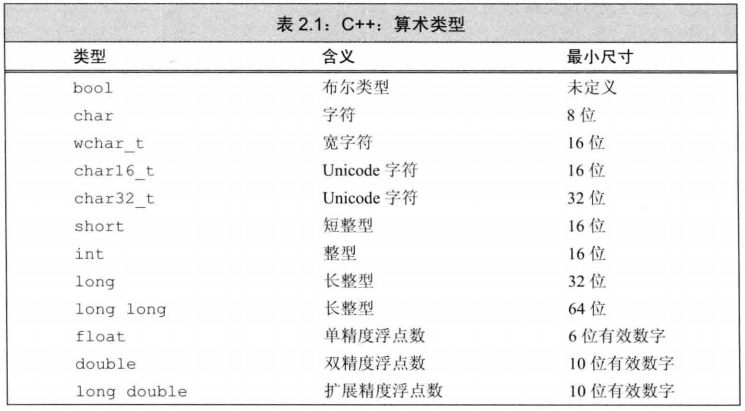
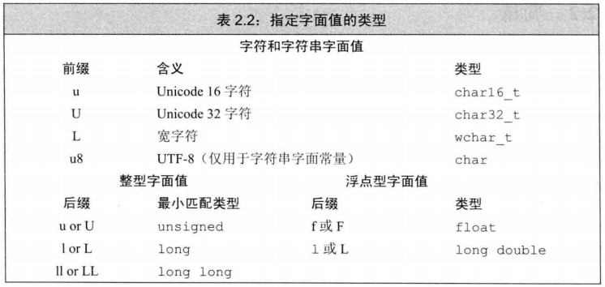
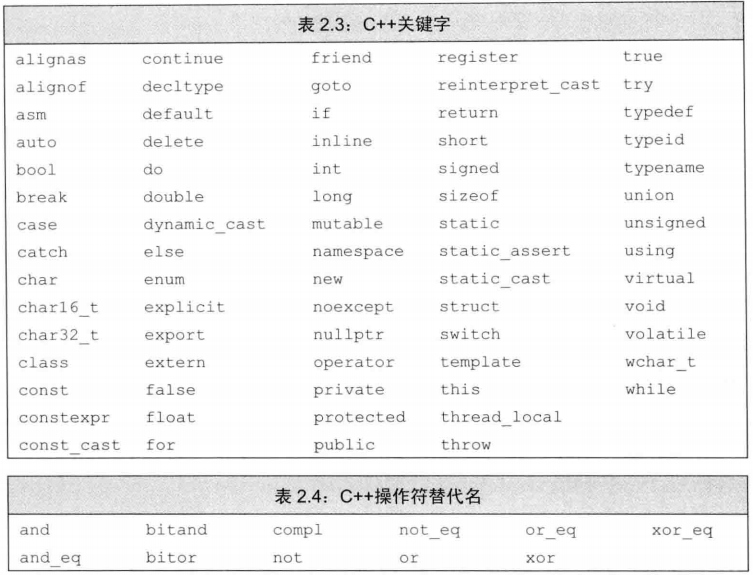
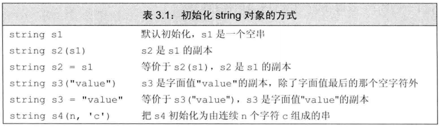
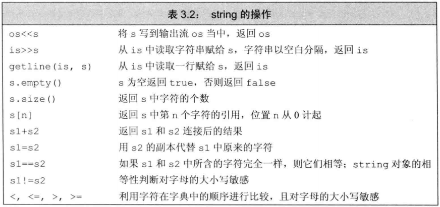
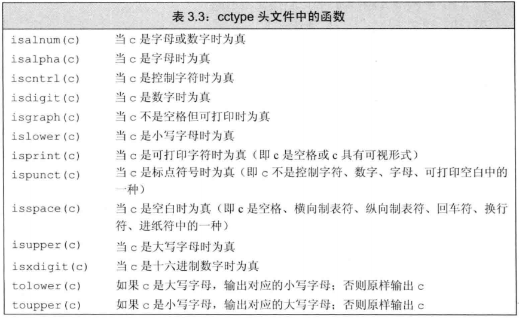
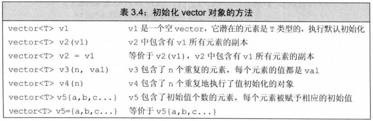
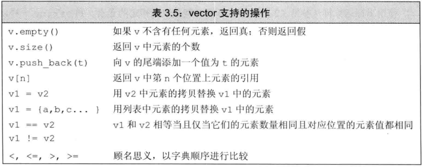
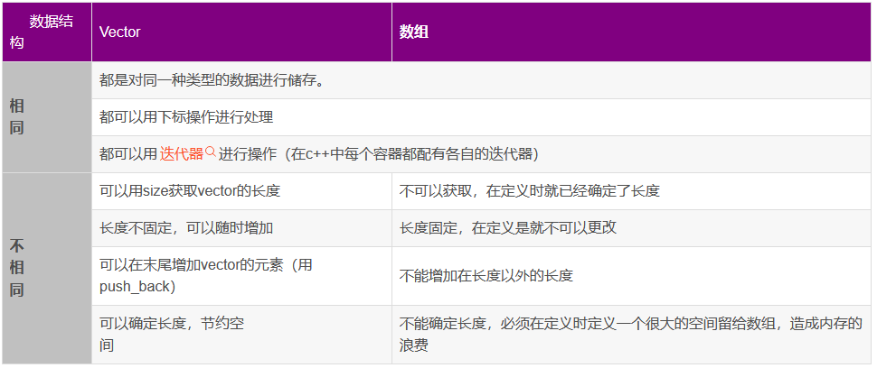
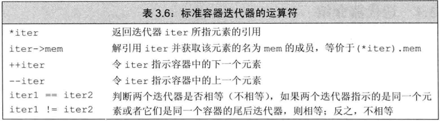

- 摘自《C++ primer》

## 变量和基本类型

### 算术类型

<div align="center">
    </img>
</div>


### 字面值常量

<div align="center">
    </img>
</div>

### 初始化、赋值

初始化不是赋值，初始化的含义是创建变量时赋予其一个初始值，而赋值的含义是把对象的当前值擦除，而以一个新值来替代。

### 声明和定义

```c
extern int i; // 声明i而非定义i
int j;        // 声明并定义j
```

> 变量能且只能被定义一次，但是可以被多次声明。

### C++ 关键字

<div align="center">
    </img>
</div>

### 左值引用

即别名

```c++
int ival = 1024;
int &refVal = ival; // refVal指向ival（是ival的另一个名字）
int &refVal2;       // 报错：引用必须被初始化
```

### 命名空间的using声明

```c++
#include<iostream>
//using std::cin; //单独声明cin
using namespace std;
int main(){
	int i;
	cin >> i;  // same as std::cin
	cout << i; // same as std::cout
	return 0;
}
```

### string

标准库类型 string 表示可变长的字符序列。

```c++
#include<string>
using namespace std;
//using std::string;

int main(){
    string word;
    while(cin >> word)        // 反复读取，直至到达文件末尾
        cout << word << endl; // 逐个输出单词
    return 0;
}
```

<div align="center">
    </img>
</div>

<div align="center">
    </img>
</div>

<div align="center">
    </img>
</div>

### 处理单个字符

范围for语句（range for），语法形式：

```c
for (declaration : expression)
    statement
```

```c++
string str("some string")
// 每行输出str中的一个字符
for(auto c : str)
    cout << c << endl;
```

使用下标：

```c++
if(!s.empty())
    cout << s[0] << endl; // 输出s的第一个字符
```

### vector 向量

类似于 ”容器“ 。

```c++
// 以10分为一个分数段统计成绩的数量：0~9，10~19，...，90~99，100
vector<usigned> scores(11,0); // 11个分数段，全部初始化为0
unsigned grade;
while (cin >> grade){         // 输入成绩
    if(grade <= 100)          // 只处理有效成绩
        ++scores[grade/10];   // 将对应分段的计数值加1
}
```

<div align="center">
    </img>
</div>

<div align="center">
    </img>
</div>

下图截自：[Vector与数组的区别](https://blog.csdn.net/zyr4712008/article/details/8686565)

<div align="center">
    </img>
</div>

### iterator 迭代器

```c++
string s("some string");
if(s.begin() != s.end()){  // 确保s非空
    auto it = s.begin();   // it表示s的第一个字符,begin返回第一个元素的迭代器
    *it = toupper(*it);    // 将当前字符改成大写形式
}
```

<div align="center">
    </img>
</div>


## 输入输出

iostream 库包含 istream 和 ostream。

- iostream 库定义了4个IO对象：
  - cin：标准输入
  - cout：标准输出
  - cerr：输出警告和错误消息
  - clog：输出程序运行时的一般性信息


```

```
