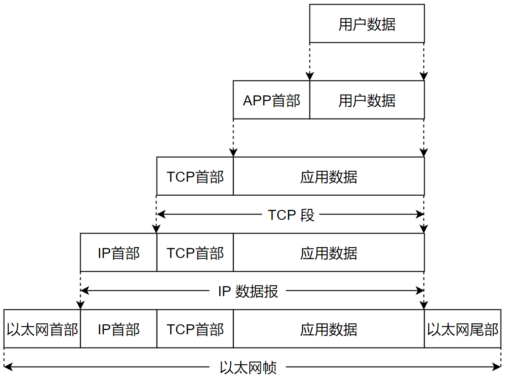
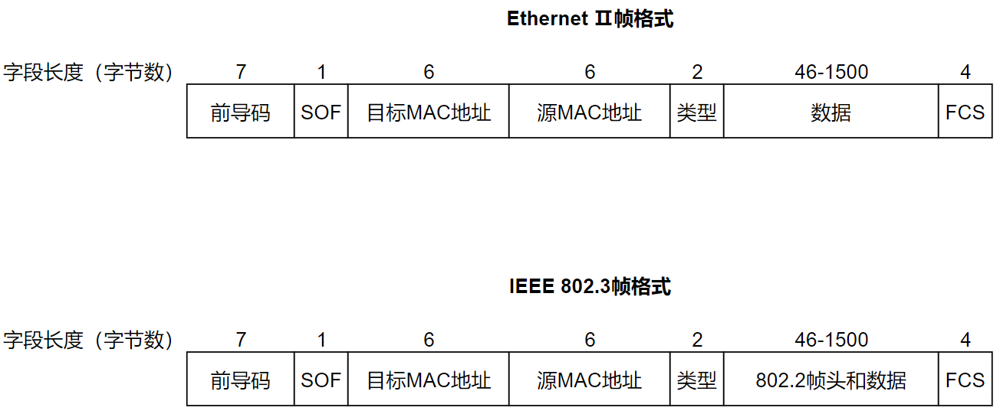
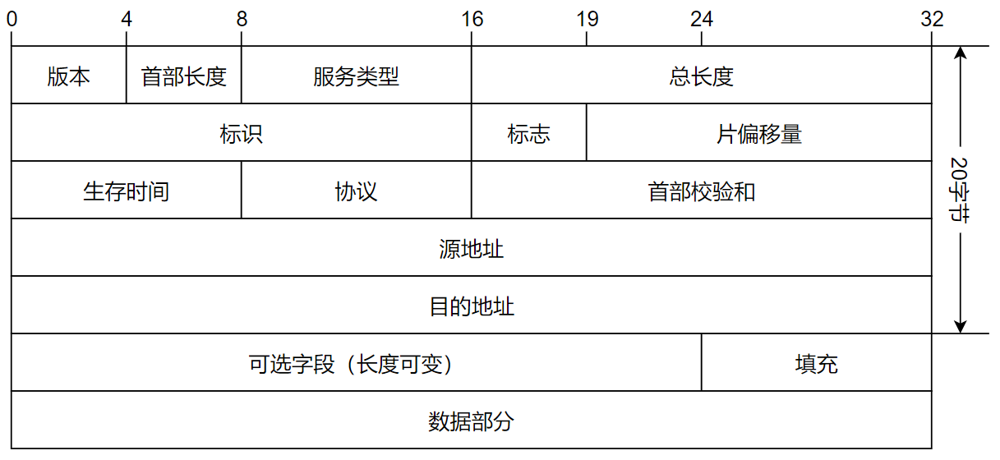
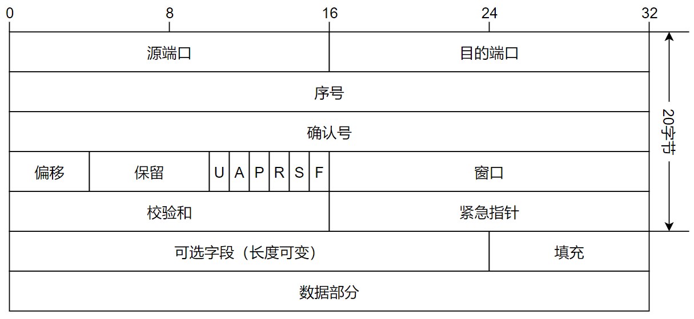

- 整理自以下文章：
  
  - [IP报文格式大全](https://support.huawei.com/enterprise/zh/doc/EDOC1100174722?section=j003)
  
  - [以太网帧结构（知乎）](https://zhuanlan.zhihu.com/p/345365572)
  - [以太网数据包结构](https://www.cnblogs.com/zhangmingda/p/12683149.html)
  - [以太网数据格式与封装解封](https://www.cnblogs.com/qishui/p/5437301.html)

    </img>

## 以太网帧格式

Ethernet Ⅱ帧，也称为Ethernet V2帧，是如今局域网里最常见的以太帧，是以太网事实标准。如今大多数的TCP/IP应用（如HTTP、FTP、SMTP、POP3等）都是采用Ethernet II帧承载。

    </img>

## IPV4头部格式

    </img>

## TCP头部格式

    </img>

