## 硬件

<div align="left">
    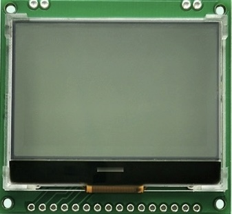</img>
</div>

- lcd12864 接口：

<div align="left">
    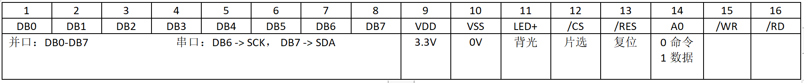</img>
</div>

- 单片机：stm32f103c8t6

- 接线：

<div align="left">
    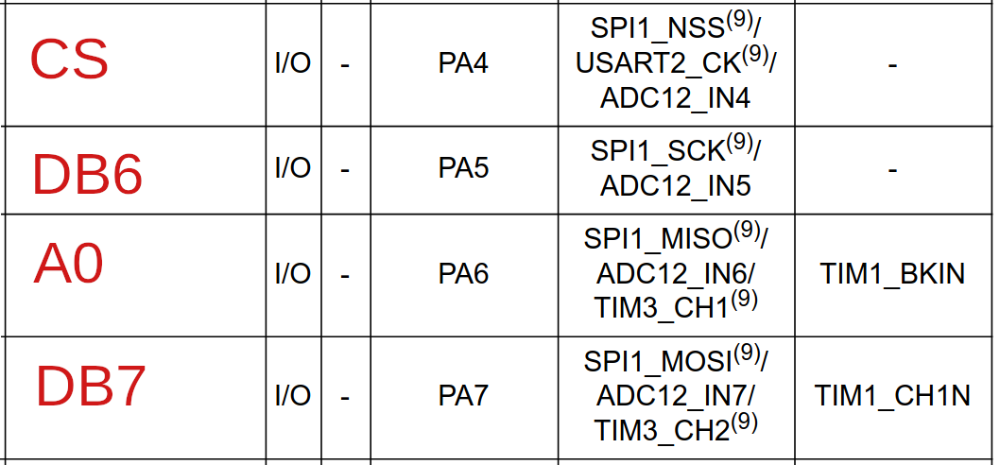</img>
</div>

## 相关参数

参考：[ST7565R 数据手册](https://www.semiee.com/file/Sitronix/Sitronix-ST7565R_V1.7.pdf)


<div align="center">
    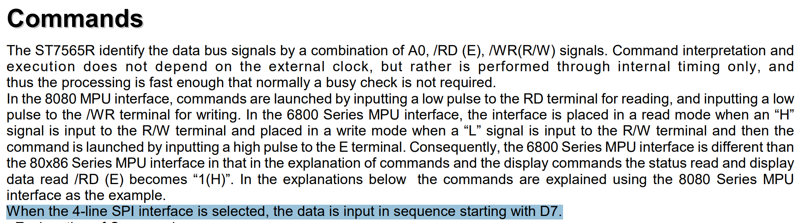</img>
</div>

- 数据是高位（MSB）先发送的方式


<div align="center">
    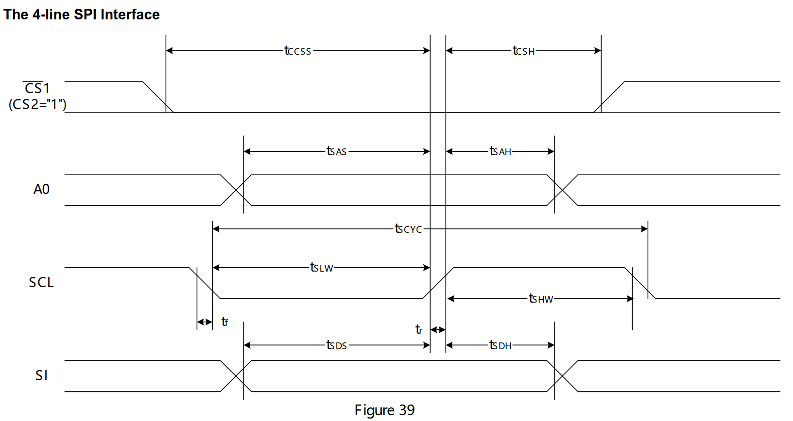</img>
</div>

- SCL 空闲时高电平
- SCL 上升沿对 SI 输入采样


<div align="center">
    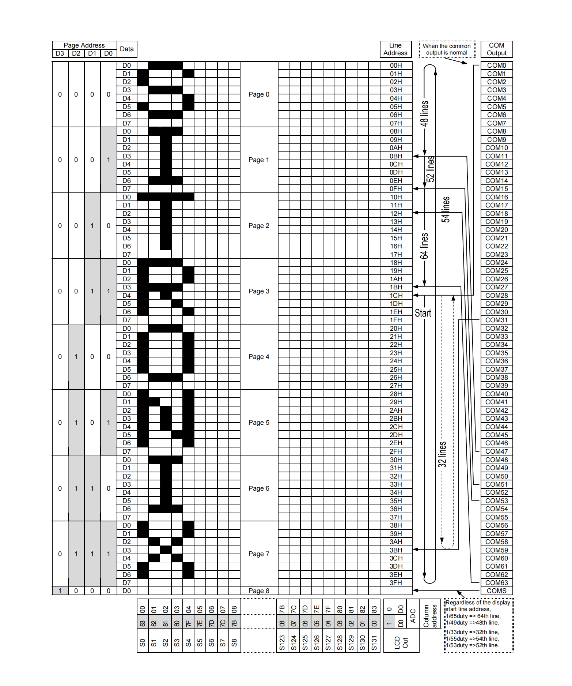</img>
</div>

- D0-D7 就是一个字节，发送时 D7 在前
- 每 8 行就是一页

## 命令

- /RD 和 /WR 是 8080 和 6800 时序用的，不管它。
- A0：0 表示低电平发送的是命令，1 高电平是数据

<div align="center">
    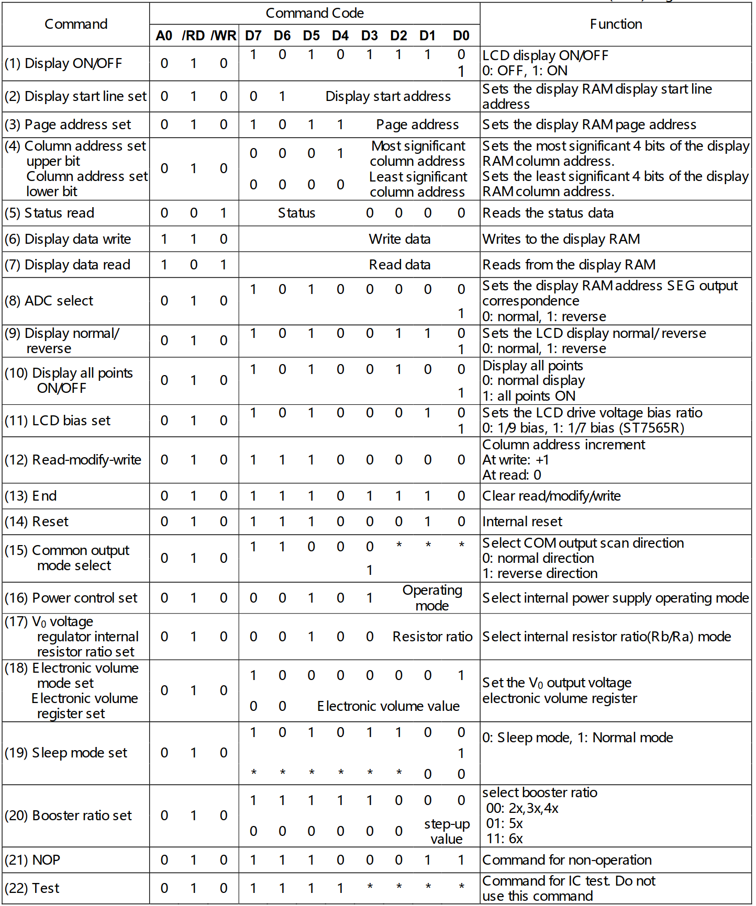</img>
</div>

## 字模软件

- PCtoLCD2002

<div align="left">
    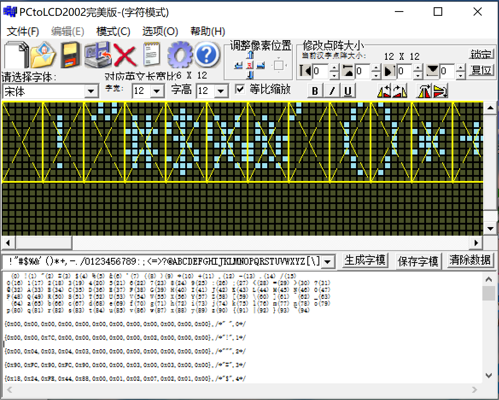</img>
</div>

- 选项配置，本文程序使用行列式

<div align="left">
    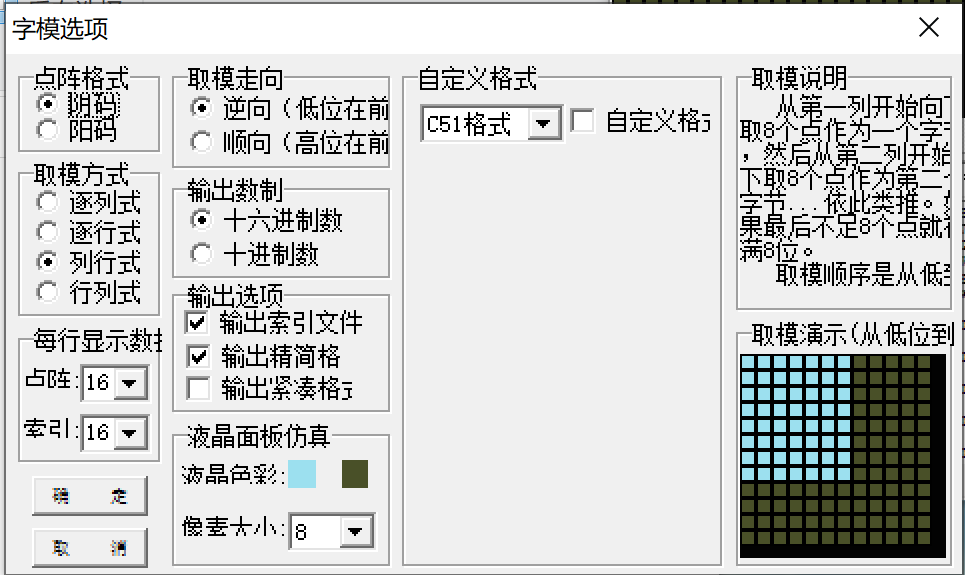</img>
</div>


<table>
    <tr>
        <td>逐列式
            <div align="center">
                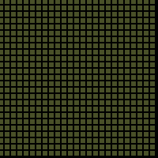</img>
            </div>
        </td>
        <td>逐行式
            <div align="center">
                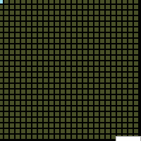</img>
            </div>
        </td>
        <td>行列式
            <div align="center">
                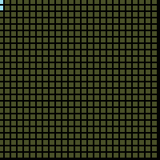</img>
            </div>
        </td>
        <td>列行式
            <div align="center">
                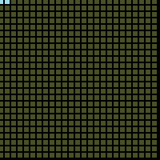</img>
            </div>
        </td>
    </tr>
</table>

LCD 扫描方式通过命令配置：
- 行扫描（Common output mode select）
  - 0xC0：从下到上
  - 0xC8：从上到下
- 列扫描（ADC select）
  - 0xA0：从左到右
  - 0xA1：从右到左


## 程序

- 由于程序中使用的是GB2312编码，所以Keil工程要如下设置

<div align="left">
    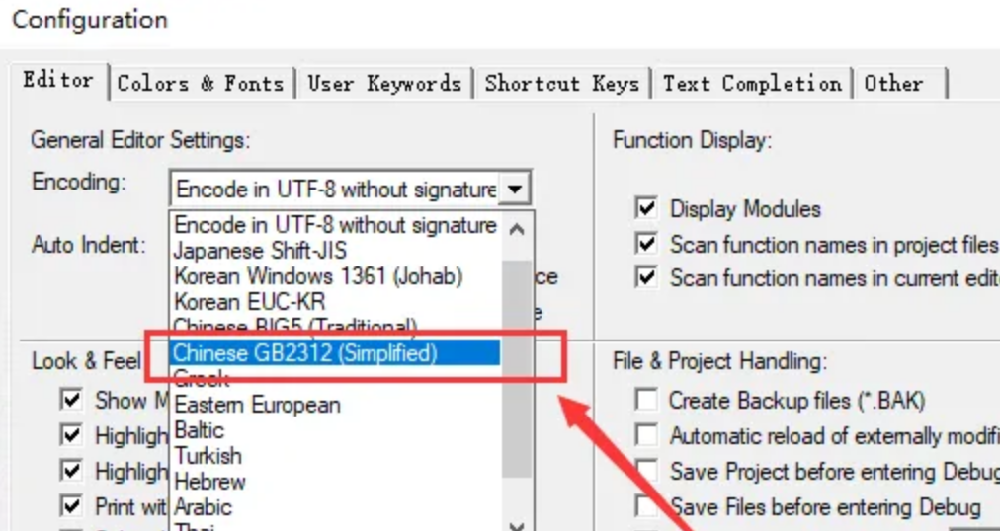</img>
</div>

- 汉字使用区位码索引：[GB2312编码对照表](http://tools.jb51.net/table/gb2312)

- 最终效果如下，能实现任意座标/中英文混合显示：

<div align="left">
    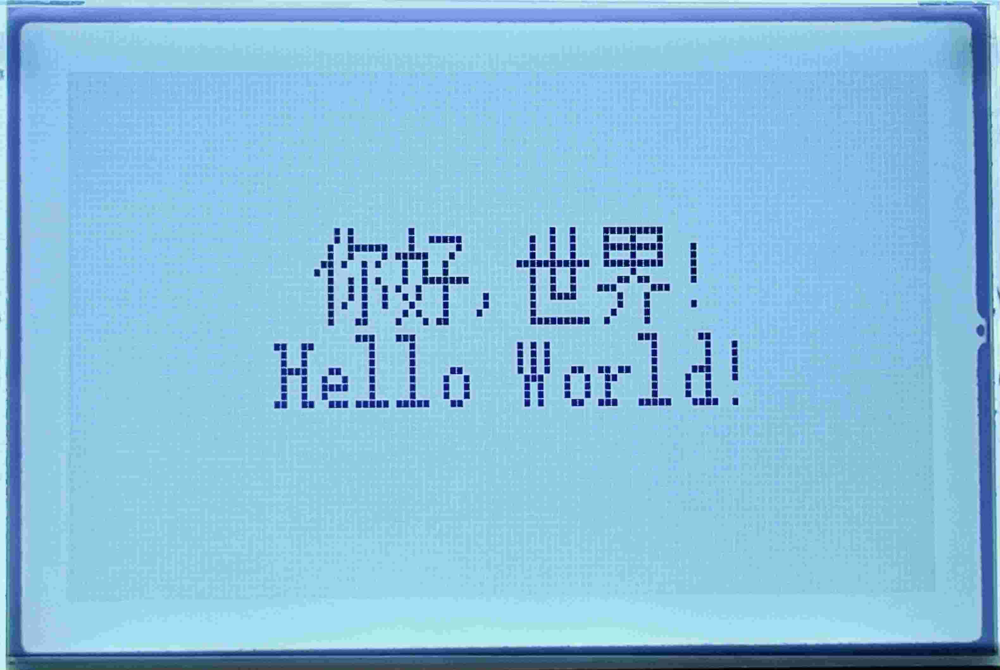</img>
</div>

### main.c

```c
#include "stm32f10x.h"
#include "bsp_lcd.h"

int main(void){
    // RCC_Config();
    LCD_SPI_Init();
    LCD_ST7565R_Config();

    LCD_ClearBuffer();
    while(1){
        LCD_DrawString(30,30,12," 你好,世界!\nHello World!");
        LCD_FlushBuffer();
    }
}
```

### bsp_lcd.h

```c
#ifndef __BSP_LCD_H
#define __BSP_LCD_H

#include "stm32f10x.h"

// 硬件SPI和软件SPI
//#define SPI_HARD
#define SPI_SOFT

#define LCD_SPIx                 SPI1
#define LCD_SPI_APBxClock_FUN    RCC_APB2PeriphClockCmd
#define LCD_SPI_CLK              RCC_APB2Periph_SPI1
#define LCD_PIN_APBxClock_FUN    RCC_APB2PeriphClockCmd
// CS引脚
#define LCD_CS_CLK               RCC_APB2Periph_GPIOA
#define LCD_CS_PORT              GPIOA
#define LCD_CS_PIN               GPIO_Pin_4
// SCK引脚
#define LCD_SCK_CLK              RCC_APB2Periph_GPIOA
#define LCD_SCK_PORT             GPIOA
#define LCD_SCK_PIN              GPIO_Pin_5
// A0引脚
#define LCD_A0_CLK               RCC_APB2Periph_GPIOA
#define LCD_A0_PORT              GPIOA
#define LCD_A0_PIN               GPIO_Pin_6
// SDA引脚（MOSI）
#define LCD_SDA_CLK              RCC_APB2Periph_GPIOA
#define LCD_SDA_PORT             GPIOA
#define LCD_SDA_PIN              GPIO_Pin_7

// 片选电平控制，低电平是选中
#define LCD_CS_LOW()             GPIO_ResetBits(LCD_CS_PORT, LCD_CS_PIN)
#define LCD_CS_HIGH()            GPIO_SetBits(LCD_CS_PORT, LCD_CS_PIN)
// A0命令电平控制，低电平是发送命令，高是发送数据
#define LCD_A0_LOW()             GPIO_ResetBits(LCD_A0_PORT, LCD_A0_PIN )
#define LCD_A0_HIGH()            GPIO_SetBits(LCD_A0_PORT, LCD_A0_PIN)
// SCK
#define LCD_SCK_LOW()             GPIO_ResetBits(LCD_SCK_PORT, LCD_SCK_PIN)
#define LCD_SCK_HIGH()            GPIO_SetBits(LCD_SCK_PORT, LCD_SCK_PIN)
// SDA
#define LCD_SDA_LOW()             GPIO_ResetBits(LCD_SDA_PORT, LCD_SDA_PIN)
#define LCD_SDA_HIGH()            GPIO_SetBits(LCD_SDA_PORT, LCD_SDA_PIN)


// 硬件SPI等待数据全部发完延时计数，如果无显示可以适当调整
#define SPI_HARD_DELAY   ((uint32_t)50)
// 软件SPI延时
#define SPI_SOFT_DELAY   ((uint32_t)10)

// 列数
#define LCD_COLUMN_NUM 128
// 页面数
#define LCD_PAGE_NUM   8


void LCD_SPI_Init(void);
void LCD_ST7565R_Config(void);
void SPI_Send(uint8_t byte);
void LCD_SendData(uint8_t byte);
void LCD_SendCmd(uint8_t byte);
void SPI_Delay(__IO uint32_t time);
void LCD_SetPosition(uint8_t page, uint8_t column);
void LCD_FlushBuffer(void);
void LCD_ClearBuffer(void);
void LCD_DrawHanzi16x16(int16_t x, int16_t y, char* hanzi);
void LCD_DrawString(int16_t x, int16_t y, uint8_t height, char* str);
void LCD_DrawAscii8x16(int16_t x, int16_t y, char* ascii);
void LCD_DrawHanzi12x12(int16_t x, int16_t y, char* hanzi);
void LCD_DrawAscii6x12(int16_t x, int16_t y, char* ascii);
void LCD_DrawDot(uint8_t x, uint8_t y);

#endif
```

### bsp_lcd.c

```c
#include "bsp_lcd.h"
#include "font.h"

uint8_t LCD_Buffer[LCD_PAGE_NUM][LCD_COLUMN_NUM];


/**
 * @brief  LCD初始化
 * @param  无
 * @retval 无
 */
void LCD_SPI_Init(void){
// 硬件SPI
#if defined SPI_HARD
    SPI_InitTypeDef  SPI_InitStructure;
    GPIO_InitTypeDef GPIO_InitStructure;
    // 使能SPI时钟
    LCD_SPI_APBxClock_FUN ( LCD_SPI_CLK, ENABLE );
    // 使能SPI引脚相关的时钟
    LCD_PIN_APBxClock_FUN(LCD_CS_CLK|
            LCD_SCK_CLK|
            LCD_A0_CLK|
            LCD_SDA_CLK, 
            ENABLE );
    // CS引脚，普通IO
    GPIO_InitStructure.GPIO_Pin   = LCD_CS_PIN;
    GPIO_InitStructure.GPIO_Speed = GPIO_Speed_50MHz;
    GPIO_InitStructure.GPIO_Mode  = GPIO_Mode_Out_PP;
    GPIO_Init(LCD_CS_PORT, &GPIO_InitStructure);
    // A0引脚，普通IO
    GPIO_InitStructure.GPIO_Pin = LCD_A0_PIN;
    GPIO_Init(LCD_A0_PORT, &GPIO_InitStructure);
    // SCK引脚
    GPIO_InitStructure.GPIO_Pin  = LCD_SCK_PIN;
    GPIO_InitStructure.GPIO_Mode = GPIO_Mode_AF_PP;
    GPIO_Init(LCD_SCK_PORT, &GPIO_InitStructure);
    // SDA(MOSI)引脚
    GPIO_InitStructure.GPIO_Pin = LCD_SDA_PIN;
    GPIO_Init(LCD_SDA_PORT, &GPIO_InitStructure);
    // 片选拉高，先不通讯LCD
    LCD_CS_HIGH();
    // SPI配置，单向只发送
    SPI_InitStructure.SPI_Direction = SPI_Direction_1Line_Tx;
    // 主机模式
    SPI_InitStructure.SPI_Mode = SPI_Mode_Master;
    // 数据帧长度8bit
    SPI_InitStructure.SPI_DataSize = SPI_DataSize_8b;
    // 时钟极性，SCK空闲时高电平
    SPI_InitStructure.SPI_CPOL = SPI_CPOL_High;
    // 时钟相位，在SCK的第二(偶数)个跳变沿采样
    SPI_InitStructure.SPI_CPHA = SPI_CPHA_2Edge;
    // 软件控制片选
    SPI_InitStructure.SPI_NSS = SPI_NSS_Soft;
    // SCK时钟频率，PLCK2/256=72/32
    SPI_InitStructure.SPI_BaudRatePrescaler = SPI_BaudRatePrescaler_32;
    // 数据传输时高位先行
    SPI_InitStructure.SPI_FirstBit = SPI_FirstBit_MSB;
    // CRC校验的多项式(忽略，默认是7)
    SPI_InitStructure.SPI_CRCPolynomial = 7;
    // 初始化SPI
    SPI_Init(LCD_SPIx, &SPI_InitStructure);
    // 使能SPI
    SPI_Cmd(LCD_SPIx, ENABLE);

// 软件SPI
#elif defined SPI_SOFT
    GPIO_InitTypeDef GPIO_InitStructure;
    // 使能GPIO时钟
    LCD_PIN_APBxClock_FUN(LCD_CS_CLK|
            LCD_SCK_CLK|
            LCD_A0_CLK|
            LCD_SDA_CLK, 
            ENABLE );
    GPIO_InitStructure.GPIO_Speed = GPIO_Speed_50MHz;
    GPIO_InitStructure.GPIO_Mode  = GPIO_Mode_Out_PP;
    // CS
    GPIO_InitStructure.GPIO_Pin   = LCD_CS_PIN;
    GPIO_Init(LCD_CS_PORT, &GPIO_InitStructure);
    // A0
    GPIO_InitStructure.GPIO_Pin = LCD_A0_PIN;
    GPIO_Init(LCD_A0_PORT, &GPIO_InitStructure);
    // SCK
    GPIO_InitStructure.GPIO_Pin = LCD_SCK_PIN;
    GPIO_Init(LCD_SCK_PORT, &GPIO_InitStructure);
    // SDA
    GPIO_InitStructure.GPIO_Pin = LCD_SDA_PIN;
    GPIO_Init(LCD_SDA_PORT, &GPIO_InitStructure);
    LCD_CS_HIGH();
    LCD_SCK_HIGH();
#endif
}


/**
 * @brief  ST7565R参数配置
 * @param  无
 * @retval 无
 */
void LCD_ST7565R_Config(void){
    // 软复位
    LCD_SendCmd(0xe2);
    // 关闭显示
    LCD_SendCmd(0xAE);
    // 设置正向显示(Display normal/reverse)
    LCD_SendCmd(0xA6);
    // 电源控制,全部开启(Power Control set)
    LCD_SendCmd(0x2F);
    // 1/9偏压比（bias）
    LCD_SendCmd(0xA2);
    // 行扫描顺序，从上到下(Common output mode select)
    LCD_SendCmd(0xC8);
    // 列扫描顺序，从左到右(ADC select)
    LCD_SendCmd(0xA0);
    // 起始行(Display start line set)
    LCD_SendCmd(0x40);
    // 粗调对比度，范围0x20-0x27,命令17
    LCD_SendCmd(0x24);
    // 微调对比度，命令18
    LCD_SendCmd(0x81);
    // 微调对比度的值，范围0x00-0x3F，命令18
    LCD_SendCmd(0x20);
    // 开启显示
    LCD_SendCmd(0xAF);
}


/**
 * @brief  SPI 发送函数
 * @param  byte: 一个字节
 * @retval 无
 */
void SPI_Send(uint8_t byte){
// 硬件SPI
#if defined SPI_HARD
    __IO uint32_t  timeout = 100;
    // 等待发送缓冲区为空，TXE事件
    while(SPI_I2S_GetFlagStatus(LCD_SPIx , SPI_I2S_FLAG_TXE) == RESET){
        if((timeout--) == 0) return;
    }
    SPI_I2S_SendData(LCD_SPIx , byte);
    // 这里必须要延时，SPI_I2S_SendData只负责把数据放入发送寄存器中，
    // 还需要等待移位寄存器把数据一位位发送出去
    SPI_Delay(SPI_HARD_DELAY);

// 软件SPI
#elif defined SPI_SOFT
    uint8_t i = 0x80;
    do{
        LCD_SCK_LOW();
        if(byte & i)
            LCD_SDA_HIGH();
        else
            LCD_SDA_LOW();
        SPI_Delay(SPI_SOFT_DELAY);
        LCD_SCK_HIGH();
        SPI_Delay(SPI_SOFT_DELAY);
        i >>= 1;
    }while(i > 0);
#endif
}


/**
 * @brief  发送数据
 * @param  byte：一个字节
 * @retval 无
 */
void LCD_SendData(uint8_t byte){
    LCD_CS_LOW();
    LCD_A0_HIGH();
    SPI_Send(byte);
    LCD_CS_HIGH();
}


/**
 * @brief  发送命令
 * @param  byte：一个字节
 * @retval 无
 */
void LCD_SendCmd(uint8_t byte){
    LCD_CS_LOW();
    LCD_A0_LOW();
    SPI_Send(byte);
    LCD_CS_HIGH();
}


/**
 * @brief  延时
 * @param  time
 * @retval 
 */
void SPI_Delay(__IO uint32_t time){
    while(time--);
}


/**
 * @brief  设置LCD写入地址
 * @param  page：页地址
 * @param  column：列地址
 * @retval 
 */
void LCD_SetPosition(uint8_t page, uint8_t column){
    // 设置页面地址
    LCD_SendCmd(0xB0 + page);
    // 设置列地址高4位
    LCD_SendCmd(0x10 + (column >> 4));
    // 设置列地址低四位
    LCD_SendCmd(0x00 + (column & 0x0F));
}


/**
 * @brief  刷新缓冲区
 * @param  无
 * @retval 无
 */
void LCD_FlushBuffer(void){
    uint16_t i, j;
    for(i = 0; i < LCD_PAGE_NUM; i++){
        for(j = 0; j < LCD_COLUMN_NUM; j++){
            LCD_SetPosition(i,j);
            LCD_SendData(LCD_Buffer[i][j]);
            LCD_Buffer[i][j] = 0x00;
        }
    }
}


/**
 * @brief  清空缓冲区
 * @param  无
 * @retval 无
 */
void LCD_ClearBuffer(void){
    uint16_t i, j;
    for(i = 0; i < LCD_PAGE_NUM; i++){
        for(j = 0; j < LCD_COLUMN_NUM; j++){
            LCD_Buffer[i][j] = 0x00;
        }
    }
}


/**
 * @brief  绘制一串字符
 * @param  x: 横坐标
 * @param  y: 纵坐标
 * @param  height: 字体高度 12、16
 * @param  str: 字符串指针
 * @retval 
 */
void LCD_DrawString(int16_t x, int16_t y, uint8_t height, char* str){
    uint8_t i = 0;
    int16_t xSaevd = x;
    while(str[i] != '\0'){
        // 判断换行
        if(str[i] == '\n'){
            x = xSaevd;
            y += height;
            str++;
        }
        // 判断GB2312中文编码
        else if((uint8_t)str[i] > 0xA0){
        //else if((uint8_t)str[i] & 0x80){
            if(height < 16){
                LCD_DrawHanzi12x12(x, y, str);
                x += 12;
            }else if(height >= 16){
                LCD_DrawHanzi16x16(x, y, str);
                x += 16;
            }
            str += 2;
        }
        // 判断ASCII编码
        else if((uint8_t)str[i] < 0x7F){
            if(height < 16){
                LCD_DrawAscii6x12(x, y, str);
                x += 6;
            }else if(height >= 16){
                LCD_DrawAscii8x16(x, y, str);
                x += 8;
            }
            str++;
        }else{
            str++;
        }
    }
}


/**
 * @brief  绘制一个16x16汉字
 * @param  
 * @retval 
 */
void LCD_DrawHanzi16x16(int16_t x, int16_t y, char* hanzi){
    int16_t  page    = y / 8;
    int16_t  offset  = (8 - ((y + 1) % 8)) % 8;
    uint32_t temp    = 0;
    uint8_t* p       = (uint8_t*)&temp;
    uint8_t* mask;
    int16_t i;
    if(x < 0 - 15 || x > 127 || y < 0 || y > 63 + 15){
        return;
    }
    if((mask = getHanZi16x16Mask(hanzi)) == 0){
        return;
    }
    for(i = 0; i < 16; i++){
        if(x + i < 0 || x + i > 127){
            continue;
        }
        temp = 0;
        p[1] = mask[i];
        p[2] = mask[i + 16];
        temp = temp >> offset;
        if(page >= 0){
            LCD_Buffer[page][x + i] &= ~(0xFF >> offset);
            LCD_Buffer[page][x + i] |= p[2];
        }
        if(page - 1 >= 0){
            LCD_Buffer[page - 1][x + i] = p[1];
        }
        if(page - 2 >= 0){
            LCD_Buffer[page - 2][x + i] &= (0xFF >> offset);
            LCD_Buffer[page - 2][x + i] |= p[0];
        }
    }
}


/**
 * @brief  绘制一个12x12汉字
 * @param  
 * @retval 
 */
void LCD_DrawHanzi12x12(int16_t x, int16_t y, char* hanzi){
    int16_t  page    = (y + 4) / 8;
    int16_t  offset  = (8 - ((y + 4 + 1) % 8)) % 8;
    uint32_t temp    = 0;
    uint8_t* p       = (uint8_t*)&temp;
    uint8_t* mask;
    int16_t i;
    if(x < 0 - 11 || x > 127 || y < 0 || y > 63 + 11){
        return;
    }
    if((mask = getHanZi12x12Mask(hanzi)) == 0){
        return;
    }
    for(i = 0; i < 12; i++){
        if(x + i < 0 || x + i > 127){
            continue;
        }
        temp = 0;
        p[1] = mask[i];
        p[2] = mask[i + 12];
        temp = temp >> offset;
        if(page >= 0){
            LCD_Buffer[page][x + i] &= ~(0x0F >> offset);
            LCD_Buffer[page][x + i] |= p[2];
        }
        if(page - 1 >= 0){
            LCD_Buffer[page - 1][x + i] = p[1];
        }
        if(page - 2 >= 0){
            LCD_Buffer[page - 2][x + i] &= (0xFF >> offset);
            LCD_Buffer[page - 2][x + i] |= p[0];
        }
    }
}


/**
 * @brief  绘制一个8x16 ascii字符
 * @param  
 * @retval 
 */
void LCD_DrawAscii8x16(int16_t x, int16_t y, char* ascii){
    int16_t  page    = y / 8;
    int16_t  offset  = (8 - ((y + 1) % 8)) % 8;
    uint32_t temp    = 0;
    uint8_t* p       = (uint8_t*)&temp;
    uint8_t* mask;
    int16_t i;
    if(x < 0 - 7 || x > 127 || y < 0 || y > 63 + 15){
        return;
    }
    if((mask = getAscii8x16Mask(ascii)) == 0){
        return;
    }
    for(i = 0; i < 8; i++){
        if(x + i < 0 || x + i > 127){
            continue;
        }
        temp = 0;
        p[1] = mask[i];
        p[2] = mask[i + 8];
        temp = temp >> offset;
        if(page >= 0){
            LCD_Buffer[page][x + i] &= ~(0xFF >> offset);
            LCD_Buffer[page][x + i] |= p[2];
        }
        if(page - 1 >= 0){
            LCD_Buffer[page - 1][x + i] = p[1];
        }
        if(page - 2 >= 0){
            LCD_Buffer[page - 2][x + i] &= (0xFF >> offset);
            LCD_Buffer[page - 2][x + i] |= p[0];
        }
    }
}


/**
 * @brief  绘制一个6x12 ascii字符
 * @param  
 * @retval 
 */
void LCD_DrawAscii6x12(int16_t x, int16_t y, char* ascii){
    int16_t  page    = (y + 4) / 8;
    int16_t  offset  = (8 - ((y + 4 + 1) % 8)) % 8;
    uint32_t temp    = 0;
    uint8_t* p       = (uint8_t*)&temp;
    uint8_t* mask;
    int16_t i;
    if(x < 0 - 5 || x > 127 || y < 0 || y > 63 + 11){
        return;
    }
    if((mask = getAscii6x12Mask(ascii)) == 0){
        return;
    }
    for(i = 0; i < 6; i++){
        if(x + i < 0 || x + i > 127){
            continue;
        }
        temp = 0;
        p[1] = mask[i];
        p[2] = mask[i + 6];
        temp = temp >> offset;
        if(page >= 0){
            LCD_Buffer[page][x + i] &= ~(0x0F >> offset);
            LCD_Buffer[page][x + i] |= p[2];
        }
        if(page - 1 >= 0){
            LCD_Buffer[page - 1][x + i] = p[1];
        }
        if(page - 2 >= 0){
            LCD_Buffer[page - 2][x + i] &= (0xFF >> offset);
            LCD_Buffer[page - 2][x + i] |= p[0];
        }
    }
}


/**
 * @brief  绘制一个点
 * @param  
 * @retval 
 */
void LCD_DrawDot(uint8_t x, uint8_t y){
    uint8_t page   = y / LCD_PAGE_NUM;
    uint8_t column = x;
    uint8_t offset = y % LCD_PAGE_NUM;
    LCD_Buffer[page][column] |= 0x01 << offset;
}
```


### font.h

```c
#ifndef __FONT_H
#define __FONT_H
#include "stm32f10x.h"


typedef struct{
    uint8_t index[2];
    uint8_t mask[32];
}HZ16x16_t;
#define HanZi16x16_NUM 4


typedef struct{
    uint8_t index[2];
    uint8_t mask[24];
}HZ12x12_t;
#define HanZi12x12_NUM 4


typedef struct{
    uint8_t mask[16];
}Ascii8x16_t;
#define Ascii8x16_NUM 95


typedef struct{
    uint8_t mask[12];
}Ascii6x12_t;
#define Ascii6x12_NUM 95


uint8_t* getHanZi12x12Mask(char* str);
uint8_t* getHanZi16x16Mask(char* str);
uint8_t* getAscii6x12Mask(char* str);
uint8_t* getAscii8x16Mask(char* str);

#endif
```

### font.c


```c
#include "font.h"

const HZ16x16_t HanZi16x16[HanZi16x16_NUM] = {
// 你 ：GB2312十六进制区位码
{0xC4,0xE3,
0x00,0x80,0x60,0xF8,0x07,0x40,0x20,0x18,0x0F,0x08,0xC8,0x08,0x08,0x28,0x18,0x00,
0x01,0x00,0x00,0xFF,0x00,0x10,0x0C,0x03,0x40,0x80,0x7F,0x00,0x01,0x06,0x18,0x00},
// 好	
{0xBA,0xC3,
0x10,0x10,0xF0,0x1F,0x10,0xF0,0x00,0x80,0x82,0x82,0xE2,0x92,0x8A,0x86,0x80,0x00,
0x40,0x22,0x15,0x08,0x16,0x61,0x00,0x00,0x40,0x80,0x7F,0x00,0x00,0x00,0x00,0x00},
// 世
{0xCA,0xC0,
0x20,0x20,0x20,0xFE,0x20,0x20,0xFF,0x20,0x20,0x20,0xFF,0x20,0x20,0x20,0x20,0x00,
0x00,0x00,0x00,0x7F,0x40,0x40,0x47,0x44,0x44,0x44,0x47,0x40,0x40,0x40,0x00,0x00},
// 界
{0xBD,0xE7,
0x00,0x00,0x00,0xFE,0x92,0x92,0x92,0xFE,0x92,0x92,0x92,0xFE,0x00,0x00,0x00,0x00,
0x08,0x08,0x04,0x84,0x62,0x1E,0x01,0x00,0x01,0xFE,0x02,0x04,0x04,0x08,0x08,0x00},
};


const HZ12x12_t HanZi12x12[HanZi12x12_NUM] = {
// 你
{0xC4,0xE3,
0x20,0x10,0xFC,0x03,0x10,0xCF,0x04,0xF4,0x04,0x54,0x8C,0x00,0x00,0x00,0x0F,0x00,
0x02,0x01,0x08,0x0F,0x00,0x00,0x03,0x00},
// 好
{0xBA,0xC3,
0x88,0x78,0x0F,0x88,0x78,0x42,0x42,0xF2,0x4A,0x46,0x40,0x00,0x08,0x05,0x02,0x05,
0x08,0x00,0x08,0x0F,0x00,0x00,0x00,0x00},
// 世
{0xCA,0xC0,
0x10,0x10,0xFE,0x10,0x10,0xFF,0x10,0x10,0xFF,0x10,0x10,0x00,0x00,0x00,0x0F,0x08,
0x08,0x09,0x09,0x09,0x09,0x08,0x08,0x00},
// 界
{0xBD,0xE7,
0x80,0x9F,0x95,0x55,0x55,0x3F,0x55,0x55,0x95,0x9F,0x80,0x00,0x00,0x08,0x04,0x03,
0x00,0x00,0x00,0x0F,0x00,0x00,0x00,0x00},
};


const Ascii8x16_t Ascii8x16[Ascii8x16_NUM] = {
{0x00,0x00,0x00,0x00,0x00,0x00,0x00,0x00,0x00,0x00,0x00,0x00,0x00,0x00,0x00,0x00},/*" ",0*/
{0x00,0x00,0x00,0xF8,0x00,0x00,0x00,0x00,0x00,0x00,0x00,0x33,0x00,0x00,0x00,0x00},/*"!",1*/
{0x00,0x10,0x0C,0x02,0x10,0x0C,0x02,0x00,0x00,0x00,0x00,0x00,0x00,0x00,0x00,0x00},/*""",2*/
{0x00,0x40,0xC0,0x78,0x40,0xC0,0x78,0x00,0x00,0x04,0x3F,0x04,0x04,0x3F,0x04,0x00},/*"#",3*/
{0x00,0x70,0x88,0x88,0xFC,0x08,0x30,0x00,0x00,0x18,0x20,0x20,0xFF,0x21,0x1E,0x00},/*"$",4*/
{0xF0,0x08,0xF0,0x80,0x60,0x18,0x00,0x00,0x00,0x31,0x0C,0x03,0x1E,0x21,0x1E,0x00},/*"%",5*/
{0x00,0xF0,0x08,0x88,0x70,0x00,0x00,0x00,0x1E,0x21,0x23,0x2C,0x19,0x27,0x21,0x10},/*"&",6*/
{0x00,0x12,0x0E,0x00,0x00,0x00,0x00,0x00,0x00,0x00,0x00,0x00,0x00,0x00,0x00,0x00},/*"'",7*/
{0x00,0x00,0x00,0xE0,0x18,0x04,0x02,0x00,0x00,0x00,0x00,0x07,0x18,0x20,0x40,0x00},/*"(",8*/
{0x00,0x02,0x04,0x18,0xE0,0x00,0x00,0x00,0x00,0x40,0x20,0x18,0x07,0x00,0x00,0x00},/*")",9*/
{0x40,0x40,0x80,0xF0,0x80,0x40,0x40,0x00,0x02,0x02,0x01,0x0F,0x01,0x02,0x02,0x00},/*"*",10*/
{0x00,0x00,0x00,0x00,0xE0,0x00,0x00,0x00,0x00,0x01,0x01,0x01,0x0F,0x01,0x01,0x01},/*"+",11*/
{0x00,0x00,0x00,0x00,0x00,0x00,0x00,0x00,0x00,0x90,0x70,0x00,0x00,0x00,0x00,0x00},/*",",12*/
{0x00,0x00,0x00,0x00,0x00,0x00,0x00,0x00,0x00,0x01,0x01,0x01,0x01,0x01,0x01,0x00},/*"-",13*/
{0x00,0x00,0x00,0x00,0x00,0x00,0x00,0x00,0x00,0x30,0x30,0x00,0x00,0x00,0x00,0x00},/*".",14*/
{0x00,0x00,0x00,0x00,0xC0,0x38,0x04,0x00,0x00,0x60,0x18,0x07,0x00,0x00,0x00,0x00},/*"/",15*/
{0x00,0xE0,0x10,0x08,0x08,0x10,0xE0,0x00,0x00,0x0F,0x10,0x20,0x20,0x10,0x0F,0x00},/*"0",16*/
{0x00,0x00,0x10,0x10,0xF8,0x00,0x00,0x00,0x00,0x00,0x20,0x20,0x3F,0x20,0x20,0x00},/*"1",17*/
{0x00,0x70,0x08,0x08,0x08,0x08,0xF0,0x00,0x00,0x30,0x28,0x24,0x22,0x21,0x30,0x00},/*"2",18*/
{0x00,0x30,0x08,0x08,0x08,0x88,0x70,0x00,0x00,0x18,0x20,0x21,0x21,0x22,0x1C,0x00},/*"3",19*/
{0x00,0x00,0x80,0x40,0x30,0xF8,0x00,0x00,0x00,0x06,0x05,0x24,0x24,0x3F,0x24,0x24},/*"4",20*/
{0x00,0xF8,0x88,0x88,0x88,0x08,0x08,0x00,0x00,0x19,0x20,0x20,0x20,0x11,0x0E,0x00},/*"5",21*/
{0x00,0xE0,0x10,0x88,0x88,0x90,0x00,0x00,0x00,0x0F,0x11,0x20,0x20,0x20,0x1F,0x00},/*"6",22*/
{0x00,0x18,0x08,0x08,0x88,0x68,0x18,0x00,0x00,0x00,0x00,0x3E,0x01,0x00,0x00,0x00},/*"7",23*/
{0x00,0x70,0x88,0x08,0x08,0x88,0x70,0x00,0x00,0x1C,0x22,0x21,0x21,0x22,0x1C,0x00},/*"8",24*/
{0x00,0xF0,0x08,0x08,0x08,0x10,0xE0,0x00,0x00,0x01,0x12,0x22,0x22,0x11,0x0F,0x00},/*"9",25*/
{0x00,0x00,0x00,0xC0,0xC0,0x00,0x00,0x00,0x00,0x00,0x00,0x30,0x30,0x00,0x00,0x00},/*":",26*/
{0x00,0x00,0x00,0x80,0x00,0x00,0x00,0x00,0x00,0x00,0x00,0xE0,0x00,0x00,0x00,0x00},/*";",27*/
{0x00,0x00,0x80,0x40,0x20,0x10,0x08,0x00,0x00,0x01,0x02,0x04,0x08,0x10,0x20,0x00},/*"<",28*/
{0x00,0x40,0x40,0x40,0x40,0x40,0x40,0x00,0x00,0x02,0x02,0x02,0x02,0x02,0x02,0x00},/*"=",29*/
{0x00,0x08,0x10,0x20,0x40,0x80,0x00,0x00,0x00,0x20,0x10,0x08,0x04,0x02,0x01,0x00},/*">",30*/
{0x00,0x70,0x48,0x08,0x08,0x88,0x70,0x00,0x00,0x00,0x00,0x30,0x37,0x00,0x00,0x00},/*"?",31*/
{0xC0,0x30,0xC8,0x28,0xE8,0x10,0xE0,0x00,0x07,0x18,0x27,0x28,0x2F,0x28,0x17,0x00},/*"@",32*/
{0x00,0x00,0xC0,0x38,0xE0,0x00,0x00,0x00,0x20,0x3C,0x23,0x02,0x02,0x27,0x38,0x20},/*"A",33*/
{0x08,0xF8,0x88,0x88,0x88,0x70,0x00,0x00,0x20,0x3F,0x20,0x20,0x20,0x11,0x0E,0x00},/*"B",34*/
{0xC0,0x30,0x08,0x08,0x08,0x08,0x38,0x00,0x07,0x18,0x20,0x20,0x20,0x10,0x08,0x00},/*"C",35*/
{0x08,0xF8,0x08,0x08,0x08,0x10,0xE0,0x00,0x20,0x3F,0x20,0x20,0x20,0x10,0x0F,0x00},/*"D",36*/
{0x08,0xF8,0x88,0x88,0xE8,0x08,0x10,0x00,0x20,0x3F,0x20,0x20,0x23,0x20,0x18,0x00},/*"E",37*/
{0x08,0xF8,0x88,0x88,0xE8,0x08,0x10,0x00,0x20,0x3F,0x20,0x00,0x03,0x00,0x00,0x00},/*"F",38*/
{0xC0,0x30,0x08,0x08,0x08,0x38,0x00,0x00,0x07,0x18,0x20,0x20,0x22,0x1E,0x02,0x00},/*"G",39*/
{0x08,0xF8,0x08,0x00,0x00,0x08,0xF8,0x08,0x20,0x3F,0x21,0x01,0x01,0x21,0x3F,0x20},/*"H",40*/
{0x00,0x08,0x08,0xF8,0x08,0x08,0x00,0x00,0x00,0x20,0x20,0x3F,0x20,0x20,0x00,0x00},/*"I",41*/
{0x00,0x00,0x08,0x08,0xF8,0x08,0x08,0x00,0xC0,0x80,0x80,0x80,0x7F,0x00,0x00,0x00},/*"J",42*/
{0x08,0xF8,0x88,0xC0,0x28,0x18,0x08,0x00,0x20,0x3F,0x20,0x01,0x26,0x38,0x20,0x00},/*"K",43*/
{0x08,0xF8,0x08,0x00,0x00,0x00,0x00,0x00,0x20,0x3F,0x20,0x20,0x20,0x20,0x30,0x00},/*"L",44*/
{0x08,0xF8,0xF8,0x00,0xF8,0xF8,0x08,0x00,0x20,0x3F,0x01,0x3E,0x01,0x3F,0x20,0x00},/*"M",45*/
{0x08,0xF8,0x30,0xC0,0x00,0x08,0xF8,0x08,0x20,0x3F,0x20,0x00,0x07,0x18,0x3F,0x00},/*"N",46*/
{0xE0,0x10,0x08,0x08,0x08,0x10,0xE0,0x00,0x0F,0x10,0x20,0x20,0x20,0x10,0x0F,0x00},/*"O",47*/
{0x08,0xF8,0x08,0x08,0x08,0x08,0xF0,0x00,0x20,0x3F,0x21,0x01,0x01,0x01,0x00,0x00},/*"P",48*/
{0xE0,0x10,0x08,0x08,0x08,0x10,0xE0,0x00,0x0F,0x10,0x28,0x28,0x30,0x50,0x4F,0x00},/*"Q",49*/
{0x08,0xF8,0x88,0x88,0x88,0x88,0x70,0x00,0x20,0x3F,0x20,0x00,0x03,0x0C,0x30,0x20},/*"R",50*/
{0x00,0x70,0x88,0x08,0x08,0x08,0x38,0x00,0x00,0x38,0x20,0x21,0x21,0x22,0x1C,0x00},/*"S",51*/
{0x18,0x08,0x08,0xF8,0x08,0x08,0x18,0x00,0x00,0x00,0x20,0x3F,0x20,0x00,0x00,0x00},/*"T",52*/
{0x08,0xF8,0x08,0x00,0x00,0x08,0xF8,0x08,0x00,0x1F,0x20,0x20,0x20,0x20,0x1F,0x00},/*"U",53*/
{0x08,0x78,0x88,0x00,0x00,0xC8,0x38,0x08,0x00,0x00,0x07,0x38,0x0E,0x01,0x00,0x00},/*"V",54*/
{0x08,0xF8,0x00,0xF8,0x00,0xF8,0x08,0x00,0x00,0x03,0x3E,0x01,0x3E,0x03,0x00,0x00},/*"W",55*/
{0x08,0x18,0x68,0x80,0x80,0x68,0x18,0x08,0x20,0x30,0x2C,0x03,0x03,0x2C,0x30,0x20},/*"X",56*/
{0x08,0x38,0xC8,0x00,0xC8,0x38,0x08,0x00,0x00,0x00,0x20,0x3F,0x20,0x00,0x00,0x00},/*"Y",57*/
{0x10,0x08,0x08,0x08,0xC8,0x38,0x08,0x00,0x20,0x38,0x26,0x21,0x20,0x20,0x18,0x00},/*"Z",58*/
{0x00,0x00,0x00,0xFE,0x02,0x02,0x02,0x00,0x00,0x00,0x00,0x7F,0x40,0x40,0x40,0x00},/*"[",59*/
{0x00,0x04,0x38,0xC0,0x00,0x00,0x00,0x00,0x00,0x00,0x00,0x01,0x06,0x38,0xC0,0x00},/*"\",60*/
{0x00,0x02,0x02,0x02,0xFE,0x00,0x00,0x00,0x00,0x40,0x40,0x40,0x7F,0x00,0x00,0x00},/*"]",61*/
{0x00,0x00,0x04,0x02,0x02,0x04,0x00,0x00,0x00,0x00,0x00,0x00,0x00,0x00,0x00,0x00},/*"^",62*/
{0x00,0x00,0x00,0x00,0x00,0x00,0x00,0x00,0x80,0x80,0x80,0x80,0x80,0x80,0x80,0x80},/*"_",63*/
{0x00,0x02,0x02,0x04,0x00,0x00,0x00,0x00,0x00,0x00,0x00,0x00,0x00,0x00,0x00,0x00},/*"`",64*/
{0x00,0x00,0x80,0x80,0x80,0x00,0x00,0x00,0x00,0x19,0x24,0x24,0x12,0x3F,0x20,0x00},/*"a",65*/
{0x10,0xF0,0x00,0x80,0x80,0x00,0x00,0x00,0x00,0x3F,0x11,0x20,0x20,0x11,0x0E,0x00},/*"b",66*/
{0x00,0x00,0x00,0x80,0x80,0x80,0x00,0x00,0x00,0x0E,0x11,0x20,0x20,0x20,0x11,0x00},/*"c",67*/
{0x00,0x00,0x80,0x80,0x80,0x90,0xF0,0x00,0x00,0x1F,0x20,0x20,0x20,0x10,0x3F,0x20},/*"d",68*/
{0x00,0x00,0x80,0x80,0x80,0x80,0x00,0x00,0x00,0x1F,0x24,0x24,0x24,0x24,0x17,0x00},/*"e",69*/
{0x00,0x80,0x80,0xE0,0x90,0x90,0x20,0x00,0x00,0x20,0x20,0x3F,0x20,0x20,0x00,0x00},/*"f",70*/
{0x00,0x00,0x80,0x80,0x80,0x80,0x80,0x00,0x00,0x6B,0x94,0x94,0x94,0x93,0x60,0x00},/*"g",71*/
{0x10,0xF0,0x00,0x80,0x80,0x80,0x00,0x00,0x20,0x3F,0x21,0x00,0x00,0x20,0x3F,0x20},/*"h",72*/
{0x00,0x80,0x98,0x98,0x00,0x00,0x00,0x00,0x00,0x20,0x20,0x3F,0x20,0x20,0x00,0x00},/*"i",73*/
{0x00,0x00,0x00,0x80,0x98,0x98,0x00,0x00,0x00,0xC0,0x80,0x80,0x80,0x7F,0x00,0x00},/*"j",74*/
{0x10,0xF0,0x00,0x00,0x80,0x80,0x80,0x00,0x20,0x3F,0x24,0x06,0x29,0x30,0x20,0x00},/*"k",75*/
{0x00,0x10,0x10,0xF8,0x00,0x00,0x00,0x00,0x00,0x20,0x20,0x3F,0x20,0x20,0x00,0x00},/*"l",76*/
{0x80,0x80,0x80,0x80,0x80,0x80,0x80,0x00,0x20,0x3F,0x20,0x00,0x3F,0x20,0x00,0x3F},/*"m",77*/
{0x80,0x80,0x00,0x80,0x80,0x80,0x00,0x00,0x20,0x3F,0x21,0x00,0x00,0x20,0x3F,0x20},/*"n",78*/
{0x00,0x00,0x80,0x80,0x80,0x80,0x00,0x00,0x00,0x1F,0x20,0x20,0x20,0x20,0x1F,0x00},/*"o",79*/
{0x80,0x80,0x00,0x80,0x80,0x00,0x00,0x00,0x80,0xFF,0x91,0x20,0x20,0x11,0x0E,0x00},/*"p",80*/
{0x00,0x00,0x00,0x80,0x80,0x00,0x80,0x00,0x00,0x0E,0x11,0x20,0x20,0x91,0xFF,0x80},/*"q",81*/
{0x80,0x80,0x80,0x00,0x80,0x80,0x80,0x00,0x20,0x20,0x3F,0x21,0x20,0x00,0x01,0x00},/*"r",82*/
{0x00,0x00,0x80,0x80,0x80,0x80,0x80,0x00,0x00,0x33,0x24,0x24,0x24,0x24,0x19,0x00},/*"s",83*/
{0x00,0x80,0x80,0xE0,0x80,0x80,0x00,0x00,0x00,0x00,0x00,0x1F,0x20,0x20,0x10,0x00},/*"t",84*/
{0x80,0x80,0x00,0x00,0x00,0x80,0x80,0x00,0x00,0x1F,0x20,0x20,0x20,0x10,0x3F,0x20},/*"u",85*/
{0x80,0x80,0x80,0x00,0x80,0x80,0x80,0x00,0x00,0x03,0x0C,0x30,0x0C,0x03,0x00,0x00},/*"v",86*/
{0x80,0x80,0x00,0x80,0x80,0x00,0x80,0x80,0x01,0x0E,0x30,0x0C,0x07,0x38,0x06,0x01},/*"w",87*/
{0x00,0x80,0x80,0x80,0x00,0x80,0x80,0x00,0x00,0x20,0x31,0x0E,0x2E,0x31,0x20,0x00},/*"x",88*/
{0x80,0x80,0x80,0x00,0x00,0x80,0x80,0x80,0x00,0x81,0x86,0x78,0x18,0x06,0x01,0x00},/*"y",89*/
{0x00,0x80,0x80,0x80,0x80,0x80,0x80,0x00,0x00,0x21,0x30,0x2C,0x22,0x21,0x30,0x00},/*"z",90*/
{0x00,0x00,0x00,0x00,0x00,0xFC,0x02,0x02,0x00,0x00,0x00,0x00,0x01,0x3E,0x40,0x40},/*"{",91*/
{0x00,0x00,0x00,0x00,0xFF,0x00,0x00,0x00,0x00,0x00,0x00,0x00,0xFF,0x00,0x00,0x00},/*"|",92*/
{0x02,0x02,0xFC,0x00,0x00,0x00,0x00,0x00,0x40,0x40,0x3E,0x01,0x00,0x00,0x00,0x00},/*"}",93*/
{0x00,0x02,0x01,0x02,0x02,0x04,0x02,0x00,0x00,0x00,0x00,0x00,0x00,0x00,0x00,0x00},/*"~",94*/
};


const Ascii6x12_t Ascii6x12[Ascii6x12_NUM] = {
{0x00,0x00,0x00,0x00,0x00,0x00,0x00,0x00,0x00,0x00,0x00,0x00},/*" ",0*/
{0x00,0x00,0x7C,0x00,0x00,0x00,0x00,0x00,0x02,0x00,0x00,0x00},/*"!",1*/
{0x00,0x04,0x03,0x04,0x03,0x00,0x00,0x00,0x00,0x00,0x00,0x00},/*""",2*/
{0x90,0xFC,0x90,0xFC,0x90,0x00,0x00,0x03,0x00,0x03,0x00,0x00},/*"#",3*/
{0x18,0x24,0xFE,0x44,0x88,0x00,0x01,0x02,0x07,0x02,0x01,0x00},/*"$",4*/
{0x38,0x44,0xF8,0xD0,0x2C,0xC0,0x00,0x03,0x00,0x01,0x02,0x01},/*"%",5*/
{0xC0,0x38,0xE4,0x18,0xE0,0x20,0x01,0x02,0x02,0x01,0x02,0x01},/*"&",6*/
{0x04,0x03,0x00,0x00,0x00,0x00,0x00,0x00,0x00,0x00,0x00,0x00},/*"'",7*/
{0x00,0x00,0xF8,0x06,0x01,0x00,0x00,0x00,0x00,0x03,0x04,0x00},/*"(",8*/
{0x00,0x01,0x06,0xF8,0x00,0x00,0x00,0x04,0x03,0x00,0x00,0x00},/*")",9*/
{0x90,0x60,0xF8,0x60,0x90,0x00,0x00,0x00,0x01,0x00,0x00,0x00},/*"*",10*/
{0x00,0x20,0x20,0xF8,0x20,0x20,0x00,0x00,0x00,0x00,0x00,0x00},/*"+",11*/
{0x00,0x00,0x00,0x00,0x00,0x00,0x04,0x03,0x00,0x00,0x00,0x00},/*",",12*/
{0x20,0x20,0x20,0x20,0x20,0x20,0x00,0x00,0x00,0x00,0x00,0x00},/*"-",13*/
{0x00,0x00,0x00,0x00,0x00,0x00,0x00,0x02,0x00,0x00,0x00,0x00},/*".",14*/
{0x00,0x00,0xC0,0x30,0x0C,0x02,0x04,0x03,0x00,0x00,0x00,0x00},/*"/",15*/
{0xF8,0x04,0x04,0x04,0xF8,0x00,0x01,0x02,0x02,0x02,0x01,0x00},/*"0",16*/
{0x00,0x08,0xFC,0x00,0x00,0x00,0x00,0x02,0x03,0x02,0x00,0x00},/*"1",17*/
{0x18,0x84,0x44,0x24,0x18,0x00,0x03,0x02,0x02,0x02,0x02,0x00},/*"2",18*/
{0x08,0x04,0x24,0x24,0xD8,0x00,0x01,0x02,0x02,0x02,0x01,0x00},/*"3",19*/
{0xC0,0xA0,0x98,0xFC,0x80,0x00,0x00,0x00,0x02,0x03,0x02,0x00},/*"4",20*/
{0x7C,0x24,0x24,0x24,0xC4,0x00,0x01,0x02,0x02,0x02,0x01,0x00},/*"5",21*/
{0xF0,0x48,0x24,0x24,0xC8,0x00,0x01,0x02,0x02,0x02,0x01,0x00},/*"6",22*/
{0x00,0x04,0xC4,0x34,0x0C,0x00,0x00,0x00,0x03,0x00,0x00,0x00},/*"7",23*/
{0xD8,0x24,0x24,0x24,0xD8,0x00,0x01,0x02,0x02,0x02,0x01,0x00},/*"8",24*/
{0x38,0x44,0x44,0x24,0xF8,0x00,0x01,0x02,0x02,0x01,0x00,0x00},/*"9",25*/
{0x00,0x00,0x10,0x00,0x00,0x00,0x00,0x00,0x02,0x00,0x00,0x00},/*":",26*/
{0x00,0x00,0x20,0x00,0x00,0x00,0x00,0x00,0x06,0x00,0x00,0x00},/*";",27*/
{0x00,0x60,0x90,0x08,0x04,0x00,0x00,0x00,0x00,0x01,0x02,0x00},/*"<",28*/
{0x50,0x50,0x50,0x50,0x50,0x50,0x00,0x00,0x00,0x00,0x00,0x00},/*"=",29*/
{0x00,0x04,0x08,0x90,0x60,0x00,0x00,0x02,0x01,0x00,0x00,0x00},/*">",30*/
{0x18,0x04,0xC4,0x24,0x18,0x00,0x00,0x00,0x02,0x00,0x00,0x00},/*"?",31*/
{0xF0,0x08,0xE4,0xF4,0x84,0x78,0x00,0x01,0x02,0x02,0x02,0x01},/*"@",32*/
{0x00,0xE0,0x9C,0xF0,0x80,0x00,0x02,0x03,0x00,0x00,0x03,0x02},/*"A",33*/
{0x04,0xFC,0x24,0x24,0xD8,0x00,0x02,0x03,0x02,0x02,0x01,0x00},/*"B",34*/
{0xF8,0x04,0x04,0x04,0x0C,0x00,0x01,0x02,0x02,0x02,0x01,0x00},/*"C",35*/
{0x04,0xFC,0x04,0x04,0xF8,0x00,0x02,0x03,0x02,0x02,0x01,0x00},/*"D",36*/
{0x04,0xFC,0x24,0x74,0x0C,0x00,0x02,0x03,0x02,0x02,0x03,0x00},/*"E",37*/
{0x04,0xFC,0x24,0x74,0x0C,0x00,0x02,0x03,0x02,0x00,0x00,0x00},/*"F",38*/
{0xF0,0x08,0x04,0x44,0xCC,0x40,0x00,0x01,0x02,0x02,0x01,0x00},/*"G",39*/
{0x04,0xFC,0x20,0x20,0xFC,0x04,0x02,0x03,0x00,0x00,0x03,0x02},/*"H",40*/
{0x04,0x04,0xFC,0x04,0x04,0x00,0x02,0x02,0x03,0x02,0x02,0x00},/*"I",41*/
{0x00,0x04,0x04,0xFC,0x04,0x04,0x0C,0x08,0x08,0x07,0x00,0x00},/*"J",42*/
{0x04,0xFC,0x24,0x50,0x8C,0x04,0x02,0x03,0x02,0x00,0x03,0x02},/*"K",43*/
{0x04,0xFC,0x04,0x00,0x00,0x00,0x02,0x03,0x02,0x02,0x02,0x03},/*"L",44*/
{0xFC,0x3C,0xC0,0x3C,0xFC,0x04,0x03,0x00,0x03,0x00,0x03,0x02},/*"M",45*/
{0x04,0xFC,0x30,0xC4,0xFC,0x04,0x02,0x03,0x02,0x00,0x03,0x00},/*"N",46*/
{0xF8,0x04,0x04,0x04,0xF8,0x00,0x01,0x02,0x02,0x02,0x01,0x00},/*"O",47*/
{0x04,0xFC,0x24,0x24,0x18,0x00,0x02,0x03,0x02,0x00,0x00,0x00},/*"P",48*/
{0xF8,0x84,0x84,0x04,0xF8,0x00,0x01,0x02,0x02,0x07,0x05,0x00},/*"Q",49*/
{0x04,0xFC,0x24,0x64,0x98,0x00,0x02,0x03,0x02,0x00,0x03,0x02},/*"R",50*/
{0x18,0x24,0x24,0x44,0x8C,0x00,0x03,0x02,0x02,0x02,0x01,0x00},/*"S",51*/
{0x0C,0x04,0xFC,0x04,0x0C,0x00,0x00,0x02,0x03,0x02,0x00,0x00},/*"T",52*/
{0x04,0xFC,0x00,0x00,0xFC,0x04,0x00,0x01,0x02,0x02,0x01,0x00},/*"U",53*/
{0x04,0x7C,0x80,0xE0,0x1C,0x04,0x00,0x00,0x03,0x00,0x00,0x00},/*"V",54*/
{0x3C,0xC0,0x7C,0xC0,0x3C,0x00,0x00,0x03,0x00,0x03,0x00,0x00},/*"W",55*/
{0x04,0x9C,0x60,0x9C,0x04,0x00,0x02,0x03,0x00,0x03,0x02,0x00},/*"X",56*/
{0x04,0x3C,0xC0,0x3C,0x04,0x00,0x00,0x02,0x03,0x02,0x00,0x00},/*"Y",57*/
{0x0C,0x84,0x64,0x1C,0x04,0x00,0x02,0x03,0x02,0x02,0x03,0x00},/*"Z",58*/
{0x00,0x00,0xFF,0x01,0x01,0x00,0x00,0x00,0x07,0x04,0x04,0x00},/*"[",59*/
{0x00,0x06,0x38,0xC0,0x00,0x00,0x00,0x00,0x00,0x01,0x06,0x00},/*"\",60*/
{0x00,0x01,0x01,0xFF,0x00,0x00,0x00,0x04,0x04,0x07,0x00,0x00},/*"]",61*/
{0x00,0x02,0x01,0x02,0x00,0x00,0x00,0x00,0x00,0x00,0x00,0x00},/*"^",62*/
{0x00,0x00,0x00,0x00,0x00,0x00,0x08,0x08,0x08,0x08,0x08,0x08},/*"_",63*/
{0x00,0x01,0x02,0x00,0x00,0x00,0x00,0x00,0x00,0x00,0x00,0x00},/*"`",64*/
{0x00,0x40,0xA0,0xA0,0xC0,0x00,0x00,0x01,0x02,0x02,0x03,0x02},/*"a",65*/
{0x02,0xFE,0x20,0x20,0xC0,0x00,0x00,0x03,0x02,0x02,0x01,0x00},/*"b",66*/
{0x00,0xC0,0x20,0x20,0x60,0x00,0x00,0x01,0x02,0x02,0x01,0x00},/*"c",67*/
{0x00,0xC0,0x20,0x22,0xFE,0x00,0x00,0x01,0x02,0x02,0x03,0x02},/*"d",68*/
{0x00,0xC0,0xA0,0xA0,0xC0,0x00,0x00,0x01,0x02,0x02,0x02,0x00},/*"e",69*/
{0x00,0x20,0xFC,0x22,0x22,0x04,0x00,0x02,0x03,0x02,0x02,0x00},/*"f",70*/
{0x00,0x40,0xA0,0xA0,0x60,0x20,0x00,0x05,0x0A,0x0A,0x0A,0x04},/*"g",71*/
{0x02,0xFE,0x20,0x20,0xC0,0x00,0x02,0x03,0x02,0x00,0x03,0x02},/*"h",72*/
{0x00,0x20,0xE6,0x00,0x00,0x00,0x00,0x02,0x03,0x02,0x00,0x00},/*"i",73*/
{0x00,0x00,0x20,0xE6,0x00,0x00,0x08,0x08,0x08,0x07,0x00,0x00},/*"j",74*/
{0x02,0xFE,0x80,0x60,0x20,0x00,0x02,0x03,0x00,0x01,0x02,0x00},/*"k",75*/
{0x02,0x02,0xFE,0x00,0x00,0x00,0x02,0x02,0x03,0x02,0x02,0x00},/*"l",76*/
{0xE0,0x20,0xE0,0x20,0xC0,0x00,0x03,0x00,0x03,0x00,0x03,0x00},/*"m",77*/
{0x20,0xE0,0x20,0x20,0xC0,0x00,0x02,0x03,0x02,0x00,0x03,0x02},/*"n",78*/
{0x00,0xC0,0x20,0x20,0xC0,0x00,0x00,0x01,0x02,0x02,0x01,0x00},/*"o",79*/
{0x20,0xE0,0x20,0x20,0xC0,0x00,0x08,0x0F,0x0A,0x02,0x01,0x00},/*"p",80*/
{0x00,0xC0,0x20,0x20,0xE0,0x00,0x00,0x01,0x02,0x0A,0x0F,0x08},/*"q",81*/
{0x20,0xE0,0x40,0x20,0x20,0x00,0x02,0x03,0x02,0x00,0x00,0x00},/*"r",82*/
{0x00,0x60,0xA0,0xA0,0x20,0x00,0x00,0x02,0x02,0x02,0x03,0x00},/*"s",83*/
{0x00,0x20,0xF8,0x20,0x20,0x00,0x00,0x00,0x03,0x02,0x02,0x00},/*"t",84*/
{0x20,0xE0,0x00,0x20,0xE0,0x00,0x00,0x01,0x02,0x02,0x03,0x02},/*"u",85*/
{0x20,0xE0,0x00,0xE0,0x20,0x00,0x00,0x00,0x03,0x00,0x00,0x00},/*"v",86*/
{0x60,0x80,0xE0,0x80,0x60,0x00,0x00,0x03,0x00,0x03,0x00,0x00},/*"w",87*/
{0x20,0x60,0x80,0x60,0x20,0x00,0x02,0x03,0x00,0x03,0x02,0x00},/*"x",88*/
{0x20,0xE0,0x00,0x00,0xE0,0x20,0x08,0x08,0x05,0x03,0x00,0x00},/*"y",89*/
{0x00,0x20,0xA0,0x60,0x20,0x00,0x00,0x02,0x03,0x02,0x02,0x00},/*"z",90*/
{0x00,0x00,0x20,0xFF,0x01,0x00,0x00,0x00,0x00,0x07,0x04,0x00},/*"{",91*/
{0x00,0x00,0x00,0xFF,0x00,0x00,0x00,0x00,0x00,0x0F,0x00,0x00},/*"|",92*/
{0x00,0x01,0xDF,0x20,0x00,0x00,0x00,0x04,0x07,0x00,0x00,0x00},/*"}",93*/
{0x02,0x01,0x01,0x02,0x01,0x00,0x00,0x00,0x00,0x00,0x00,0x00},/*"~",94*/
};


/**
  * @brief  获取12x12大小汉字的点阵数据指针
  * @param  str：字符指针
  * @retval 返回点阵数据首字节地址
  */
uint8_t* getHanZi12x12Mask(char* str){
    uint16_t i;
    for(i = 0; i < HanZi12x12_NUM; i++){
        if(str[0] == HanZi12x12[i].index[0] && str[1] == HanZi12x12[i].index[1]){
            return (uint8_t*)HanZi12x12[i].mask;
        }
    }
    return 0;
}


/**
  * @brief  获取16x16大小汉字的点阵数据指针
  * @param  str：字符指针
  * @retval 返回点阵数据首字节地址
  */
uint8_t* getHanZi16x16Mask(char* str){
    uint16_t i;
    for(i = 0; i < HanZi16x16_NUM; i++){
        if(str[0] == HanZi16x16[i].index[0] && str[1] == HanZi16x16[i].index[1]){
            return (uint8_t*)HanZi16x16[i].mask;
        }
    }
    return 0;
}


/**
  * @brief  获取6x12大小Ascii的点阵数据指针
  * @param  str：字符指针
  * @retval 返回点阵数据首字节地址
  */
uint8_t* getAscii6x12Mask(char* str){
    int16_t i = *str - 0x20;
    if(i>= 0 && i < Ascii6x12_NUM){
        return (uint8_t*)Ascii6x12[i].mask;
    }
    return 0;
}


/**
  * @brief  获取8x16大小Ascii的点阵数据指针
  * @param  str：字符指针
  * @retval 返回点阵数据首字节地址
  */
uint8_t* getAscii8x16Mask(char* str){
    int16_t i = *str - 0x20;
    if(i>= 0 && i < Ascii8x16_NUM){
        return (uint8_t*)Ascii8x16[i].mask;
    }
    return 0;
}
```
