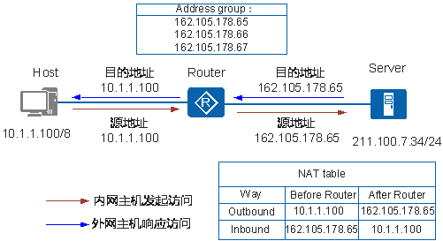
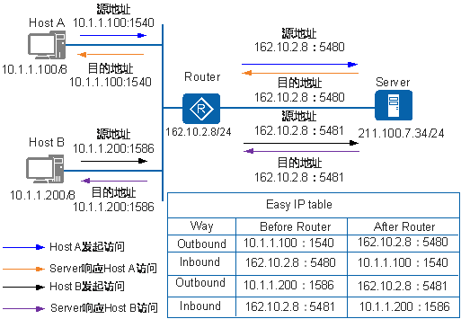

- 参考文章：
  - [什么是NAT？](https://info.support.huawei.com/info-finder/encyclopedia/zh/NAT.html)
  - [NAT](https://support.huawei.com/enterprise/zh/doc/EDOC1100086644#zh-cn_topic_0166436068_dc_fd_nat_section000401)
  - [NAT技术easy IP 原理](https://blog.csdn.net/BIGmustang/article/details/106673081)
  - [Easy IP与NAPT的区别](https://forum.huawei.com/enterprise/zh/thread-173507-1-1.html)
  - [NAT Static与NAT Server的区别](https://forum.huawei.com/enterprise/zh/thread-262683.html)

## NAT概述

NAT（Network Address Translation）是将IP数据报文头中的IP地址转换为另一个IP地址的过程，主要用于实现内部网络（私有IP地址）访问外部网络（公有IP地址）的功能。

## Basic NAT

Basic NAT方式属于一对一的地址转换，在这种方式下只转换IP地址，而不处理TCP/UDP协议的端口号，一个公网IP地址不能同时被多个私网用户使用。

### 动态NAT

    </img>

上图实现过程如下：

1. Router收到内网侧Host发送的访问公网侧Server的报文，其源IP地址为10.1.1.100，目的IP地址是211.100.7.34。
2. Router从地址池（Address group）中选取一个空闲的公网IP地址162.105.178.65。
3. Router建立内网侧源IP与公网IP间的双向NAT转换表（NAT table）。
4. Router查找正向NAT表，将报文转换后向公网侧发送，其源IP地址是162.105.178.65，目的IP地址是211.100.7.34。
5. Router收到公网侧的回应报文后，根据其目的IP地址查找反向NAT表项，并依据查表结果将报文转换后向私网侧发送，其源IP地址是211.100.7.34，目的IP地址是10.1.1.100。

> 当该公网IP空闲时也可分配给其他任一内网主机，这种分配的方式属于动态NAT。

### 静态NAT

 - 一个公网IP只会分配给唯一且固定的内网主机。
 - 静态NAT实现了私有地址和公有地址的一对一映射。

## NAPT
网络地址端口转换NAPT（Network Address Port Translation）。

NAPT方式属于多对一的地址转换，它通过使用“IP地址＋端口号”的形式进行转换，使多个私网用户可共用一个公网IP地址访问外网。

    </img>

上图描述了NAPT的基本原理，实现过程如下：

1. Router收到内网侧Host发送的访问公网侧Server的报文。源IP是10.1.1.100，端口号1025。
2. Router从地址池中选取一对空闲的“公网IP地址＋端口号” 建立与内网侧报文“源IP地址＋源端口号”间的NAPT转换表项（正反向），并依据查找正向NAPT表项的结果将报文转换后向公网侧发送。Router转换后的报文源地址为162.105.178.65，端口号16384。
3. Router收到公网侧的回应报文后，根据其“目的IP地址＋目的端口号”查找反向NAPT表项，并依据查表结果将报文转换后向私网侧发送。比如Server回应Host A的报文经Router转换后，目的地址为10.1.1.100，端口号1025。

## Easy IP

Easy IP方式可以利用访问控制列表来控制哪些内部地址可以进行地址转换。

Easy IP方式特别适合小型局域网访问Internet的情况。这里的小型局域网主要指中小型网吧、小型办公室等环境，一般具有以下特点：内部主机较少、出接口通过拨号方式获得临时公网IP地址以供内部主机访问Internet。对于这种情况，可以使用Easy IP方式使局域网用户都通过这个IP地址接入Internet。

    </img>

Easy IP方式的处理过程如下：
1. Router收到内网侧主机发送的访问公网侧服务器的报文。
2. Router利用公网侧接口的“公网IP地址＋端口号”，建立与内网侧报文“源IP地址＋源端口号”间的Easy IP转换表项（正反向），并依据查找正向Easy IP表项的结果将报文转换后向公网侧发送。
3. Router收到公网侧的回应报文后，根据其“目的IP地址＋目的端口号”查找反向Easy IP表项，并依据查表结果将报文转换后向内网侧发送。

> Easy IP 与 NAPT 类似，但NAPT 不能映射像拨号上网这种不固定IP的，所以出现了 Easy IP。

> 动态的公网IP适合用 Easy IP，固定的公网IP适合用 NAPT。
