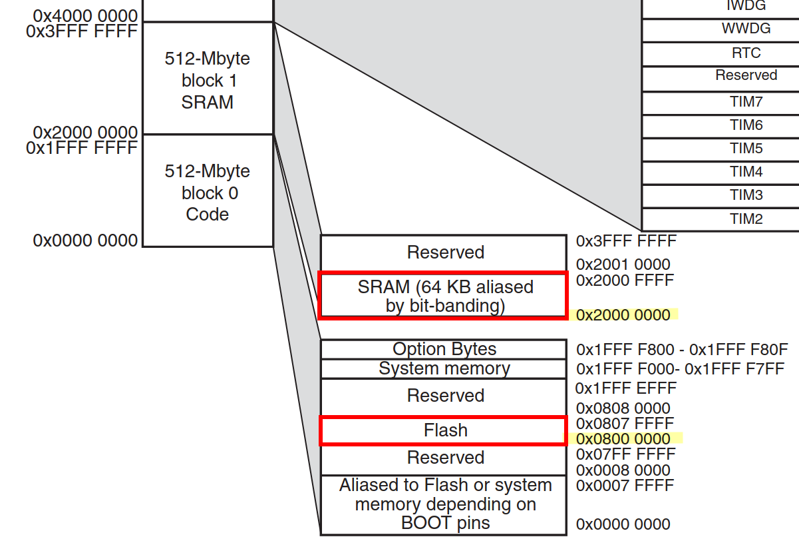
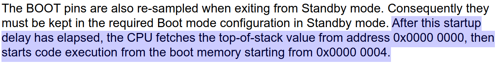
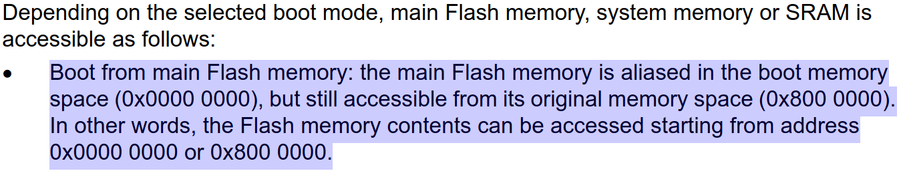

- 参考文章：
  - [Writing linker script for STM32 from scratch](https://itachi.pl/hardware/writing_linker_script_for_stm32_from_scratch)
  - [链接脚本(Linker Scripts)语法和规则解析](https://www.cnblogs.com/jianhua1992/p/16852784.html)
  - [LD链接脚本解析](https://blog.csdn.net/weixin_39177986/article/details/108455827)
  - [链接脚本中 AT> 的作用 ](https://www.cnblogs.com/LogicBai/p/16982841.html)
  - **[LD 链接器](https://sourceware.org/binutils/docs/ld/index.html)**
  - [How to get the load address of .data section](https://stackoverflow.com/questions/68670510/avr-gnu-linker-script-how-to-get-the-load-address-of-data-section)
  - [C代码中如何使用链接脚本中定义的变量](https://cloud.tencent.com/developer/article/1709022)
  - [From Zero to main(): Bare metal C](https://interrupt.memfault.com/blog/zero-to-main-1)
  - [From Zero to main(): Demystifying Firmware Linker Scripts](https://interrupt.memfault.com/blog/how-to-write-linker-scripts-for-firmware)
  - [STM32的启动](https://www.cnblogs.com/The-explosion/p/13652387.html)


## 硬件平台

 STM32F103ZET6 野火霸道开发板 V2

## 准备工具

ARM GCC 工具链，参考此文安装：[Linux 下搭建 STM32 开发环境](../linux-stm32-development/)


## 预备知识

### STM32 启动模式

|BOOT0|BOOT1|启动方式|
|--|--|--|
|0|X|内部flash，用户程序|
|1|0|系统存储器，BootLoader|
|0|1|内部SRAM，程序调试|

### 内存映射

<div align="left">
    </img>
</div>

FLASH 起始地址是 `0x08000000`，SRAM 起始地址是 `0x20000000`


参考手册 `Boot configuration` 一节有这样一段话：

<div align="left">
    </img>
</div>

上电后，CPU 从地址 `0x00000000` 获取栈顶地址，然后从地址 `0x00000004` 处开始执行代码


<div align="left">
    </img>
</div>

从 FLASH 启动时，CPU 将地址 `0x00000000` 映射到 `0x08000000`，然后 CPU 就可以从 `0x00000000` 读取 FLASH 上的数据，当然 `0x08000000` 依然是可以被 CPU 访问的。

> `0x00000000` 中的值会被加载到 SP 寄存器，`0x00000004` 中的值会被加载到 PC 寄存器


## 开始编写

### 最简单的链接脚本

链接文件由一个称为 `SECTIONS` 的块组成。在此块中，你定义的段将被按顺序分配到二进制文件中。

比较重要的段有：

<table>
  <tbody>
    <tr>
      <td>.text</td>
      <td>包含你的代码</td>
    </tr>
    <tr>
      <td>.rodata</td>
      <td>包含 const 定义的常量数据</td>
    </tr>
    <tr>
      <td>.data</td>
      <td>包含已初始化的全局/静态变量</td>
    </tr>
    <tr>
      <td>.bss</td>
      <td>包含未初始化的全局/静态变量</td>
    </tr>
  </tbody>
</table>


第一个脚本，将只使用 `.text` 。没有数据，没有变量，只有纯代码。

创建一个 `script.ld` 文件，写入下面的内容：

```c
SECTIONS
{
    .text : 
    { 
        /* 星号是通配符 */
        *(.text)
        *(.text*)
    }
}
```

上面的脚本告诉链接器：
  1. 创建一个 `.text` 段（冒号左边的部分）
  2. 获取目标文件中所有的 `.text` 段（花括号中的部分）
  3. 把第 2 步获取的段放到第 1 步创建的段中

虽然定义了代码部分，但没有指定它放在哪里。根据之前讲述的内容，它应该被放到地址 `0x08000000`：

```c
SECTIONS
{
    . = 0x08000000;
    .text : 
    { 
        *(.text) 
        *(.text*) 
    }
}
```

点 `.` 是位置计数器。它从 `0x0` 开始，可以直接修改，如上所示。也可以通过添加段、常量等间接修改。因此，如果你在 `.text` 段之后读取位置计数器的值，它的值将是 `0x08000000` 加上你添加的段的大小。

接下来添加栈顶地址及入口程序地址：

```c
ENTRY(main);

SECTIONS
{
    . = 0x08000000;
    .text :
    {   /* BYTE，SHORT，LONG，QUAD 命令分别存储 1，2，4，8 字节 */
        LONG(0x20010000);
        LONG(main | 1);
        *(.text)
        *(.text*)

    }
}
```

当 STM32 启动时，它会从 FLASH 读取两个地址（共 8 字节）。第一个是栈顶地址，第二个是入口程序地址。

- `ENTRY(main)` 告诉链接器使用 mian 作为程序的入口点。这也可以防止包含 `main` 函数的 `.text` 部分被链接器作为垃圾“优化”（因为 main 函数没有被其它函数调用）。

- `LONG(0x20010000)` 告诉链接器将 `0x20010000` 这四个字节放入输出的二进制文件中。为什么是这四个字节？因为 SRAM 地址从 `0x20000000` 开始，大小有 64KB（0x10000）。 `0x20000000 + 0x10000 = 0x20010000` 就是栈顶的地址。

- `LONG(main | 1)` 将 main 函数的地址输出到二进制文件中。main 与 1 做了或运算生成一个奇数值。在 ARM 体系结构中，函数地址是奇数（最后一位是1）告诉 CPU 使用 thumb 指令集。

> 疑问：SRAM 的范围是 `0x20000000` - `0x2000FFFF`，初始栈顶地址却是 `0x20010000`

> 因为 CM3 使用的是向下生长的满栈，栈顶初始值必须是内存的末地址加 1

> 满栈进栈是先移动指针再存数据

接下来创建 `main.c` 来点亮开发板上的红色 LED ：

```c
#include "registers.h"

// 由于没有配置时钟源，STM32 将使用内部 8 MHz RC 振荡器，这对于这个简单的项目来说绰绰有余
int main(void) {
    // 开启 GPIOB 时钟
    RCC->APB2ENR  |= (1 << LED_CLK);
    // 配置 PB5 引脚推挽输出
    LED_GPIO->CRL |= (3 << (LED_PIN * 4));
    // 引脚输出低电平
    LED_GPIO->BRR  = (1 << LED_PIN);
    while (1);
}
```

创建头文件 `registers.h` ：

```c
#ifndef __REGISTERS_H
#define __REGISTERS_H

#include <stdint.h>

typedef struct {
    uint32_t CR;
    uint32_t CFGR;
    uint32_t CIR;
    uint32_t APB2RSTR;
    uint32_t APB1RSTR;
    uint32_t AHBENR;
    uint32_t APB2ENR;
    uint32_t APB1ENR;
    uint32_t BDCR;
    uint32_t CSR;
} RCC_Reg;
#define RCC ((RCC_Reg*) 0x40021000)

typedef struct {
    uint32_t CRL;
    uint32_t CRH;
    uint32_t IDR;
    uint32_t ODR;
    uint32_t BSRR;
    uint32_t BRR;
    uint32_t LCKR;
} GPIOB_Reg;
#define GPIOB ((GPIOB_Reg*) 0x40010C00)

#define LED_CLK     3
#define LED_GPIO    GPIOB
#define LED_PIN     5

#endif
```

创建 `makefile` ：

```makefile
TARGET    := led

BUILD_DIR := ./Build

C_SRC := main.c
C_OBJ := main.o

CP_FLAGS := -mcpu=cortex-m3 -mthumb -Os -Wall -fdata-sections -ffunction-sections -MMD -MP
LD_FLAGS := -mcpu=cortex-m3 -specs=nano.specs -T script.ld  -Wl,-Map=$(BUILD_DIR)/$(TARGET).map,--gc-sections

.PHONY: all
all: $(BUILD_DIR) $(BUILD_DIR)/$(TARGET).elf $(BUILD_DIR)/$(TARGET).hex $(BUILD_DIR)/$(TARGET).bin
    @echo "Done"

%.elf: $(BUILD_DIR)/$(C_OBJ)
    arm-none-eabi-gcc $(LD_FLAGS) $< -o $@

$(BUILD_DIR)/%.o: %.c
    arm-none-eabi-gcc -c $(CP_FLAGS) $< -o $@

%.hex: %.elf
    arm-none-eabi-objcopy -O ihex $< $@

%.bin: %.elf
    arm-none-eabi-objcopy -O binary -S $< $@

$(BUILD_DIR):
    mkdir -p $@

clean:
    rm $(BUILD_DIR) -rf

install:
    st-flash write $(BUILD_DIR)/$(TARGET).bin 0x08000000

-include $(BUILD_DIR)/*.d
```

现在目录下有这几个文件：

```bash-session
$ ls
main.c  makefile  registers.h  script.ld
```

编译代码：

```bash-session
$ make
$ ls Build/
led.bin  led.elf  led.hex  main.d  main.o 
```

查看 `led.bin` 文件：

```bash-session
$ hexdump Build/led.bin
0000000 0000 2001 0009 0800 4a06 6993 f043 0308
0000010 6193 4b05 681a f442 1240 601a 2220 615a
0000020 e7fe bf00 1000 4002 0c00 4001 b5f8 bf00
0000030 b5f8 bf00
```

前面 8 个字节 `0000 2001 0009 0800` 数据从小端转换为大端就是：`2001 0000` ，`0800 0009`

第一个就是在链接脚本中设置的栈顶地址 `0x20010000`

第二个很可能是 main 函数的地址 `0x08000009`，最后一位表示 thumb 指令集，所以实际应该是 `0x08000008`

查看一下：

```bash-session
$ arm-none-eabi-objdump -D Build/led.elf
08000008 <main>:
 8000008:       4a06            ldr     r2, [pc, #24]   @ (8000024 <main+0x1c>)
 8000012:       4b05            ldr     r3, [pc, #20]   @ (8000028 <main+0x20>)
```

最后下载程序，成功点亮 led，使用 stlink 烧录器和 st-flash 命令烧录（见 makefile）：

```
$ make install
```


### 添加 .data

```c
MEMORY
{
 /* 名称 (读/写/执行权限)         起始地址     大小        */
    SRAM (xrw)      : ORIGIN = 0x20000000, LENGTH = 64K
    FLASH (rx)      : ORIGIN = 0x08000000, LENGTH = 512K
}

ENTRY(main);

SECTIONS
{
    .text :
    {
        LONG(0x20010000);
        LONG(main | 1);
        *(.text)
        *(.text*)
    } >FLASH

    .data :
    {
        *(.data)
        *(.data*)
    /* AT> 指令用于指定这个段的加载内存地址 */
    } >SRAM AT> FLASH
}
```

相较之前做了这些改动：

- 增加了 MEMORY 块，定义了两个区域 FLASH 和 SRAM
- 增加了 `.data` 段，可以存放已初始化的全局/静态变量
- 删除了位置计数器
- `>FLASH` 表示将 `.text` 段放到 FLASH 中
- `>SRAM AT> FLASH` 表示 `.data` 段的 VMA 在 SRAM 中，LMA 在 FLASH 中

> VMA（虚拟内存地址）：程序运行时的地址，即堆栈上的地址。

> LMA（加载内存地址）：程序数据存储的地址，比如已初始化的全局变量的值在 FLASH 中存储的地址就是 LMA ，当这个值被加载到 SRAM 中栈上的地址就是 VMA 。

> 简单来说：LMA 是在 ROM 中的地址，VMA 是在 RAM 中的地址。

> `.text` 没有使用 `AT>` 指定 LMA，所以它的 LMA = VMA

修改一下 `main.c` 并添加一个全局变量：`int a = 0xAAAABBBB`，

```c
#include "registers.h"
int a = 0xAAAABBBB;
int main(void) {
    RCC->APB2ENR  |= (1 << LED_CLK);
    LED_GPIO->CRL |= (3 << (LED_PIN * 4));
    LED_GPIO->BSRR  = (1 << LED_PIN);
    if(a == 0xAAAABBBB){
        // 点亮 LED
        LED_GPIO->BRR  = (1 << LED_PIN);
    }
    while (1);
}
```

看看 `a` 会被放在哪里：

```bash-session {hl_lines=[4,12]}
$ arm-none-eabi-objdump -D Build/led.elf
Disassembly of section .data.a:
20000000 <a>:
20000000:       aaaabbbb        bge     1eaaeef4 <main+0x16aaeee4>
$ arm-none-eabi-objdump -h Build/led.elf
Build/led.elf:     file format elf32-littlearm
Sections:
Idx Name          Size      VMA       LMA       File off  Algn
  0 .text         00000008  08000000  08000000  00001000  2**0
                  CONTENTS, ALLOC, LOAD, READONLY, CODE
...
  4 .data.a       00000004  20000000  08000048  00002000  2**2
                  CONTENTS, ALLOC, LOAD, DATA
...
```

可以看到 `a` 的 VMA = `20000000`，LMA = `08000048`

也就是说 `a` 存储在 FLASH 的 `0x08000048` 地址处

此时写入程序，发现 led 不点亮，因为 `a` 的值不会自己从 `0x08000048` 跑到 `0x20000000` 地址处， 所以还需要编写代码完成这个操作。


### 初始化 .data 

初始化 `.data` 段，就是把 `.data` 中的数据搬运到栈中，我们需要知道 `.data` 的地址和栈的地址

先修改一下链接脚本：

```c
MEMORY
{
SRAM (xrw)      : ORIGIN = 0x20000000, LENGTH = 64K
FLASH (rx)      : ORIGIN = 0x08000000, LENGTH = 512K
}

ENTRY(Reset_Handler);

SECTIONS
{
    .text :
    {
        LONG(0x20010000);
        /* 修改了入口函数 */
        LONG(Reset_Handler | 1);
        *(.text)
        *(.text*)
    } >FLASH

    /* 获取 .data 在 FLASH 上起始位置的加载内存地址 LMA */
    _sidata   = LOADADDR(.data);

    .data :
    {
        /* 获取 .data 在栈上的起始位置的虚拟内存地址 VMA*/
        _sdata = .;
        *(.data)
        *(.data*)
        /* 获取 .data 在栈上的结束位置的虚拟内存地址 VMA */
        _edata = .;
    } >SRAM AT> FLASH
}
```

现在通过变量 `_sidata`，`_sdata`，`_edata` 就能获取 `.data` 的 LMA 和 VMA，接下来需要在 main 函数运行之前把数据搬运过去，我们把数据搬运的工作交给 `Reset_Handler` 这个函数。

修改 `main.c` 如下：

```c
#include "registers.h"

extern int _sidata, _sdata, _edata;

int a = 0xAAAABBBB;

int main(void) {
    RCC->APB2ENR  |= (1 << LED_CLK);
    LED_GPIO->CRL |= (3 << (LED_PIN * 4));
    LED_GPIO->BSRR  = (1 << LED_PIN);
    if(a == 0xAAAABBBB){
        // 点亮 LED
        LED_GPIO->BRR  = (1 << LED_PIN);
    }
    while (1);
}

void Reset_Handler(void){
    // LMA
    int* init_data = &_sidata;
    // VMA
    int* stack_ptr = &_sdata;
    while(stack_ptr < &_edata){
        // 搬运数据
        *stack_ptr++ = *init_data++;
    }
    main();
}
```

通过 `Reset_Handler` 函数初始化 `.data` 后，再调用 `main` 主函数。

OK，成功点亮 LED ！

> 类似的，初始化 `.bss` 更简单，只需要将 `.bss` 在栈上的区域赋值为 0 即可。

## ST 标准库启动文件

- `gcc_ride7/startup_stm32f10x_hd.s`
- `arm/startup_stm32f10x_hd.s`

对于 `gcc` 编译器，堆栈初始化在 Reset_Handler 中进行，最后会调用 `mian` 函数：

```c
Reset_Handler:
/* Copy the data segment initializers from flash to SRAM */
  movs  r1, #0
  b  LoopCopyDataInit

...

LoopFillZerobss:
  ldr  r3, = _ebss
  cmp  r2, r3
  bcc  FillZerobss
/* Call the clock system intitialization function.*/
  bl  SystemInit
/* Call the application's entry point.*/
  bl  main
  bx  lr
```

对于 `ARM Compiler`（Keil 自带的编译器）Reset_Handler 是调用 C 库提供的 `__mian` 函数初始化堆栈，`__main` 再调用用户的 `main` 函数：
```asm
; Reset handler
Reset_Handler   PROC
                EXPORT  Reset_Handler             [WEAK]
                IMPORT  __main
                IMPORT  SystemInit
                ; 调用 SystemInit 配置系统时钟
                LDR     R0, =SystemInit
                BLX     R0
                ; 调用 __main
                LDR     R0, =__main
                BX      R0
                ENDP
```


