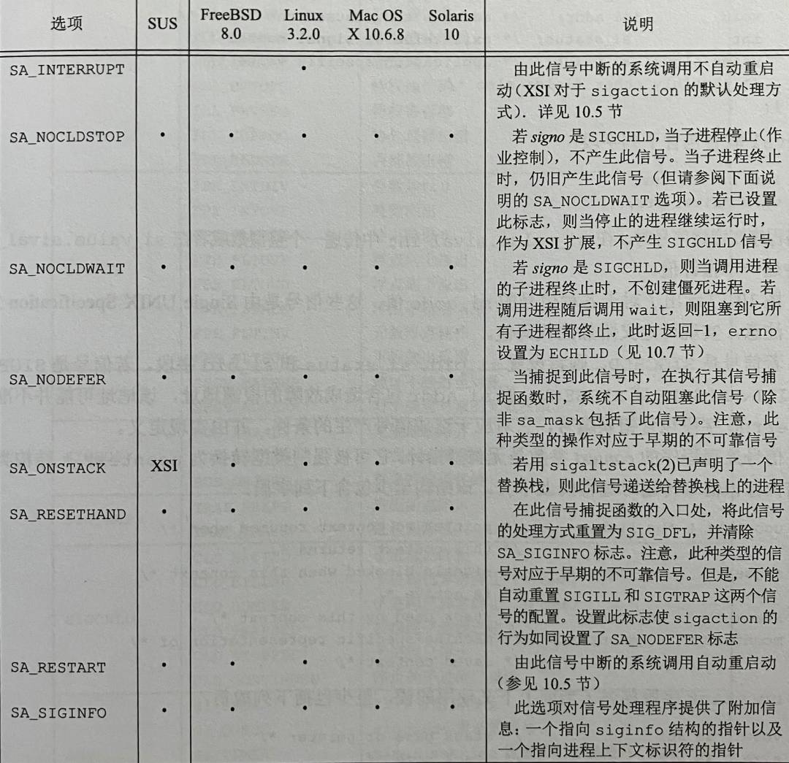

## 10.1 引言

信号是软中断。信号提供了一种处理异步事件的方法。

## 10.2 信号概念

- 信号名字都以3个字符 `SIG` 开头。

- 在头文件 `<signal.h>` 中，信号名都被定义为**正整数常量（信号编号）**。

- 不存在编号为0的信号。

- 信号的处理：
  1. 忽略此信号。SIGKILL 和 SIGSTOP 不能被忽略，原因：它们向内核和超级用户提供了使进程终止或停止的可靠方法。
  2. 捕捉信号。不能捕捉 SIGKILL 和 SIGSTOP 信号。
  3. 执行系统默认动作。[见图10-1](10-1.jpg)

> kill 命令默认发送 SIGTERM 终止信号。查看所有信号：

```
$ kill -l
 1) SIGHUP       2) SIGINT       3) SIGQUIT      4) SIGILL       5) SIGTRAP
 6) SIGABRT      7) SIGBUS       8) SIGFPE       9) SIGKILL     10) SIGUSR1
11) SIGSEGV     12) SIGUSR2     13) SIGPIPE     14) SIGALRM     15) SIGTERM
...
```

使用 kill 命令给进程发送指定信号：

```
$ kill -9 pid
$ kill -SIGKILL pid
```

## 10.3 函数 signal

```c
#include <signal.h>

typedef void (*sighandler_t)(int);

sighandler_t signal(int signum, sighandler_t handler);

/* signal() returns the previous value of the signal handler.  
 * On failure, it returns SIG_ERR, and errno is set to indicate the error.
 */
```

sighandler_t 是函数指针类型，该函数有一个 int 型的参数，返回值为空。

signum 参数是图10-1中的信号名。handler 的值是常量 SIG_IGN，SIG_DFL 或接受到此信号后要调用的函数的地址。

signal() 返回值类型和第二参数的类型都是 sighandler_t，若成功则返回上一个 handler，失败返回 SIG_ERR。

`<signal.h>` 可能会有以下形式的声明，大多数 UNIX 系统使用以下的值：

```c
#define SIG_ERR (void (*)())-1
#define SIG_DFL (void (*)())0
#define SIG_IGN (void (*)())1
```

以下是 signal 函数简单的示例：

```c
#include "apue.h"

static void sig_usr(int);   /* one handler for both signals */

int main(void)
{
    if (signal(SIGUSR1, sig_usr) == SIG_ERR)
        err_sys("can't catch SIGUSR1");
    if (signal(SIGUSR2, sig_usr) == SIG_ERR)
        err_sys("can't catch SIGUSR2");
    for ( ; ; )
        pause();
}

static void sig_usr(int signo)  /* argument is signal number */
{
    if (signo == SIGUSR1)
        printf("received SIGUSR1\n");
    else if (signo == SIGUSR2)
        printf("received SIGUSR2\n");
    else
        err_dump("received signal %d\n", signo);
}
```

```
$ ./a.out &
[1] 27897

$ kill -SIGUSR1 27897
received SIGUSR1

$ kill -SIGUSR2 27897
received SIGUSR2

$ kill -SIGTERM 27897
[1]+  Terminated    ./a.out
```


**1. 程序启动**

当你在终端执行：

```
$ cc main.c &
```

shell 自动将进程 cc 对中断信号（SIGINT）和退出信号（SIGQUIT）的处理方式设置为忽略（SIG_IGN）。于是，当按下中断字符（ctrl+c）时就不会影响到后台进程。

很多捕捉这两个信号的交互程序有以下形式的代码：

```c
void sig_int(void), sig_quit(void);
if (signal(SIGINT, SIG_IGN) != SIG_IGN)
    signal(SIGINT,sig_int);
if (signal(SIGQUIT, SIG_IGN) != SIG_IGN)
    signal(SIGQUIT,sig_quit);
```

这样处理后，仅当 SIGINT 和 SIGQUIT 当前未被忽略时，进程才会捕捉它们。


**2. 进程创建**

当一个进程调用 fork 时，其子进程继承父进程的信号处理方式。


##  10.4 不可靠信号

略

## 10.5 中断的系统调用

早期 UNIX 系统的一个特性是：如果进程在执行一个低速系统调用而阻塞期间捕捉到一个信号，则该系统调用就被中断不再继续执行。该系统调用返回出错，其 errno 设置为 EINTR。

假设一个读操作被中断，我们希望重新启动它：

```c
again:
    if ((n = read(fd, buf, BUFFSIZE)) < 0)
        if (errno == EINTR)
            goto again;
    /* handle other errors*/
```

为了帮助程序不必处理中断的系统调用，4.2BSD 引进了某些自动重启的系统调用 (ioctl, read, readv, write, writev, wait, waitpid)。

> POSIX.1 要求只有中断信号的 SA_RESTART 标志有效时，实现才重启系统调用。sigaction 函数使用这个标志允许应用程序重启被中断的系统调用。

> FreeBSD8.0、Linux3.2.0、Mac OS X10.6.8中，当信号处理程序是用 signal 函数时，被中断的系统调用会重启动。


## 10.6 可重入函数

信号是异步的，它会在程序的任何地方发生。如果进程正在执行 malloc，在其堆中分配另外的存储空间，而此时由于捕捉到信号
而插入执行该信号处理程序，其中又调用 malloc，这时可能会对进程造成破坏。

可重入函数是在信号处理程序中保证调用安全的函数，被称为**异步信号安全的（async-signal safe）**。[如图10-4](10-4.jpg)

> **在信号处理程序中调用一个非可重入函数，其结果是不可预知的。**


## 10.7 SIGCLD 语义

[说说SIGCLD和SIGCHLD](https://blog.csdn.net/csxiaoshui/article/details/120234865)


## 10.8 可靠信号术语和语义

略


## 10.9 函数 kill 和 raise

kill 函数将信号发送给进程或进程组。raise 函数则允许进程向自身发送信号。

```c
#include <signal.h>
int kill(pid_t pid, int signo);
int raise(int signo);
```

`raise(signo)` 与 `kill(getpid(), signo)` 等价。

kill 的 pid 参数有以下4种情况：

```
pid >   0 : 将信号发送给进程 ID 为 pid 的进程
pid ==  0 : 将信号发送给与发送进程属于同一进程组的所有进程
pid <   0 : 将信号发送给进程组 id 为 pid 绝对值的所有进程
pid == -1 : 将信号发送给发送进程有权限向它们发送信号的所有进程
```


## 10.10 函数 alarm 和 pause

```c
#include <unistd.h>
// 返回值：0或以前设置的闹钟时间的余留秒数
unsigned int alarm(unsigned int seconds);
// 返回值：-1，errno 设置为 EINTR
int pause(void);
```

每个进程只能有一个闹钟时间，重复调用 alarm 会覆盖之前的闹钟时间，alarm(0) 会取消计时。闹钟时间到后会发送 SIGALRM 信号。

pause 函数使调用进程挂起直至捕捉到一个信号。且只有执行了一个信号处理程序并从其返回时，pause 才返回。


## 10.11 信号集

信号集（signal set）：能表示多个信号的数据类型。POSIX.1 定义数据类型 `sigset_t` 以包含一个信号集。

信号集处理函数：

```c
#include <signal.h>

// 初始化由set指向的信号集，清除其中所有信号。
int sigemptyset(sigset_t *set);
// 初始化由set指向的信号集，使其包括所有信号。
int sigfillset(sigset_t *set);

// 添加一个信号至信号集。
int sigaddset(sigset_t *set, int signum);
// 从信号集删除一个信号。 
int sigdelset(sigset_t *set, int signum);

// 测试信号是否属于信号集。
int sigismember(const sigset_t *set, int signum);
```

> 使用信号集前，要对该信号集调用 sigemptyset 或 sigfillset 一次。


## 10.12 函数 sigprocmask

每个进程都有一个信号屏蔽字（signal mask），它规定了当前要阻塞递送到该进程的信号集。对于每种可能的信号，该屏蔽字中都有一位与之对应。

```c
#include <signal.h>
// 成功返回0，出错-1
int sigprocmask(int how, const sigset_t *restrict set, sigset_t *restrict oldset);
```

若 oldset 是非空指针，则 oldset 用于保存当前的信号屏蔽字。

若 set 是非空指针，则参数 how 指示如何修改当前信号屏蔽字。

|how|说明|
|:--|:--|
|SIG_BLOCK|set 包含了希望阻塞的附加信号|
|SIG_UNBLOCK|set 包含了希望解除阻塞的信号|
|SIG_SETMASK|该进程新的信号屏蔽是 set 指向的值|

如果 set 是空指针，则不改变信号屏蔽字，how 的值也无意义。可以用 `sigprocmask(0, NULL, &oldset) < 0` 测试当前进程是否设置了屏蔽字。

在调用 sigprocmask 后，如果有任何未决的（pending）、不再阻塞的信号，则在 sigprocmask 返回之前，会至少将其中之一递送给该进程。


## 10.13 函数 sigpending

通过 set 参数返回未决的（未递送）信号集。

```c
#include <signal.h>
// 成功返回0，出错-1
int sigpending(sigset_t *set);
```

> 如果程序阻塞期间产生多个同一信号，解除阻塞后信号只递交一次（类似位图的机制，只有0|1）。


## 10.14 函数 sigaction

sigaction 函数的功能是检查或修改与指定信号相关联的处理动作。

```c
#include <signal.h>
// 成功返回0，出错-1
int sigaction(int signo, const struct sigaction *restrict act, 
                               struct sigaction *restrict oldact);
```

signo，信号编号。act，结构体指针，如下：

```c
struct sigaction {
    // 信号处理函数的地址，SIG_IGN，SIG_DFL
    void (*sa_handler)(int);
    // 调用信号处理程序时，需要阻塞的信号
    sigset_t sa_mask;
    // 信号处理选项，见下图
    int sa_flags;
    // 一个替代的信号处理程序，需在 sa_flags 中启用 SA_SIGINFO
    void (*sa_sigaction)(int, siginfo_t *, void *);
};
```

<div align="center">
        </img>
</div>

通常，按下列方式调用信号处理程序：

```c
void handler(int signo);
```

但是，如果设置了 SA_SIGINFO 标志，那么按下列方式调用信号处理程序：

```c
void handler(int signo, siginfo_t *info, void *context);
```

info 结构体指针包含了信号产生原因的有关信息。

context 是无类型指针，可强制转换为　ucontext_t 结构类型，包含信号传递时进程上下文内容。


## 10.15 函数 sigsetjmp 和 siglongjmp

```c
#include <setjmp.h>

// 返回值：直接调用返回0；若从 siglongjmp 调用返回，则返回非0 （val）。
int sigsetjmp(sigjmp_buf env, int savemask);
void siglongjmp(sigjmp_buf env, int val);
```

这两个函数类似 `setjmp` 和 `longjmp`，只多了一个 `savemask` 参数。若 `savemask` 非0，则调用 `sigsetjmp` 时会保存当前信号屏蔽字至 `env`，在调用 `siglongjmp` 后恢复保存的屏蔽字。

> 当调用一个信号处理程序时，被捕捉到的信号会添加到信号屏蔽字中（执行信号处理程序时屏蔽该信号），返回时恢复原来的屏蔽字。相关：10.14 节 SA_NODEFER 选项


## 10.16 函数 sigsuspend

```c
#include <signal.h>

// 返回值：只返回-1，并设置 errno（通常是 EINTR）
int sigsuspend(const sigset_t *sigmask);
```

调用时挂起进程，信号屏蔽字设置为 sigmask 指向的值，捕捉到信号后返回，并恢复调用前的屏蔽字。


## 10.17 函数 abort

此函数将 SIGABRT 信号发送给调用进程，使程序异常终止。

```c
#include <stdlib.h>

void abort(void);
```

SIGABRT 信号默认动作是 `终止+core`

SIGABRT 信号不能被忽略，即使用了信号屏蔽字。因为 abort 函数内部的实现已确保该信号不可被忽略和屏蔽。

SIGABRT 信号如果被注册了一个信号处理函数例如 handler_abrt ，当调用 abort 函数，进程捕获到 SIGABRT 信号后，先执行 handler_abrt 函数，若 handler_abrt 没有终止自己，返回 abort 函数后，abort 函数内部将 SIGABRT 改为默认动作，然后重新发送 SIGABRT 信号，进程终止。


## 10.18 函数 system

system 在第8章有提到不再赘述，书中这里讲的是 system 函数 POSIX.1 的实现。


## 10.19 函数 sleep、nanosleep 和 clock\_nanosleep

```c
#include <unistd.h>
// 返回值：0 或 未休眠完的秒数
unsigned int sleep(unsigned int seconds);
```

注意：sleep 计时并不精准，会被信号处理程序打断(直接返回了)。

nanosleep 提供了纳秒级的精度。clock_nanosleep 相对于特定时钟的延迟。

```c
#include <time.h>
// 返回值：若休眠到要求时间，返回0；若出错，返回-1
int nanosleep(const struct timespec *req, struct timespec *_Nullable rem);

// 返回值：若休眠到要求时间，返回0；若出错，返回错误码
int clock_nanosleep(clockid_t clockid, int flags,
                           const struct timespec *request,
                           struct timespec *_Nullable remain);
```


## 10.20 函数 sigqueue

[转自csdn：sigqueue 函数](https://blog.csdn.net/Scroll_C/article/details/123671969)


## 10.21 作业控制信号

POSIX.1 认为有以下6中信号与作业控制有关：

- SIGCHLD 子进程已停止或终止
- SIGCONT 如果进程已停止，则使其继续运行
- SIGSTOP 停止信号（不能被捕捉或忽略）
- SIGTSTP 交互式停止信号（Ctrl+z）
- SIGTTIN 后台进程组成员读控制终端
- SIGTTOU 后台进程组成员写控制终端
