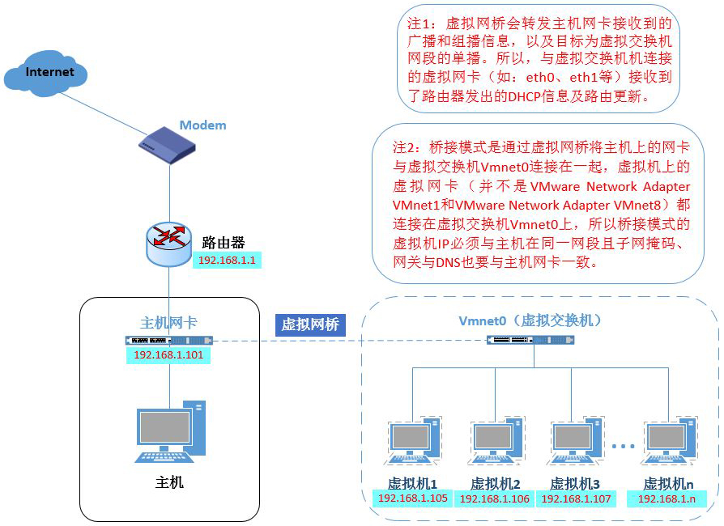
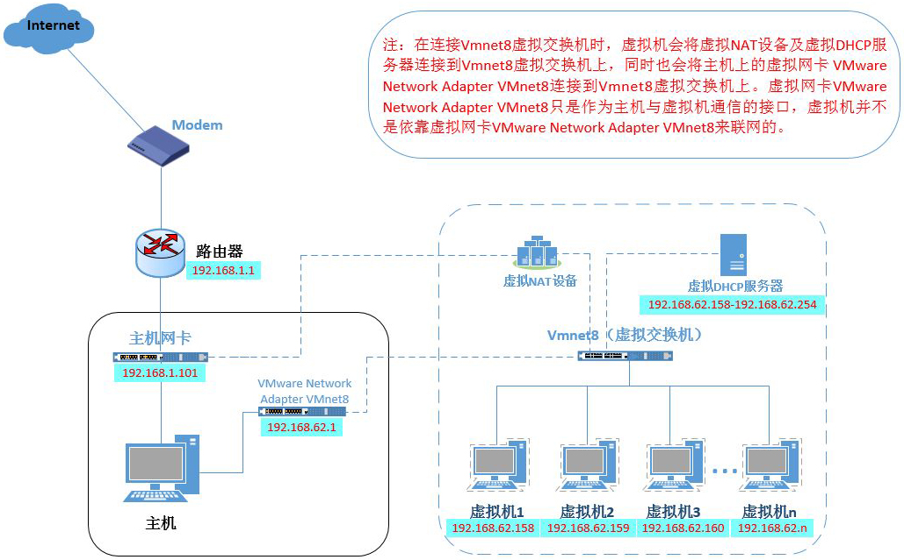
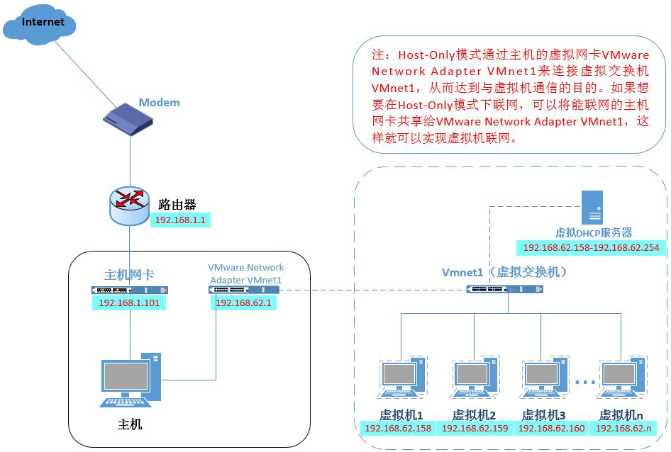

- 参考资料：
  - [vmware中nat、bridge、host-only的区别](https://yyleeshine.gitee.io/2020/06/19/vmware%E4%B8%ADnat%E3%80%81bridge%E3%80%81host-only%E7%9A%84%E5%8C%BA%E5%88%AB/#%E4%B8%80%E3%80%81%E6%A1%A5%E6%8E%A5%E6%A8%A1%E5%BC%8F%EF%BC%88bridge%EF%BC%89)
  - ["Bridged, NAT, Host-only or Custom" VMWare](https://www.centennialsoftwaresolutions.com/post/bridged-nat-host-only-or-custom-vmware)

## Bridge

    </img>

## NAT

    </img>

- 虚拟NAT+虚拟DHCP服务器的功能相当于路由器
- 虚拟机通过虚拟NAT设备联网

## Host-only

    </img>

