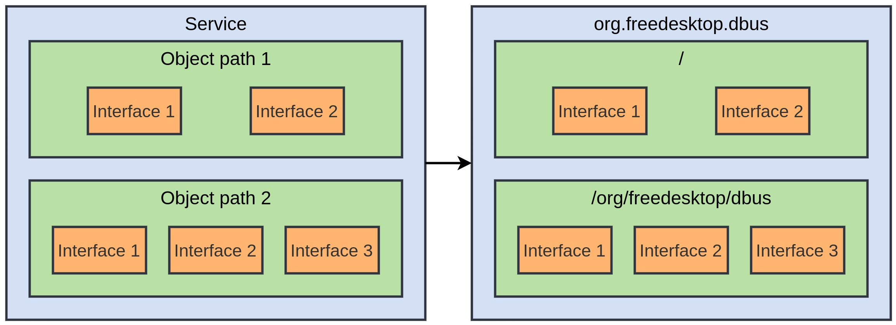
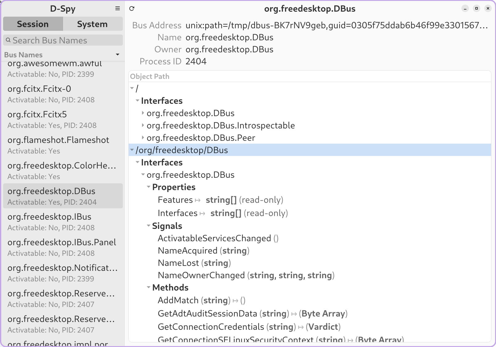
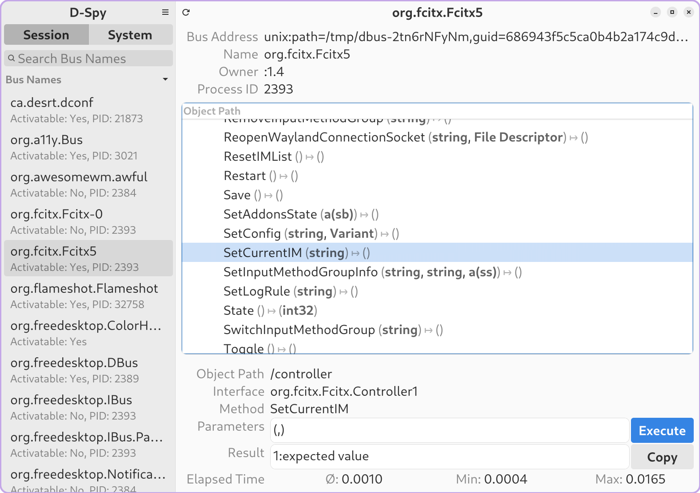

参考文章

- [Understanding D-Bus](https://bootlin.com/pub/conferences/2016/meetup/dbus/josserand-dbus-meetup.pdf)
- [dbus-specification](https://dbus.freedesktop.org/doc/dbus-specification.html)
- [dbus-tutorial](https://dbus.freedesktop.org/doc/dbus-tutorial.html)

## 基本概念

D-Bus（Desktop Bus）是一种进程间通信（IPC，Inter-Process Communication）机制

**系统总线（System Bus）**：用于系统级服务，如硬件事件等

**会话总线（Session Bus）**：用于用户会话中的应用程序通信

**libdbus**： 最底层实现的 API 库，只能用于两个程序交互消息

**dbus-daemon**：基于 libdbus 的守护进程，用于处理多个程序之间的消息路由，不同总线有独立的守护进程


## 总线地址

D-Bus 通过 Unix 域套接字传递消息，地址格式：`unix:path=/path/to/socket`

**系统总线地址**：`unix:path=/var/run/dbus/system_bus_socket`

**会话总线地址**：`echo $DBUS_SESSION_BUS_ADDRESS`


## 类型代码

D-Bus 消息体中包含的数据通过 `类型代码` 描述其类型：

<div align="left">
    </img>
</div>


示例：

- `is` 表示消息体包含一个 `int32` 和一个 `string`
- `a{sv}` 表示消息体包含一个字典数组，键为 `string`，值为 `variant`

`variant` 是动态类型，相当于一个容器，可以存储任何类型的值，当类型不确定时，使用 `variant` 表示


## D-Bus 服务程序

一个提供接口服务的 D-Bus service 组成如下：

<div align="left">
    </img>
</div>

<div align="left">
    </img>
</div>

### Service

当进程连接到 D-Bus 时，D-Bus 会分配一个唯一的连接名称如 `:1.40` （以冒号开头）
，server 进程可以注册一个 well-know 名称如 `org.freedesktop.dbus`（反向域名的形式），
类似使用域名解析 IP 地址，这样 client 进程就可以通过这个 well-know 名称连接到 D-Bus 与 server 进程通信

### Object path

对象路径：类似于文件路径，如 `/org/freedesktop/DBus`

对象路径包含接口，比如标准接口：
- `org.freedesktop.DBus.Introspectable`：查询对象的信息（接口、方法和实现的信号）
- `org.freedesktop.DBus.Peer`：提供了解连接是否建立的方法（ping）
- `org.freedesktop.DBus.Properties`：提供方法和信号来处理属性


### Interface

接口包含以下成员：

- **Properties**：属性有名称和值，可读写
- **Methods**：就是函数调用
- **Signals**：信号被触发时，消息会发送给所有注册过该信号的客户端，不需要客户端回应消息

## Policy 文件

Policy 文件位于 `/etc/dbus-1/system.d/` 和 `/etc/dbus-1/session.d/` 目录中

Policy 文件通过 XML 格式定义谁可以访问系统或会话总线上的服务、接口和方法。
通过 `<allow>` 和 `<deny>` 元素控制访问权限，例如：

```xml
<!DOCTYPE busconfig PUBLIC "-//freedesktop//DTD D-BUS Bus Configuration 1.0//EN"
 "http://www.freedesktop.org/standards/dbus/1.0/busconfig.dtd">
<busconfig>
  <policy user="alice">
    <allow send_destination="com.example.Service"/>
    <allow receive_sender="com.example.Service"/>
  </policy>
</busconfig>
```

主要元素：

- `<policy>`：定义策略的主体。可以针对特定用户、用户组或默认策略
  - `context="default"`：默认策略
  - `user="username"`：针对特定用户的策略
  - `group="groupname"`：针对特定用户组的策略
  - `context="mandatory"`：强制策略，优先级最高

- `<allow>`: 允许某些操作
  - `send_destination="com.example.Service"`：允许发送消息到指定的服务
  - `send_interface="com.example.Interface"`：允许发送消息到指定的接口
  - `send_member="MethodName"`：允许调用指定的方法
  - `send_type="method_call"`：允许发送方法调用
  - `receive_sender="com.example.Service"`：允许接收来自指定服务的消息
  - `own="com.example.Service"`：允许拥有指定的服务名称

- `<deny>`：拒绝某些操作，属性与 `<allow>` 相同


## D-Bus 调试

### d-spy

<div align="left">
    </img>
</div>

### dbus-send

<div align="left">
    </img>
</div>

其中参数的表示方法如下：

```bash
# <类型>:<值> , 多个值用空格分隔
string:"pingyin" int32:100
# variant:<类型>:<值>，一个 int32 数组类型的 variant，值为 [1, 2, 3]
variant:array:int32:[1, 2, 3]

```

列出所有可用的 D-Bus 服务：

```bash
dbus-send --session --print-reply \
    --dest=org.freedesktop.DBus \
    /org/freedesktop/DBus \
    org.freedesktop.DBus.ListActivatableNames
```

大多数 D-Bus 服务会从根 `/` 开始注册对象，
使用标准接口 `org.freedesktop.DBus.Introspectable` 的 `Introspect` 方法获取 `/` 对象的信息： 

```bash
dbus-send --session --print-reply \
    --dest=org.freedesktop.DBus \
    / \
    org.freedesktop.DBus.Introspectable.Introspect
```


### gdbus


```bash
# 查看对象
gdbus introspect --session --dest org.fcitx.Fcitx5 --object-path /
# 递归查看
gdbus introspect --session --dest org.fcitx.Fcitx5 --object-path / --recurse
# 调用方法
gdbus call --session --dest org.fcitx.Fcitx5 --object-path /controller --method org.fcitx.Fcitx.Controller1.SetCurrentIM "pinyin"
# 监控信号
gdbus monitor --session --dest org.fcitx.Fcitx5
```


### dbus-monitor

```bash
dbus-monitor --system
dbus-monitor --session
dbus-monitor "interface='org.fcitx.Fcitx.Controller1'"
```

## GDBus 编程示例

GDBus 是 GLib 附带的 GIO 库为 D-Bus 提供的高级 API

下例程序调用 `CurrentInputMethod` 方法查询 Fcitx5 的当前输入法：

```c
#include <glib.h>
#include <gio/gio.h>

int main(int argc, char *argv[]) {
    GDBusConnection *connection;
    GError *error = NULL;
    GVariant *result;

    // 连接到会话总线
    connection = g_bus_get_sync(G_BUS_TYPE_SESSION, NULL, &error);
    if (error != NULL) {
        g_printerr("Failed to connect to D-Bus: %s\n", error->message);
        g_error_free(error);
        return 1;
    }

    // 调用方法
    result = g_dbus_connection_call_sync(connection,
                                         "org.fcitx.Fcitx5",
                                         "/controller",
                                         "org.fcitx.Fcitx.Controller1",
                                         "CurrentInputMethod",
                                         NULL,
                                         NULL,
                                         G_DBUS_CALL_FLAGS_NONE,
                                         -1,
                                         NULL,
                                         &error);

    if (error != NULL) {
        g_printerr("Failed to call method: %s\n", error->message);
        g_error_free(error);
        return 1;
    }

    // 打印方法调用结果
    const gchar *response;
    g_variant_get(result, "(&s)", &response);
    g_print("Method call result: %s\n", response);
    g_variant_unref(result);

    // 清理
    g_object_unref(connection);

    return 0;
}
```

编译并运行：

```bash-session
$ gcc `pkg-config --cflags --libs gio-2.0` client.c -o client
$ ./client
Method call result: keyboard-us
```
