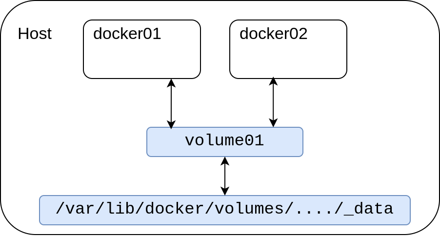

## 挂载数据卷
指定路径挂载

```shell
$ docker run -it -v <宿主机路径>:<容器内路径> nginx
```

具名挂载，主机路径 `/var/lib/docker/volumes/<卷名>/_data`

```shell
$ docker run -it -v <卷名>:<容器内路径> nginx
```

匿名挂载，主机路径 `/var/lib/docker/volumes/<一串随机字符>/_data`

```shell
$ docker run -it -v <容器内路径> nginx
```

## 查看数据卷
列出数据卷
```shell
$ docker volume ls
```

```bash
DRIVER    VOLUME NAME
local     0b60738f27c8adc38559981ad727d36a722b70b1736b20d8f3020ffc88d202b2
local     21f61aa404a0fe9c15a6a6ad4a6a056a0ee009a98af593c2092a14062fa7c02e
local     test

# 上面两个是匿名挂载
# test是具名挂载
```

查看卷详情

```shell
$ docker volume inspect <卷名>
```

```
[
    {
        "CreatedAt": "2022-01-24T17:08:58+08:00",
        "Driver": "local",
        "Labels": null,
        "Mountpoint": "/var/lib/docker/volumes/test/_data",
        "Name": "test",
        "Options": null,
        "Scope": "local"
    }
]
```

## 读写权限

`ro` 只读，容器对该数据卷只读

```shell
$ docker run -d -v /home/nginx:/etc/nginx:ro nginx
```

`rw` 读写，容器对该数据卷可读写

```shell
$ docker run -d -v /home/nginx:/etc/nginx:rw nginx
```

## 数据卷共享

```shell
$ docker run -it --name docker01 -v volume01 ubuntu bash
$ docker run -it --name docker02 --volume-from docker01 ubuntu bash
```

上面的命令中 `docker02` 与 `docker01` 共享 `volume01` ，用到参数 `--volume-from` 。

我们来查看下两个容器数据卷的关系

```shell
$ docker inspect docker01 docker02 | grep volume
```

```
"Type": "volume",
"Source": "/var/lib/docker/volumes/505a478d050df91857b156119a9d83626614ffb3962d1ac3459d14756c5544dc/_data",
"Destination": "volume01",
"volume01": {}
"Type": "volume",
"Source": "/var/lib/docker/volumes/505a478d050df91857b156119a9d83626614ffb3962d1ac3459d14756c5544dc/_data",
"Destination": "volume01",
"volume01": {}
```

可以看到两个容器匿名挂载的宿主机路径是一样的

<div align="center">
    </img>
</div>

