参考文章

- [EBUILD](https://devmanual.gentoo.org/eclass-reference/ebuild/)
- [Ebuild Writing](https://devmanual.gentoo.org/ebuild-writing/index.html)
- [Gentoo Devmanual](https://devmanual.gentoo.org/)
- [How to Create an ebuild on Gentoo](https://terminalroot.com/how-to-create-an-ebuild-on-gentoo/)
- [/etc/portage](https://wiki.gentoo.org/wiki//etc/portage)
- [Binary package guide](https://wiki.gentoo.org/wiki/Binary_package_guide)


## 编写 ebuild

### ebuild 是什么

ebuild 是在特殊环境中执行的 bash 脚本

### ebuild 文件命名

```text
libfoo-1.2.5b_pre5-r2.ebuild
[----][-----][---][-]
   │     │     │   │
   │     │     │   └───> 4. 修订号，-r2 表示第二个修订版
   │     │     └───────> 3. 后缀
   │     └─────────────> 2. 版本号
   └───────────────────> 1. 包名
```

|后缀|说明|
|:--|:--|
|\_alpha|软件开发最初期的版本|
|\_beta|测试版|
|\_pre|预发布|
|\_rc|候选发布|
|无后缀|正常发布|
|\_p|补丁发布|

### ebuild 示例

```bash
# Copyright 1999-2024 Gentoo Authors
# Distributed under the terms of the GNU General Public License v2

EAPI=8

# eclass
inherit autotools

# 变量 
DESCRIPTION="This is a sample skeleton ebuild file"
HOMEPAGE="https://foo.example.org/"
SRC_URI="ftp://foo.example.org/${P}.tar.gz"
LICENSE="GPL-2+"
SLOT="0"
KEYWORDS="~amd64 x86"
IUSE="gnome +gtk"

# 依赖
RDEPEND=""
DEPEND="${RDEPEND}"
BDEPEND="virtual/pkgconfig"

# 函数
src_configure() {
    ./configure --prefix=${EPREFIX}/usr
}

src_compile() {
    emake
}

src_install() {
    emake DESTDIR="${D}" install
}
```

- ebuild 中缩进必须使用 `tab`，每行末尾不要留空格

- ebuild 模板路径：`/var/db/repos/gentoo/skel.ebuild`

### eclasses

`eclass` 是在 ebuild 之间共享的函数或功能的集合（库），使用 `inherit` 调用 `eclass`，
`inherit` 语句必须位于 ebuild 的顶部，在所有函数之前

```bash
EAPI=8
inherit autotools bash-completion-r1 flag-o-matic
```

可用的 `eclass` 见：[Eclass reference](https://devmanual.gentoo.org/eclass-reference/index.html)

### 变量

<div class="table-container">

|用户定义的变量|说明|
|:--|:--|
|`EAPI`            | 告诉 ebuild 使用哪个版本的 EAPI 语法规则|
|`DESCRIPTION`     | 软件包及其用途的简短描述|
|`HOMEPAGE`        | 软件包官网主页|
|`SRC_URI`         | 软件包的下载链接|
|`LICENSE`         | 软件包许可证|
|`SLOT`            | 同一软件可以安装多少个不同版本，如果不使用就声明为 0|
|`KEYWORDS`        | 软件包可以安装的平台，~keyword 表示软件包没有经过广泛测试|
|`IUSE`            | 可用的 use 标志，+use 表示默认启用|
|`REQUIRED_USE`    | USE 标志的配置必须满足的断言列表，才能对此 ebuild 有效|
|`PROPERTIES`      | 以空格分隔的属性列表，支持条件语法|
|`RESTRICT`        | 要限制的 Portage 功能的空格分隔列表，参考[man Ebuild](https://devmanual.gentoo.org/eclass-reference/ebuild/) 中 `RESTRICT` 一节|
|`DEPEND`          | 软件包的 build 依赖项列表，仅适用于 CHOST，参考 [Dependencies](https://devmanual.gentoo.org/general-concepts/dependencies/index.html)|
|`RDEPEND`         | 运行时需要的依赖，即需要这些依赖软件才能正常运行|
|`DEPEND`          | 构建时依赖的库或头文件|
|`BDEPEND`         | 构建时依赖的可执行程序|
|`S`               | 解压后源码所在路径，默认 `${WORKDIR}/${P}`|
|`DOCS`            | 使用 `dodoc` 安装的默认 `src_install` 函数的文档文件的数组或以空格分隔的列表|

</div>


<div class="table-container">

|预定义的只读变量|说明|
|:--|:--|
|`P`              | 包名和版本号，如 vim-6.3|
|`PN`             | 包名，如 vim|
|`PV`             | 版本号，如 6.3|
|`PVR`            | 版本号和修订版本，如 6.3-r2|
|`PF`             | 完整的文件名，即不含 .ebuild 后缀的部分，如 vim-6.3-r2|
|`A`              | 包的所有源文件，即 ebuild 下载的文件|
|`CATEGORY`       | 类目名，如 app-shells|
|`FILESDIR`       | 路径 `${PORTAGE_BUILDDIR}/files`，通常存放小补丁和其他文件|
|`WORKDIR`        | 路径 `${PORTAGE_BUILDDIR}/work`|
|`T`              | 路径 `${PORTAGE_BUILDDIR}/temp`|
|`D`              | 路径 `${PORTAGE_BUILDDIR}/image`|
|`HOME`           | 路径 `${PORTAGE_BUILDDIR}/homedir`|
|`ROOT`           | 要将 `${D}` 下的文件合并到的根目录的绝对路径，一般就是系统的根路径 `/`，仅允许在 `pkg_*` 阶段进行|
|`DISTDIR`        | 下载的文件所在路径 `${PORTAGE_BUILDDIR}/distdir`|
|`EPREFIX`        | 偏移安装目录，例如 `--prefix=${EPREFIX}/usr`|
|`ED`             | 路径 `${D%/}${EPREFIX}/` |
|`EROOT`          | 路径 `${ROOT%/}${EPREFIX}/`|

</div>

`PORTAGE_BUILDDIR` 应该是 `${PORTAGE_TMPDIR}/portage/${CATEGORY}/${PF}`

更多参考：[Variables](https://devmanual.gentoo.org/ebuild-writing/variables/index.html)

### SRC\_URI

#### 条件源

```bash
SRC_URI="https://example.com/files/${P}-core.tar.bz2
	x86?   ( https://example.com/files/${P}/${P}-sse-asm.tar.bz2 )
	ppc?   ( https://example.com/files/${P}/${P}-vmx-asm.tar.bz2 )
	sparc? ( https://example.com/files/${P}/${P}-vis-asm.tar.bz2 )
	doc?   ( https://example.com/files/${P}/${P}-docs.tar.bz2 )"
```

#### 重命名源

使用 `->` 重命名文件：

```bash
SRC_URI="https://example.com/files/${PV}.tar.gz -> ${P}.tar.gz"
```

### REQUIRED\_USE

必须满足 `REQUIRED_USE` 中的这些 USE 条件，此 ebuild 才有效

```bash
REQUIRED_USE="foo? ( !bar )"
```

### 依赖

```shell
# 版本依赖
DEPEND="~app-misc/foo-1.23"    # 等于 1.23 或任何 1.23-r* 版本
DEPEND="=app-misc/foo-1.23"    # 严格等于 1.23 版本，如果可以的话最好用 ~ 替代

# 范围依赖
DEPEND="=app-misc/foo-2*"      # 指定软件包的 2.x 版本，使用 * 后缀；注意，等号是必需的，星号前面没有点

# 阻断器
RDEPEND="!app-misc/foo"        # 弱阻断，当两个软件包无法同时安装，只在 RDEPEND 中有效
RDEPEND="!!app-misc/foo"       # 强阻断，当两个软件包无法同时安装，只在 RDEPEND 中有效

# SLOT 依赖
DEPEND="=app-misc/foo-1.2.3:="      # 表示任何 slot 都可以接受，slot 或 sub-slot 变更则 rebuild
DEPEND="=app-misc/foo-1.2.3:*"      # 表示任何 slot 都可以接受，忽略 slot 或 sub-slot 变更
DEPEND="=app-misc/foo-1.2.3:5="     # 表示只接受 slot 5，sub-slot 变更则 rebuild
DEPEND="=app-misc/foo-1.2.3:5"      # 表示只接受 slot 5，忽略 sub-slot 变更
DEPEND="=app-misc/foo-1.2.3:5/1"    # 表示只接受 slot 5，sub-slot 1

# USE 条件依赖
RDEPEND="gtk? ( app-misc/foo )"     # 当 gtk 启用时，依赖 foo 这个包

# 多个依赖中的任意一个
DEPEND="|| ( app-misc/foo app-misc/bar )"               # 依赖 foo 或 bar
DEPEND="baz? ( || ( app-misc/foo app-misc/bar ) )"      # 如果 baz 启用，则依赖 foo 或 bar
```

参考：[Dependencies](https://devmanual.gentoo.org/general-concepts/dependencies/index.html)

### 函数

ebuild 构建时会按下图顺序调用函数

<div align="left">
    </img>
</div>

> 个人理解：如果是基于 autotools 的标准 tar 包，
> ebuild 按顺序调用这些函数能自动完成解压、编译、安装。
> 如果你需要在某一阶段做特定的操作或软件包使用 cmake、ninja 等其他构建工具，则需手动编写对应的函数。

<div class="table-container">

|||
|:--|:--|
|[pkg\_pretend](https://devmanual.gentoo.org/ebuild-writing/functions/pkg_pretend/index.html)|计算依赖及包的健全性检查|
|[pkg\_nofetch](https://devmanual.gentoo.org/ebuild-writing/functions/pkg_nofetch/index.html)|文件下载失败的处理|
|[pkg\_setup](https://devmanual.gentoo.org/ebuild-writing/functions/pkg_setup/index.html)|预构建环境配置和检查|
|[src\_unpack](https://devmanual.gentoo.org/ebuild-writing/functions/src_unpack/index.html)|解压源码包，ebuild 提供 unpack 函数自动识别并解压各种格式的包，不要使用 tar 等命令|
|[src\_prepare](https://devmanual.gentoo.org/ebuild-writing/functions/src_prepare/index.html)|为源码打补丁或其它必要的修改|
|[src\_configure](https://devmanual.gentoo.org/ebuild-writing/functions/src_configure/index.html)|配置包，如执行 ./configure|
|[src\_compile](https://devmanual.gentoo.org/ebuild-writing/functions/src_compile/index.html)|编译|
|[src\_test](https://devmanual.gentoo.org/ebuild-writing/functions/src_test/index.html)|运行预安装测试脚本（如果源码包有测试套件）|
|[src\_install](https://devmanual.gentoo.org/ebuild-writing/functions/src_install/index.html)|将包安装到 `${D}` ，即 `${PORTAGE_BUILDDIR}/image` 目录，例如 `emake DESTDIR="${D}" install`|
|[pkg\_preinst](https://devmanual.gentoo.org/ebuild-writing/functions/pkg_preinst/index.html)|在将 image 目录下的文件安装到 `${ROOT}` 之前调用，例如修改特定的安装文件|
|[pkg\_postinst](https://devmanual.gentoo.org/ebuild-writing/functions/pkg_postinst/index.html)|在文件安装到 `${ROOT}` 后调用，例如显示安装后的信息性消息或警告|
|[pkg\_prerm](https://devmanual.gentoo.org/ebuild-writing/functions/pkg_prerm/index.html)|在软件包 unmerge 前调用|
|[pkg\_postrm](https://devmanual.gentoo.org/ebuild-writing/functions/pkg_postrm/index.html)|在软件包 unmerge 后调用，用于在卸载包后更新符号链接、缓存文件和其他生成的内容|
|[pkg\_config](https://devmanual.gentoo.org/ebuild-writing/functions/pkg_config/index.html)|软件包安装后的配置，需要手动调用，例如 mysql 安装后初始化配置 `emerge --config dev-db/mysql`|
|[pkg\_info](https://devmanual.gentoo.org/ebuild-writing/functions/pkg_info/index.html)|显示软件包的信息时调用|

</div>

参考：[Ebuild phase functions](https://devmanual.gentoo.org/ebuild-writing/functions/index.html)

更多函数参考：[Function reference](https://devmanual.gentoo.org/function-reference/index.html)

### 临时目录

`PORTAGE_TMPDIR` 目录在 `make.conf` 中设置，例如 `PORTAGE_TMPDIR="/tmp"`

```text
<PORTAGE_TMPDIR>
└── portage
    └── <CATEGORY>
        └── <PF>
             ├── build-info
             ├── distdir
             ├── files
             ├── work
             └── ...
```


以 `zsh` 为例，构建时的临时目录结构如下：

```text
/tmp
└── portage
    └── app-shells
        └── zsh-5.9-r6
            ├── build-info
            │   ├── ...
            │   └── zsh-5.9-r6.ebuild
            ├── distdir
            │   └── zsh-5.9.tar.xz -> /var/cache/distfiles/zsh-5.9.tar.xz
            ├── empty/
            ├── files -> /var/db/repos/gentoo/app-shells/zsh/files
            ├── homedir/
            ├── image
            │   ├── bin
            │   │   ├── zsh
            │   │   └── zsh-5.9
            │   ├── etc
            │   │   └── zsh
            │   └── usr
            │       ├── include
            │       ├── lib64
            │       └── share
            ├── temp
            │   ├── ...
            │   └── build.log
            └── work
                └── zsh-5.9
                    ├── configure
                    ├── Makefile
                    ├── ...
                    └── Src
```

- ebuild 下载的文件存放在 `/var/cache/distfiles` 目录，然后链接到 `distdir` 目录下

- `src_unpack` 解压软件包到 `${WORKDIR}` 目录，即 `work` 目录

- `src_configure`、`src_compile` 在 `${s}` = `${WORKDIR}/${P}` 目录，即 `work/zsh-5.9` 中配置、编译程序

- `src_install` 将文件临时安装到 `${D}`，即 `image` 目录 

- 最后 ebuild 将 `image` 下的文件合并到系统的 `${ROOT}` 路径上，完成安装


### USE 条件判断

```bash
if use gtk ; then
    ...
end

if ! use gtk ; then
    ...
end

use gtk && echo "it's and"
use gtk || echo "it's or"
```

参考：[USE flag conditional code](https://devmanual.gentoo.org/ebuild-writing/use-conditional-code/index.html)

### 错误处理

```bash
# die 函数：打印信息并终止运行
make || die "make failed"

# 管道 | 只返回最后一条命令的执行是否错误，
# 简单的条件测试和 $? 无法检测最后命令之前的内容是否出错，
# 所以 bash 提供 PIPESTATUS 变量供检测
bunzip2 "${DISTDIR}/${VIM_RUNTIME_SNAP}" | tar xf
# assert 函数：检测 ${PIPESTATUS} 变量，报告错误并终止运行
assert
```

参考：[Error handling](https://devmanual.gentoo.org/ebuild-writing/error-handling/index.html)

### 创建用户和组

- 创建用户的 ebuild 存放在 `acct-user` 目录，用户名和包名相同

- 创建用户组的 ebuild 存放在 `acct-group` 目录，组名和包名相同

- ebuild 通过调用 `acct-user` 和 `acct-group` 的 `eclass` 创建用户和组

以下是创建 docker 用户组的 ebuild `/var/db/repos/gentoo/acct-group/docker/docker-0-r3.ebuild`：

```bash
# Copyright 1999-2024 Gentoo Authors
# Distributed under the terms of the GNU General Public License v2

EAPI=8

inherit acct-group

ACCT_GROUP_ID=48
```

参考：[Users and groups](https://devmanual.gentoo.org/ebuild-writing/users-and-groups/index.html)

### 消息

```bash
pkg_postinst() {
    elog "You will need to set up your /etc/foo/foo.conf file before"
    elog "running foo for the first time. For details, please see the"
    elog "foo.conf(5) manual page."
}

```

`elog` ： 消息将以绿色星号为前缀打印

`einfo`：信息性消息，以绿色星号为前缀，不会输出到日志

`ewarn`：警告消息，显示黄色星号

`eerror`：错误消息，显示红色星号，该函数后面通常跟一个 `die` 函数

参考：[Messages](https://devmanual.gentoo.org/ebuild-writing/messages/index.html)


## ebuild 仓库

```text
/var/db/repos                       -----> 仓库默认存放路径
└── gentoo                          -----> 仓库目录
    ├── app-misc                    -----> 类目
    │   └── foo                     -----> 包名
    │       ├── foo-1.2.3.ebuild    -----> ebuild 文件
    │       ├── Manifest            -----> 记录了当前目录下各个文件的校验和
    │       ├── metadata.xml        -----> 记录了软件包的一些描述信息
    │       └── files               -----> 存放 ebuild 构建时额外所需的文件
    │           └── foo-1.2.3.patch
    ├── ...
    ├── metadata
    │   └── layout.conf             -----> 仓库配置文件
    └── profiles
        ├── repo_name               -----> 仓库名称
        ├── package.mask            -----> 屏蔽的包
        └── license_groups
```

参考：[Repository format](https://wiki.gentoo.org/wiki/Repository_format)


### 创建本地仓库

#### 手动创建

创建仓库目录：

```bash-session
# mkdir -p /var/db/repos/localrepo/{metadata,profiles}
# chown -R portage:portage /var/db/repos/localrepo
```

配置仓库名称：

```bash-session
# echo 'localrepo' > /var/db/repos/localrepo/profiles/repo_name
```
定义仓库中配置文件的 `EAPI` 版本：

```bash-session
# echo '8' > /var/db/repos/localrepo/profiles/eapi
```

配置仓库：

```bash-session
# vim /var/db/repos/localrepo/metadata/layout.conf
```

```bash
# 告诉 portage gentoo 是主仓库
masters = gentoo
# 本地仓库不用自动同步
auto-sync = false
thin-manifests = true
sign-manifests = false
```

添加仓库到 portage：

```bash-session
# vim /etc/portage/repos.conf/localrepo.conf
```

```bash
[localrepo]
location = /var/db/repos/localrepo
```

#### 可选：使用 eselect 创建仓库

需安装 `app-eselect/eselect-repository` 这个模块：

```bash-session
# eselect repository create testrepo
# tree /var/db/repos/testrepo
/var/db/repos/testrepo
├── metadata
│   └── layout.conf
└── profiles
    ├── eapi
    └── repo_name
# cat /etc/portage/repos.conf/eselect-repo.conf
[testrepo]
location = /var/db/repos/testrepo
```

参考：[Creating an ebuild repository](https://wiki.gentoo.org/wiki/Creating_an_ebuild_repository)、[Adding unofficial ebuilds](https://wiki.gentoo.org/wiki/Handbook:AMD64/Portage/CustomTree#Adding_unofficial_ebuilds)


### 添加 ebuild 到本地仓库

```bash-session
# mkdir -p /var/db/repos/localrepo/app-misc/hello
# vim /var/db/repos/localrepo/app-misc/hello/hello-1.0.ebuild
```
```bash
# Copyright 1999-2024 Gentoo Authors
# Distributed under the terms of the GNU General Public License v2

EAPI=8

DESCRIPTION="hello world"
HOMEPAGE="https://gitee.com/kingtuo123/gentoo-kt"
SRC_URI="https://gitee.com/kingtuo123/gentoo-kt/releases/download/1.0/hello-1.0.tar.gz"

LICENSE="GPL-2"
SLOT="0"
KEYWORDS="amd64 x86"
IUSE=""
```

该程序使用 autotools 构建，且没有依赖项等其他操作，所以无需编写函数。

生成 `hello-1.0.ebuild` 文件的校验和到 `manifest` ：

```bash-session
# ebuild hello-1.0.ebuild manifest
```

> 可选：创建 `metadata.xml`，该文件记录包的一些描述信息，参考 [Package and category metadata.xml](https://devmanual.gentoo.org/ebuild-writing/misc-files/metadata/)

安装运行：

```bash-session
# emerge -av hello::localrepo
# hello
Hello World!
```


### 创建远程仓库

```bash-session
# eselect repository create gentoo-kt
# vim /etc/portage/repos.conf/eselect-repo.conf
[gentoo-kt]
location = /var/db/repos/gentoo-kt
sync-type = git
auto-sync = false
sync-uri = https://gitee.com/kingtuo123/gentoo-kt.git

# mkdir -p /var/db/repos/gentoo-kt/app-misc/hello
# cd /var/db/repos/gentoo-kt/app-misc/hello
# vim hello-1.0.ebuild
# ebuild hello-1.0.ebuild manifest

# cd /var/db/repos/gentoo-kt
# git init
# git config user.name "kingtuo123"
# git config user.email "kingtuo123@foxmail.com"
# git branch -M master
# git remote add origin git@gitee.com:kingtuo123/gentoo-kt.git
# git add -A
# git commit -m "first commit"
# git push -f -u origin master
```

测试：

```bash-session
# rm -rf /var/db/repos/gentoo-kt

# emerge --sync -r gentoo-kt
 >> Syncing repository 'gentoo-kt' into '/var/db/repos/gentoo-kt'...
/usr/bin/git clone --depth 1 https://gitee.com/kingtuo123/gentoo-kt.git .
Cloning into '.'...
remote: Enumerating objects: 12, done.
remote: Counting objects: 100% (12/12), done.
remote: Compressing objects: 100% (7/7), done.
remote: Total 12 (delta 0), reused 0 (delta 0), pack-reused 0
Receiving objects: 100% (12/12), done.
=== Sync completed for gentoo-kt

Action: sync for repo: gentoo-kt, returned code = 0

# emerge -av hello::gentoo-kt
# hello
Hello World!
```


## ebuild 调试

指定运行到特定阶段的函数，例如执行 ebuild 到 `src_install` 阶段：

```bash-session
# ebuild hello-1.0.ebuild install
```

注意事项：

- 执行前清空 `/tmp/portage/` 下的临时目录，否则旧文件会导致奇怪的问题

- ebuild 修改后要更新 `manifest` 文件

- 多使用 `elog`、`einfo` 这些消息函数

- 通过 `${PORTAGE_BUILDDIR}/${D}` 即 `image` 下的目录结构及文件，判断是否正确安装

更多指令见 `man 1 ebuild`


## 遇到的问题

二进制包可能需要在 ebuild 中添加 `RESTRICT="binchecks"` 以跳过某些无意义的检查

参考：[Ebuild](https://devmanual.gentoo.org/eclass-reference/ebuild/) 中 `RESTRICT` 一节
