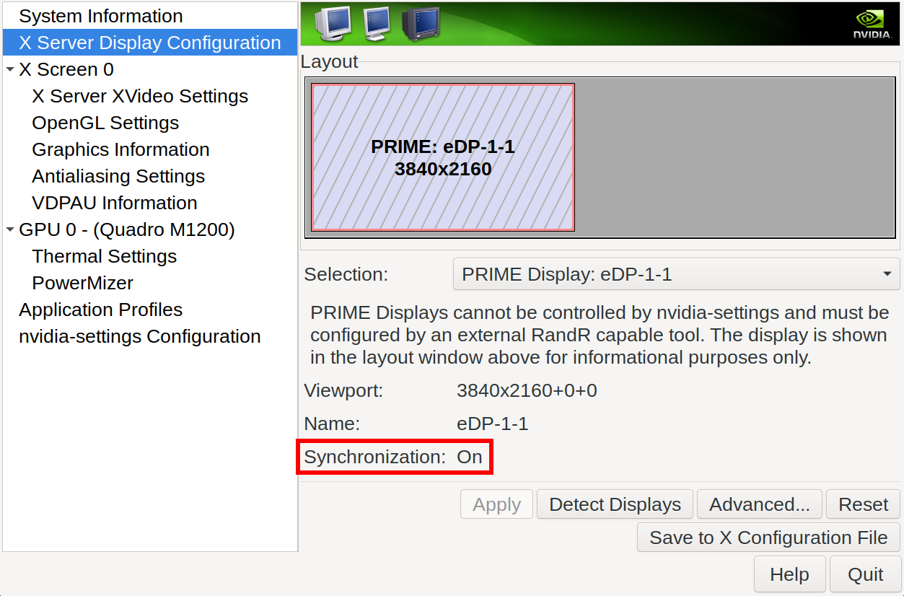

参考文章
- [NVIDIA/Optimus](https://wiki.gentoo.org/wiki/NVIDIA/Optimus)
- [NVIDIA/nvidia-drivers](https://wiki.gentoo.org/wiki/NVIDIA/nvidia-drivers)
- [NVIDIA on Linux](https://comfy.guide/client/nvidia/)
- [Nvidia Optimus (youtube)](https://www.youtube.com/watch?v=Pn2iUgW3l6w)

## 内核配置

### Enable

```text
CONFIG_MODULES
CONFIG_MTRR
CONFIG_VGA_ARB
CONFIG_ACPI_IPMI
CONFIG_AGP
CONFIG_SYSFB_SIMPLEFB
CONFIG_FB_VESA
CONFIG_FB_EFI
CONFIG_FB_SIMPLE
```

### Disable

```text 
CONFIG_FB_NVIDIA
CONFIG_FB_RIVA
CONFIG_DRM_NOUVEAU
CONFIG_DRM_SIMPLEDRM
```

## 安装 nvidia-drivers

编辑 `make.conf`，添加：

```
VIDEO_CARDS="nvidia"
```

执行：

```bash-session
# emerge -avuDN @world
```

## 开机加载模块

创建 `/etc/modules-load.d/nvidia.conf`：

```bash
nvidia-modeset
nvidia-uvm
# nvidia
# nvidia-drm
```

## 配置模块

### 方法一

编辑 `/etc/modprobe.d/nvidia.conf`，添加：

```
options nvidia-drm modeset=1
```

`nvidia.conf` 由软件包 `x11-drivers/nvidia-drivers` 安装


### 方法二

编辑 `/etc/default/grub`，添加启动参数：

```
GRUB_CMDLINE_LINUX_DEFAULT="nvidia-drm.modeset=1"
```

然后执行：

```bash-session
# grub-mkconfig -o /boot/grub/grub.cfg
```

## 自动生成 Xorg.conf 配置

```bash-session
# nvidia-xconfig --prime
```

文件路径在 `/etc/X11/`

## Startx

修改 `.xinitrc`，添加下列两行至开头：

```bash
xrandr --setprovideroutputsource modesetting NVIDIA-0
xrandr --auto
```

## nvidia-settings

检查同步是否开启

<div align="left">
    </img>
</div>
