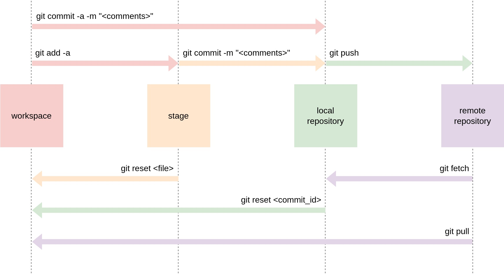
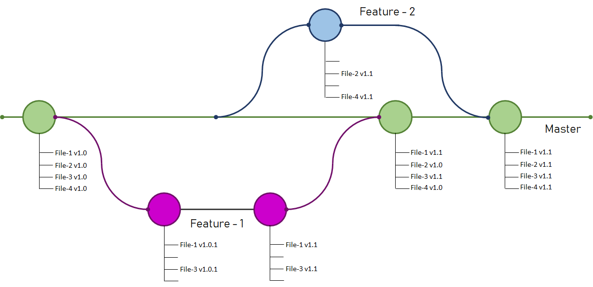

<div align="center">
    </img>
</div>


- **参考文章：**
  - [GIT Branch and its Operations](https://digitalvarys.com/git-branch-and-its-operations/)
  - [Git 分支操作](https://blog.csdn.net/qq_40430360/article/details/126637005)
  - [How To Add and Update Git Submodules](https://devconnected.com/how-to-add-and-update-git-submodules/)
  - [How to Remove a Git Submodule](https://www.w3docs.com/snippets/git/how-to-remove-a-git-submodule.html)
  - [how to delete all commit history in github](https://stackoverflow.com/questions/13716658/how-to-delete-all-commit-history-in-github)

## Git 配置

### 配置文件路径

- 全局配置文件  `/etc/gitconfig`
- 当前用户配置文件 `~/.gitconfig`  或 `~/.config/git/config`
- 当前仓库配置文件 `.git/config`

> 后面配置会覆盖上层的配置

### 设置帐号

``` bash
# 设置用户名
git config --global user.name "Your Name"
# 设置邮箱
git config --global user.email "email@example.com"
```

### 查看帐号

```bash
# 查看用户名
git config user.name
# 查看邮箱
git config user.email
# 直接看配置文件
cat ~/.gitconfig 
```

## Git 创建/提交基本流程

```bash
# 初始化仓库
git init
# 添加文件到仓库
echo "Hello World" >> README.md
# 添加文件到暂存区
git add README.md
# 提交到本地仓库
git commit -m "first commit"
# 创建 master 分支
git branch -M master
# 添加远程仓库
git remote add origin git@github.com:kingtuo123/test-only.git
# 推送到远程仓库
git push -u origin master
```

## Git 分支操作

### 基础操作

```bash
# 查看分支
git branch -v
# 查看当前分支
git branch --show-current
# 创建分支，其本质只是创建了一个可以移动的新的指针
git branch 分支名
# 删除分支
git brach -d 分支名
# 切换分支
git checkout 分支名
# 合并分支，例如想合并其它分支到 master，则需要先切换至 master，再执行下列命令
git merge 分支名
```
<div align="center">
    </img>
    <p class="entry-content">合并分支示意图</p>
</div>

### 合并冲突

执行 `git merge --abort` 可取消合并

**解决冲突**

使用 `git status` 查看合并失败的文件：

```
Unmerged paths:
  (use "git add <file>..." to mark resolution)
        both modified:   README.md
```

打开 `README.md`，其中 `<<<<<<<` 和 `>>>>>>>` 之间的就是冲突的地方：

```
<<<<<<< HEAD
this is master brach
=======
this is test brach
>>>>>>> test
```

解决冲突就是把这部分按自己的需求修改（如下），然后删除这些个符号`<`，`>`，`=`：

```
this is master + test brach
```
最后再执行 `add` 和 ` commit`


## Git 子模块

### 拉取子模块

如果使用 `git clone` 拉取的项目中含有子模块，用下面命令拉取子模块：

```bash
git submodule update --init --recursive
```

> 可以使用 `git clone --recurse-submodules URL` 一并拉取子模块的文件，就不用上面的操作了

### 更新子模块

```bash
git submodule update --remote --merge
```

### 添加子模块

```bash
git submodule add <远程仓库地址> <本地路径>
```

例如添加 `hugo-PaperMod` 这个项目到 `themes/hugo-PaperMod` 路径：

```
git submodule add https://github.com/adityatelange/hugo-PaperMod.git themes/hugo-PaperMod
```

### 删除子模块

```bash
# 查看子模块路径
git submodule
# 移除子模块
git submodule deinit <path_to_submodule>
# 移除目录
git rm <path_to_submodule>
# 提交
git commit -m "Removed submodule <path_to_submodule>"
```

## Git 清空历史 commits

```bash
# 创建孤立分支，并切换到该分支
git checkout --orphan latest_branch
# 暂存所有文件
git add -A
# 提交所有更改
git commit -am "First Commit"
# 删除主分支 master
git branch -D master
# 重命名当前分支为 master
git branch -m master
# 强制推送本地分支
git push -f origin master
```
