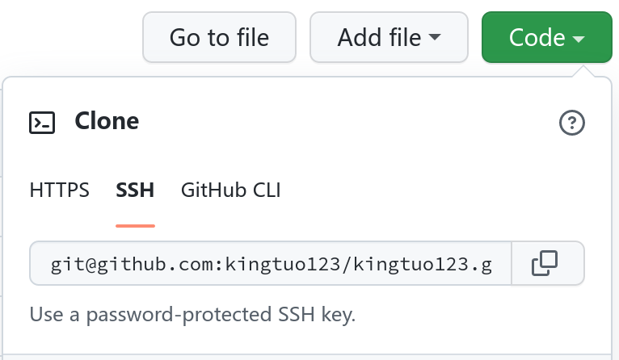

## 创建 SSH Key

运行下列命令创建 SSH Key，使用 github 帐号的邮箱：

```bash-session
$ ssh-keygen -t rsa -C "kingtuo123@email.com"
Generating public/private rsa key pair.
Enter file in which to save the key (/home/king/.ssh/id_rsa): 
Enter passphrase (empty for no passphrase): 
Enter same passphrase again: 
```

以上会在 `～/.ssh` 目录下生成 `id_rsa`（私钥）和 `id_rsa.pub`（公钥）

## 配置 git ssh 默认私钥

ssh 配置文件：`/etc/ssh/ssh_config` 或 `~/.ssh/config`

编辑 `~/.ssh/config`：

```
Host github.com
    IdentityFile /home/king/.ssh/id_rsa
    Hostname ssh.github.com
    Port 443
```

> 建议给 `id_rsa` 重命名，以免和其他密钥搞混

## Github 添加 SSH Key

查看公钥的内容：

```bash-session
$ cat ~/.ssh/id_rsa.pub
```

打开 github 主页，`头像` -> `Settings` -> `SSH and GPG keys` -> `New SSH Key`，将上面的输出复制进去。

## 验证

```bash
# 使用默认路径的密钥
ssh -T git@github.com

# 也可以指定密钥路径
ssh -i <rsa_path> -T git@github.com
```

返回如下信息则配置成功

```text
You've successfully authenticated, but GitHub does not provide shell access
```
## 使用 SSH Key 推送

<div align="left">
    </img>
</div>

使用以上的链接
