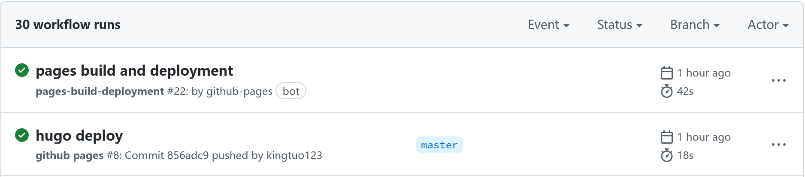
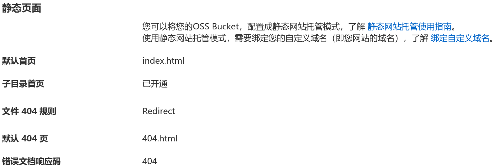
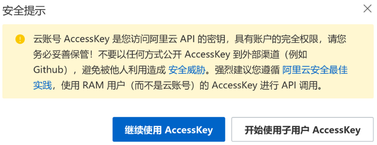
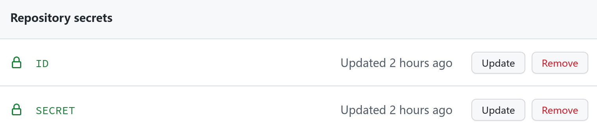

## 初始化

```text
mkdir blog
cd blog
git init
git remote add origin git@github.com:kingtuo123/kingtuo123.github.io.git
echo resources/ >> .gitignore
echo public/ >> .gitignore
```

## 添加主题&相关文件

```bash
git submodule add https://github.com/CaiJimmy/hugo-theme-stack/ themes/hugo-theme-stack

# 拷贝主题SCSS文件至根目录
# 后面修改主题就改assets/scss下的文件，它比主题下的文件有更高的优先级
cp themes/hugo-theme-stack/assets/ . -r

# 一些文章模板
cp themes/hugo-theme-stack/exampleSite/content/ . -r

# 配置文件 
cp themes/hugo-theme-stack/exampleSite/config.yaml .
```

## 修改config.yaml

按需修改，参考[ 配置主题](https://docs.stack.jimmycai.com/zh/configuration/)

## 配置GitHub Action

```bash
mkdir -p .github/workflows/
touch .github/workflows/gh-pages.yml
```

编辑 gh-pages.yml，参考[ peaceiris/actions-gh-pages ](https://github.com/peaceiris/actions-gh-pages#getting-started)

```yml
name: github pages

on:
  push:
    branches:
      - master
    paths-ignore:
      - 'README.md'
      - '.gitignore'
      - '.gitmodules'
  pull_request:

jobs:
  deploy:
    runs-on: ubuntu-latest
    steps:
      - uses: actions/checkout@v2
        with:
          submodules: true  # Fetch Hugo themes (true OR recursive)
          fetch-depth: 0    # Fetch all history for .GitInfo and .Lastmod

      - name: Setup Hugo
        uses: peaceiris/actions-hugo@v2
        with:
          hugo-version: 'latest'
          extended: true

      - name: Build
        run: hugo --minify

      - name: Deploy
        uses: peaceiris/actions-gh-pages@v3
        with:
          github_token: ${{ secrets.GITHUB_TOKEN }}
          publish_dir: ./public

```

## 推送至仓库

     git push -u origin master


查看Action中的信息，如上则配置正确。
    
## 设置GitHub Pages Source

在Pages设置中，修改Source分支为gh-pages

<div align="center">
    </img>
</div>

等待gh-pages自动部署完成后，即可打开站点。

## 网站加速

国内访问 `github.io` 较慢，部署至阿里云 `OSS` 并使用 `DCDN` 加速。

> 也可以直接使用DCDN加速github.io，但使用中发现缓存刷新较慢，导致页面显示异常等。

### Bucket设置

设置Bucket读写权限权限为 `公共读` 

设置静态页面如下

<div align="center">
    </img>
</div>

### 创建Accesskey

打开阿里云控制台右上角 `头像` -> `Accesskey管理`

<div align="center">
    </img>
</div>

选择 `子用户Accesskey`

<div align="center">
    </img>
</div>

Accesskey创建成功后会生成 `ID` 和 `SECRET`，记得复制否则要重新创建。

最后给当前子用户添加 `AliyunOSSFullAccess` 权限。

### 添加Repository secrets 

打开仓库主页(是仓库的setting不是个人)，`Setting` -> `Secrets` -> `Actions`，添加Accesskey的内容。

<div align="center">
    </img>
</div>

### 配置GitHub action

在 `gh-pages.yml` 里追加以下内容

```yml
      - name: Setup AliyunOSS
        uses: manyuanrong/setup-ossutil@v2.0
        with:
          # 地域节点在Bucket概览里查看
          endpoint: "oss-cn-hangzhou.aliyuncs.com"
          access-key-id: ${{ secrets.ID }}
          access-key-secret: ${{ secrets.SECRET }}
      - name: Deploy To OSS
        # 将public下的页面拷贝至Bucket
        run: ossutil cp -rf ./public oss://kingtuo123/
```

最后 `git push` 一下即可。

### 全站加速配置

需要已备案的域名。

再配置全站加速，`域名管理` -> `添加域名` ，等待生成 `CNAME` 记录。

最后在 `DNS解析` 中添加域名 `CNAME` 记录。 
