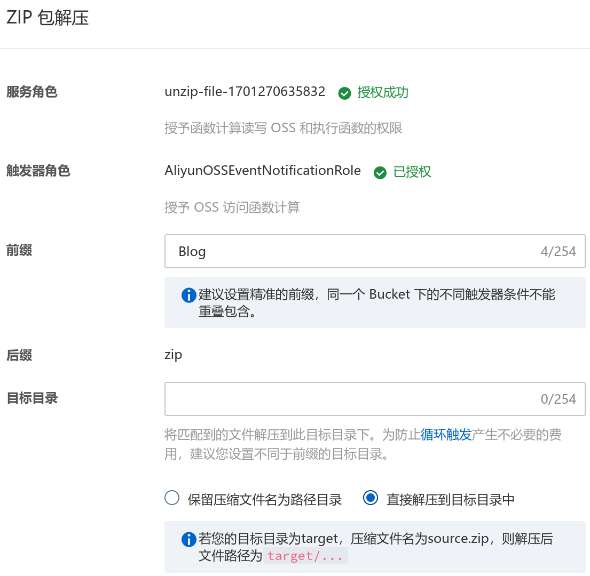
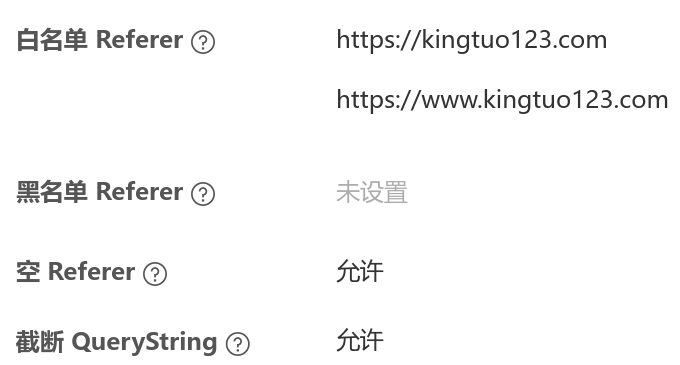
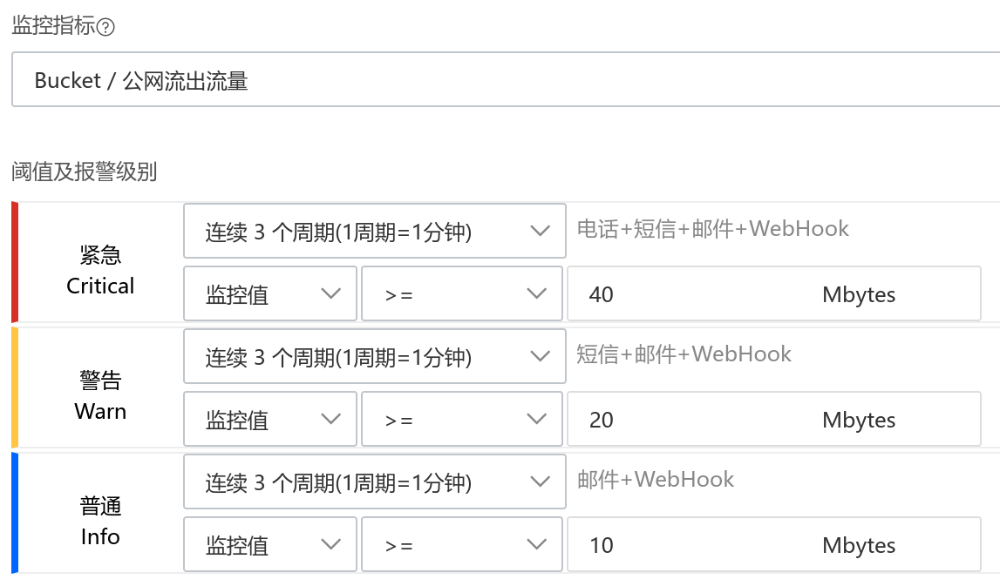

## Bucket 设置

### 权限

`权限控制` -> `读写权限` -> `公共读` 

### 传输加速

`Bucket 配置` -> `传输加速` -> `开启`

### 域名

`Bucket 配置` -> `域名管理` -> `绑定域名`

### 静态页面

`数据管理` -> `静态页面`，设置如下：

<div align="left">
    </img>
</div>

### ZIP 包解压

`数据处理` -> `ZIP 包解压`，设置如下：

<div align="left">
    </img>
</div>

### 防盗链

`数据安全` -> `防盗链`

<div align="left">
    </img>
</div>

## 创建 Accesskey

`头像` -> `Accesskey管理` -> `使用子用户Accesskey` -> `创建用户` -> `添加 AliyunOSSFullAccess 权限`

> 用户创建成功后会生成 `ID` 和 `SECRET`，记得复制或下载 `CSV文件` 否则要重新创建


## 添加 Repository Secrets 

打开仓库主页，`Setting` -> `Secrets` -> `Actions`，添加 scret

<div align="left">
    </img>
</div>

## GitHub Action 配置

> 参考文章：[peaceiris/actions-gh-pages](https://github.com/peaceiris/actions-gh-pages#getting-started)

```bash-session
$ mkdir -p .github/workflows/
$ touch .github/workflows/gh-pages.yml
```

编辑 `gh-pages.yml`：

```yml
name: github pages

on:
  push:
    branches:
      - master
    paths-ignore:
      - 'README.md'
      - '.gitignore'
      - '.gitmodules'
  pull_request:

jobs:
  deploy:
    runs-on: ubuntu-latest
    steps:
      - uses: actions/checkout@v3
        with:
          submodules: true
          fetch-depth: 0

      # 设置 hugo
      - name: Setup Hugo
        uses: peaceiris/actions-hugo@v2
        with:
          hugo-version: 'latest'
          extended: true

      # 构建静态页面
      - name: Build Blog
        run: hugo --minify

      # 打包 zip
      - name: Archive Blog.zip
        uses: vimtor/action-zip@v1.1
        with:
          files: ./public
          dest: Blog.zip

      # 部署 github page
      - name: Deploy To Github Pages
        uses: peaceiris/actions-gh-pages@v3
        with:
          github_token: ${{ secrets.GITHUB_TOKEN }}
          publish_dir: ./public

      # 配置阿里 ossutil 工具
      - name: Setup AliyunOSS
        uses: manyuanrong/setup-ossutil@v2.0
        with:
          endpoint: "oss-accelerate.aliyuncs.com"
          access-key-id: ${{ secrets.ID }}
          access-key-secret: ${{ secrets.SECRET }}

      # 删除 oss 旧页面
      - name: Remove old files of OSS
        run: ossutil rm -rf oss://kingtuo123 --include "*"

      # 上传 zip 至 oss
      - name: Upload Blog.zip file to OSS
        run: ossutil cp -f Blog.zip oss://kingtuo123/

      # 等待 zip 解压完毕
      - name: Sleep for unzip
        uses: juliangruber/sleep-action@v2.0.0
        with:
          time: 50s

      # 删除刚上传的 zip
      - name: Remove Blog.zip from OSS
        run: ossutil rm -f oss://kingtuo123/Blog.zip
```

## GitHub Pages 设置（可选）

如果不需要 github page，注释掉 gh-pages.yml 中对应的部分

在仓库主页 `Settings` -> `Pages` 中，修改分支为 `gh-pages`

<div align="left">
    </img>
</div>


## OSS 流量报警

主要为防止 OSS 流量盗刷，`云监控` -> `报警服务` -> `报警规则` -> `创建报警规则`

<div align="left">
    </img>
</div>

> OSS 不支持流量超阈值停止，参考此文：[阿里云对象存储 OSS 限流超过阈值自动关闭](https://xiangchengkang.github.io/2023/03/26/a-li-yun-dui-xiang-cun-chu-oss-xian-liu-chao-guo-yu-zhi-zi-dong-guan-bi-fang-po-chan-bao-ping-an/)
