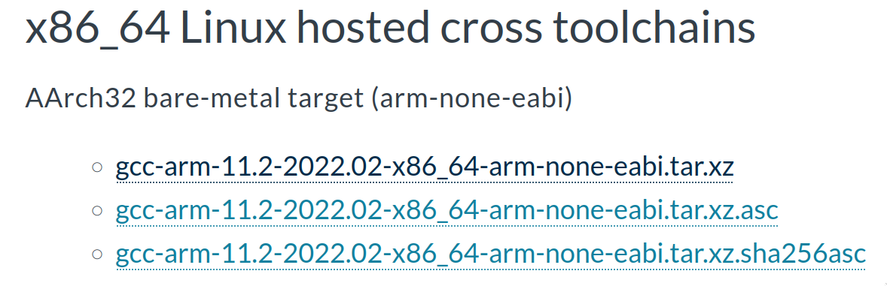
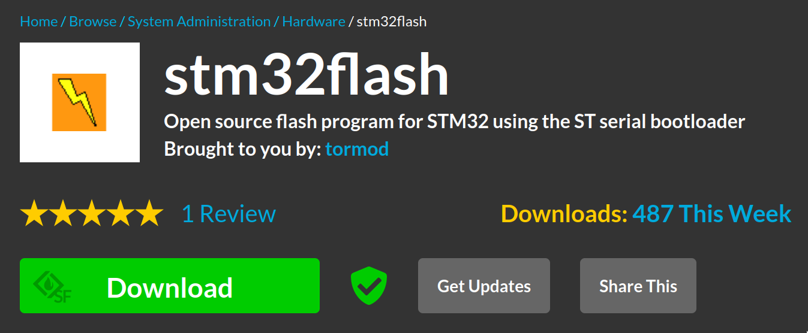
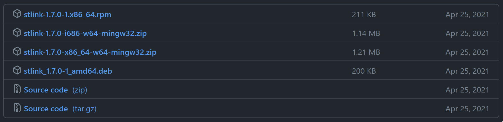
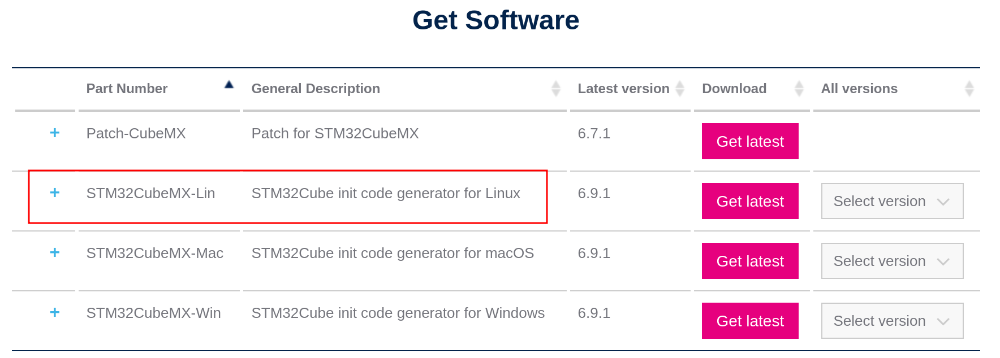

## arm gcc 工具链

- [下载地址](https://developer.arm.com/tools-and-software/open-source-software/developer-tools/gnu-toolchain/downloads)

<div align="left">
    </img>
</div>


解压：

```
$ tar xvf gcc-arm-*-arm-none-eabi.tar.xz
```

安装：

```
$ sudo mv gcc-arm-*-arm-none-eabi /opt/arm-none-eabi-gcc
```

添加 `PATH` 到 `/etc/profile`：

```
export PATH=${PATH}:/opt/arm-none-eabi-gcc/bin
```

## ISP 串口下载工具

- [下载地址](https://sourceforge.net/projects/stm32flash/)

<div align="left">
    </img>
</div>

解压：

```
$ tar xvf stm32flash-0.7.tar.gz
```

编译：

```
$ cd stm32flash-0.7/
$ make
```

安装，默认安装路径 `/usr/local/bin`：

```
$ sudo make install
```

- 使用方法详见：[ISP 一键下载](../stm32-isp-flash/)

- 串口驱动安装：[CH340 驱动](../gentoo-ch340-driver/)

## ST-LINK 下载工具

- [下载地址](https://github.com/stlink-org/stlink/releases)：选择 `Source Code`

<div align="center">
    </img>
</div>

解压：

```
$ tar xvf stlink-1.7.0.tar.gz
```

安装依赖库（可选）：

```
$ sudo emerge -av virtual/libusb
```

编译安装：

```
$ cd stlink-1.7.0/
$ make release
$ make debug
$ sudo make install
```

测试：

```bash-session
$ st-info --version
libstlink.so.1: cannot open shared object file: No such file or directory
$ sudo ldconfig    # 如果显示上面的信息，则执行该命令
$ st-info --version
v1.7.0
```

- 使用方法详见：[使用 stlink 烧录程序](../stlink-linux/)

## STM32CubeMX 安装

- [CubeMX 下载地址](https://www.st.com/en/development-tools/stm32cubemx.html#get-software)
- [HAL 库下载地址](https://www.st.com/en/embedded-software/stm32cube-mcu-mpu-packages.html)

<div align="left">
    </img>
</div>

解压：

 ```
 $ unzip en.stm32cubemx-lin-v6-9-1.zip
 ```

 安装：

 ```
 $ sudo ./SetupSTM32CubeMX-6.9.1
 ```

 HAL 库导入：`Help` -> `Manage embedded software packages` -> `From Local`

## openocd 安装

Gentoo 软件仓库有：

```
# emerge -av dev-embedded/openocd
```

## gdb

> Gentoo 需要启用 USE 标记 `multitarget`，其他发行版安装 `gdb-multiarch` 这个包

```
# emerge -av sys-devel/gdb
```
