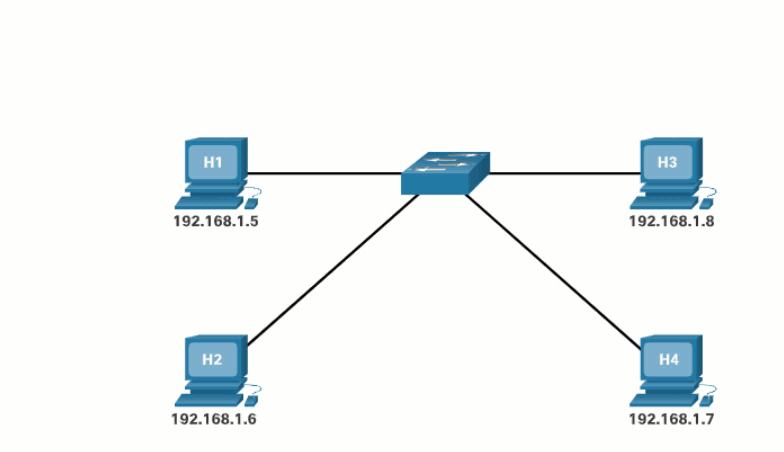

- 参考文章：
  - [Communication through Multiple Switches](http://www.practicalnetworking.net/stand-alone/communication-through-multiple-switches/)
  - [交换机概述（MAC地址表建立与转发）](https://blog.csdn.net/polar_night_down/article/details/121745921)

## 目的mac地址是如何得到的？

通过 ARP广播（Address Resolution Protocol）获取目标的物理地址。

    </img>

## MAC地址表是如何建立的？

    <video autoplay="" controls="" style="width:100%" src="mac-adr-table.webm"></video>

假设主机A向主机B发送一个数据帧，当该数据帧从端口1进入交换机后，交换机通过检查数据帧中的源MAC地址字段，将该字段的值（主机A的MAC地址）放入MAC地址表中，并把它与端口1对应起来，表示端口1所连接的主机是A。此时，由于在MAC地址表中没有关于目的地MAC地址（主机B的MAC地址）的条目。交换机将此帧向除了端口1以外的所有端口转发，从而保证主机B能收到该帧（这种操作叫flooding）。

> 泛洪（flooding）：是发给除了当前发来信息的端口之外的所有端口

同理，当交换机收到主机B、C、D的数据后也会把他们的地址学习到，写入地址表中，并将相应的端口和MAC地址对应起来。最终会把所有的主机地址都学习到，构建出完整的地址表。

不要将泛洪与广播混淆。

> 广播：是发送给当前子网内的所有端口（包括发送数据报的端口本身）
