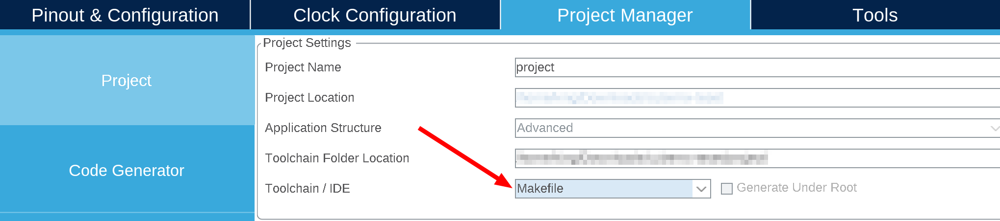

## 标准库工程

### 目录结构

```text
.
├── Libraries
│   ├── CMSIS
│   └── STM32F10x_StdPeriph_Driver
│       ├── inc
│       └── src
├── makefile
├── STM32F103ZETx_FLASH.ld
└── User
    ├── led
    │   ├── bsp_led.c
    │   └── bsp_led.h
    ├── main.c
    ├── stm32f10x_conf.h
    ├── stm32f10x_it.c
    └── stm32f10x_it.h
```


### Makefile

```makefile
TARGET    := led-blink

# 存放构建时生成的文件的目录
BUILD_DIR := ./Build

# ARM GCC 工具链
TOOLCHAIN  = arm-none-eabi-
CC  := $(TOOLCHAIN)gcc
CP  := $(TOOLCHAIN)objcopy
AS  := $(TOOLCHAIN)gcc -x assembler-with-cpp
SZ  := $(TOOLCHAIN)size
HEX := $(CP) -O ihex
BIN := $(CP) -O binary -S


########################################### 标准库源码 #################################################
ASM_SRC := ./Libraries/CMSIS/CM3/DeviceSupport/ST/STM32F10x/startup/gcc_ride7/startup_stm32f10x_hd.s
C_SRC   := ./Libraries/CMSIS/CM3/CoreSupport/core_cm3.c
C_SRC   += ./Libraries/CMSIS/CM3/DeviceSupport/ST/STM32F10x/system_stm32f10x.c
C_SRC   += $(wildcard ./Libraries/STM32F10x_StdPeriph_Driver/src/*.c)

########################################### 头文件路径 #################################################
INC_DIR := ./Libraries/CMSIS/CM3/CoreSupport/
INC_DIR += ./Libraries/CMSIS/CM3/DeviceSupport/ST/STM32F10x/
INC_DIR += ./Libraries/STM32F10x_StdPeriph_Driver/inc/
INC_DIR += ./User/
INC_DIR += ./User/led/

############################################ 用户源码 ##################################################
C_SRC += $(wildcard ./User/*.c)
C_SRC += $(wildcard ./User/led/*.c)


# 内核架构
CPU := cortex-m3
# 预定义宏
DEFS := -D STM32F10X_HD  -D USE_STDPERIPH_DRIVER
# 链接脚本
LINK_SCRIPT := ./STM32F103ZETx_FLASH.ld
# 编译参数
CP_FLAGS := $(DEFS) $(addprefix -I,$(INC_DIR)) -mcpu=$(CPU) -g -gdwarf-2 -mthumb -Os -Wall -Wextra -fdata-sections -ffunction-sections -fmessage-length=0 -MMD -MP 
# 汇编参数
AS_FLAGS := $(CP_FLAGS)
# 链接参数
LD_FLAGS := -mcpu=$(CPU) -T $(LINK_SCRIPT) -specs=nano.specs -Wl,-Map=$(BUILD_DIR)/$(TARGET).map,--cref,--gc-sections,--print-memory-usage


# 设置文件搜索路径，.h 文件路径由 gcc -I 参数指定
vpath %.c $(sort $(dir $(C_SRC)))
vpath %.s $(sort $(dir $(ASM_SRC)))
# 保留 .o 文件，make 可能会删除生成的 .o 文件
.PRECIOUS: $(BUILD_DIR)/%.o


.PHONY: all
all: $(BUILD_DIR) $(BUILD_DIR)/$(TARGET).elf $(BUILD_DIR)/$(TARGET).bin $(BUILD_DIR)/$(TARGET).hex
	@echo "Done"

%.elf: $(addprefix $(BUILD_DIR)/,$(notdir $(C_SRC:.c=.o))) $(addprefix $(BUILD_DIR)/,$(notdir $(ASM_SRC:.s=.o)))
	$(CC) $(LD_FLAGS) $^ -o $@

$(BUILD_DIR)/%.o: %.c
	$(CC) -c $(CP_FLAGS) $< -o $@

$(BUILD_DIR)/%.o: %.s
	$(AS) -c $(AS_FLAGS) $< -o $@

%.hex: %.elf
	$(HEX) $< $@

%.bin: %.elf
	$(BIN) $< $@

$(BUILD_DIR):
	mkdir -p $@


clean:
	rm $(BUILD_DIR)/ -rf

st-flash: $(BUILD_DIR)/$(TARGET).bin
	st-flash --format binary write $(BUILD_DIR)/$(TARGET).bin 0x8000000

st-erase:
	st-flash erase

isp-flash: $(BUILD_DIR)/$(TARGET).bin
	stm32flash -b 115200 -i '-dtr&rts,dtr:-dtr&-rts,dtr' -v -w $(BUILD_DIR)/$(TARGET).bin /dev/ttyUSB0

isp-erase:
	stm32flash -b 115200 -i '-dtr&rts,dtr:-dtr&-rts,dtr' -o /dev/ttyUSB0

isp-info:
	stm32flash -b 115200 -i '-dtr&rts,dtr:-dtr&-rts,dtr' /dev/ttyUSB0

rebuild: clean all

install: st-flash


# 包含由 gcc -MMD 参数生成的 .d 文件
-include $(BUILD_DIR)/*.d
```


### 链接脚本

使用 `STM32CubeMX` 生成：

<div align="center">
    </img>
</div>

随便建个工程，按图中所示选择 `Makefile` 生成代码即可，`STM32F103ZETx_FLASH.ld` 如下：

```c
// 设置入口符号
ENTRY(Reset_Handler)

// 初始栈顶地址
_estack = ORIGIN(RAM) + LENGTH(RAM);

// 设置堆栈大小
_Min_Heap_Size = 0x200;
_Min_Stack_Size = 0x400;

MEMORY
{
// RAM 起始地址和大小
RAM (xrw)      : ORIGIN = 0x20000000, LENGTH = 64K
// FLASH 起始地址和大小
FLASH (rx)      : ORIGIN = 0x8000000, LENGTH = 512K
}

// 后面是段的分配，一般不需要改
// 略...
```


### GCC 编译报错

```bash-session
/tmp/cceEC3n9.s:599: Error: registers may not be the same -- `strexb r0,r0,[r1]'
/tmp/cceEC3n9.s:629: Error: registers may not be the same -- `strexh r0,r0,[r1]'
```

修改标准库中 `Libraries/CMSIS/CM3/CoreSupport/core_cm3.c` 文件

将 `__STREXB` 和 `__STREXH` 函数中的 `=r` 改为 `=&r` ，一共有两处：

```asm
__ASM volatile ("strexb %0, %2, [%1]" : "=&r" (result) : "r" (addr), "r" (value) );
```
貌似是 `gcc` 编译优化导致的问题，参考下列文章：

- [Error: registers may not be the same -- strexb r0,r0,[r1]](https://github.com/stlink-org/stlink/issues/65)
- [Fix registers may not be the same ARM GCC error](http://www.cesareriva.com/fix-registers-may-not-be-the-same-error/)
- [gcc编译后出现与CMSIS相关的错误](https://amobbs.com/thread-5465367-1-1.html)


### GCC 参数说明

<div class="table-container">

|参数|说明|
|:--|:--|
|`-D STM32F10X_HD`|表示芯片容量|
|`-D USE_STDPERIPH_DRIVER`|表示使用官方标准固件库|
|`-mcpu=cortex-m3`|指定芯片内核架构|
|`-g`|产生调试信息|
|`-gdwarf-2`|调试信息格式|
|`-mthumb`|表示使用 thumb 指令集|
|`-Os`|优化代码大小|
|`-Wall`|允许输出所有警告|
|`-MMD`|生成依赖关系文件 .d，依赖不包括系统头文件|
|`-MP`|依赖规则中的所有 .h 依赖项都会在该文件中生成一个伪目标，其不依赖任何其他依赖项|
|`-fdata-sections`|为每个 data item 分配独立的 section，方便后面链接器优化|
|`-ffunction-sections`|为每个 function 分配独立的 section，方便后面链接器优化|
|`-specs=nano.specs`|使用精简版的 C 库替代标准 C 库，可以减少最终程序映像的大小|
|`-T`|指定链接脚本|
|`-Wl`|表示后面跟的参数传递给链接器，用逗号分隔|
|`-Map=<filename>`|生成 map 映射文件|
|`--cref`|Cross Reference 的简写，输出交叉引用表|
|`--gc-sections`|不链接未用函数，减小可执行文件大小|

</div>


## HAL 库

### 目录结构

```text {hl_lines=[]}}
.
├── Drivers
│   ├── CMSIS
│   │   ├── Device
│   │   └── Include
│   └── STM32F1xx_HAL_Driver
│       ├── Inc
│       └── Src
├── makefile
├── STM32F103ZETx_FLASH.ld
└── User
    ├── led
    │   ├── bsp_led.c
    │   └── bsp_led.h
    ├── main.c
    ├── stm32f1xx_hal_conf.h
    ├── stm32f1xx_it.c
    └── stm32f1xx_it.h
```

- HAL 库 [makefile](https://gitee.com/kingtuo123/stm32f103-template/blob/master/stm32-hal/makefile)
- LL 库 [makefile](https://gitee.com/kingtuo123/stm32f103-template/blob/master/stm32-ll/makefile)
