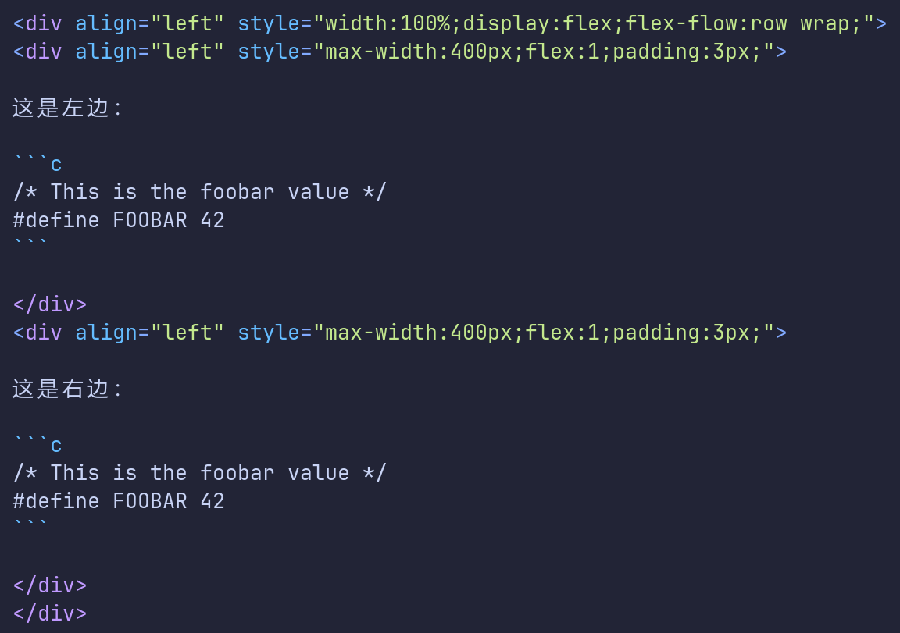

## 标题

```text
# 这是一级标题
## 这是二级标题
### 这是三级标题
#### 这是四级标题
##### 这是五级标题
###### 这是六级标题
```

最后一个 `#` 号后面加空格，下同

## 字体样式

```text
*倾斜的文字*
**加粗的文字**
***斜体加粗的文字***
~~加删除线的文字~~
```

## 引用

换行则使用单个 `>`

```text
> 这是引用的内容
>
> 这是引用的内容
```


## 分割线

三个或者三个以上的 `-` 或者 `*` 都可以

```text
---
----
***
*****
```

## 图片

```text


```

指定图片大小，使用 html：

```html
<div align="center">
    </img>
</div>
```

超链接图片：

```html
<div align="center">
    <a href="1.jpg" target="_blank">
        </img>
    </a>
</div>
```


## 超链接

```text
[name](url)
[超链接名](超链接url "超链接title")
```

## 列表

### 无序列表

`-` 和`+` 和`*` 三个符号都可以

```text
- 列表内容
+ 列表内容
* 列表内容
```

### 有序列表

```text
1. 列表内容
2. 列表内容
3. 列表内容
```

### 多级列表

二级列表前加三个空格

```markdown
- 一级无序列表内容
   - 二级无序列表内容
   - 二级无序列表内容
   - 二级无序列表内容
```

## 表格

```text
|表头1|表头2|表头3|
|---|:--:|--:|
|内容|内容|内容|
|内容|内容|内容|
```
居中 `:--:`

靠左 `:--`

靠右 `--:`
     

## 代码

```text
​```java
  代码...
  代码...
  代码...
​```
```

## 左右分隔代码块

<div align="left">
    </img>
</div>


<div align="left" style="width:100%;display:flex;flex-flow:row wrap;">
<div align="left" style="max-width:400px;flex:1;padding:3px;">

这是左边：

```c
/* This is the foobar value */
#define FOOBAR 42
```

</div>
<div align="left" style="max-width:400px;flex:1;padding:3px;">

这是右边：

```c
/* This is the foobar value */
#define FOOBAR 42
```

</div>
</div>

