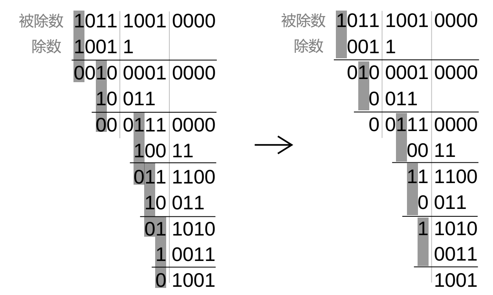
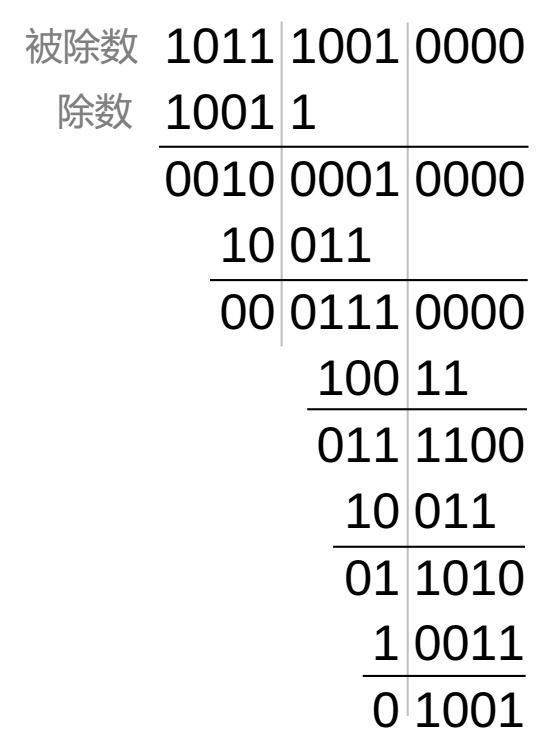
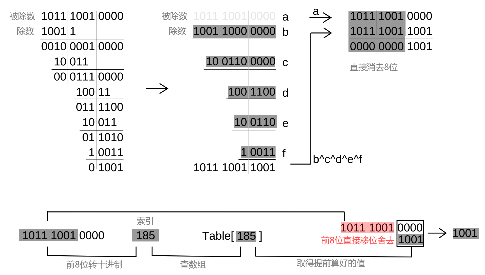

## 什么是CRC

循环冗余校验码 ( cyclie redundancy check ) 简称CRC（循环码）。

## CRC算法原理

假如有数据A：**1011 1001**

以 CRC-4 为例计算该数据的 CRC 码，它的多项式公式 **g(x) = x⁴ + x + 1** , 用二进制表示为 **10011**

- 计算它的 CRC 码（冗余位）： 
   - CRC-4 表示所得 CRC 码为 4 位，在数据 A 右侧补上 4 个 0，数据 A：**1011 1001 0000**
   - 数据A做被除数，用除数 **10011** 做**模2除法**，如下图

<div align="left">
    </img>
</div>

- 关于模2除法：
   - 本质是**异或运算**
   - 舍去最左侧 0，以 1 对齐

最后结果 **1001** 就是 CRC 冗余位，将它附加在**原数据帧末尾**，构建成一个新的数据帧进行发送；最后接收方将**整个**数据帧以**模2除法**除相同的**除数**，如果没有余数，则说明数据帧在传输的过程中没有出错。

## CRC算法参数模型

为了方便机器更好的计算CRC所以制定了一些规则，添加了一些参数参与计算，称为CRC参数模型。如 CRC-8、CRC-16/MODBUS、CRC-32。

- 以CRC-16/MODBUS 为例，它的参数模型如下：

|CRC算法名称|多项式公式|宽度|多项式|初始值|结果异或值|输入反转|输出反转|
|:--|:--|:--|:--|:--|:--|:--|:--|
|CRC-4/ITU|x⁴ + x + 1|4|03|00|00|true|true|
|CRC-16/MODBUS|x¹⁶ + x¹⁵ + x² + 1|16|8005|FFFF|0000|true|true|

- **CRC算法参数模型解释：** 

   - **CRC算法名称（NAME）**：名称后面的数字就表示生成的冗余位的位数。 

   - **宽度（WIDTH）**：CRC 校验宽度，即 CRC 比特数。 

   - **多项式（POLY）**：生成项的简写，以16进制表示。例如：CRC-16/MODBUS 即是0x8005，**忽略最高位的"1"**，即完整的生成项是0x18005。 

   - **初始值（INIT）**：算法开始时计算（crc）的**初始化预置值**，一般取值FFFF或0000。当数据前几位为0时，因为模2除法会忽略0，先用FFFF异或将0取反为1，再进行模2除法，使数据开头的0也参与运算，以上是个人理解仅供参考。 

   - **结果异或值（REFIN）**：计算结果和该值异或运算。 

   - **输入反转（REFOUT）**：输入数据高低位互换，类似镜像。

   - **输出反转（XOROUT）**：计算结果高低位互换，类似镜像。

## 为什么可以忽略最高位的"1"


以 CRC-4 为例，它的多项式公式 **g(x) = x⁴ + x + 1** , 用二进制表示为 **10011**，多项式用十六进制表示应该是13，为什么参数模型里用 03 表示？

再来观察上面的式子,看下图左侧，模2除法里除数和被除数左侧以 1 对齐后再异或运算，最左侧1在每次运算后都会被丢弃（因为 1 异或 1 为 0，而模 2 除法会舍去 0），并不会对最终结果产生影响

<div align="left">
    </img>
</div>

我们把除数左侧的 1 去掉，如图右侧所示，可以看出，只要将除数与被除数的第 2 位对齐再异或运算 ，最后结果是一样的，所以除数最高位1可以舍去，13 就可以简写为 03。

## 直接计算法 - 正/反向

- 以CRC-16/MODBUS 参考模型为例编程

   - 第一步，输入数据反转，**只反转单个字节不改变字节顺序**，例如 0x0903 反转为 0x90C0

   - 第二步，定义初始值 FFFF，以除数 8005 进行模 2 运算

   - 最后，输出数据反转,**反转整个CRC寄存器**，例如 0x0903 反转为 0xC090


```c
#include<stdio.h>

/* 字节反转 */
unsigned char Flip(unsigned char data) {
    data = ((data&0x55)<<1)|((data&0xaa)>>1);
    data = ((data&0x33)<<2)|((data&0xcc)>>2);
    data = ((data&0x0f)<<4)|((data&0xf0)>>4);   
    return data;
}
/* CRC算法正向 */
unsigned short CRC16( unsigned char * data, unsigned short len) {
   int i,j;
   unsigned short CRC = 0xFFFF;  /* CRC寄存器，初始化预置值 */
   for( i = 0;i < len; i++ ) {
      CRC ^= (unsigned short)Flip(*data++)<<8;  /* 单个字节反转 */
      for(j = 0; j< 8; j++) {
         if(CRC & 0x8000)
            CRC = CRC << 1 ^ 0x8005;
         else
            CRC <<= 1;
        }
    }
    /* 全反转 */
    CRC = (unsigned short)Flip((unsigned char)CRC)<<8|Flip((unsigned char)(CRC>>8));
    return CRC;
}
/* CRC算法反向，比正向效率要高，网上找的算法大多是反向的*/
unsigned short CRC16_Rev( unsigned char * data, unsigned short len) {
   int i,j;
   unsigned short CRC = 0xFFFF; 
   for( i = 0;i < len; i++ ) {
      CRC ^= *data++;
      for(j = 0; j< 8; j++) {
         if(CRC & 0x0001)
            CRC = CRC >> 1 ^ 0xA001; /* 8005反转就是A001 */
         else
            CRC >>= 1;
        }
    }
   return CRC;
}

int main(void) {
   unsigned char data[6] = {0x01,0x04,0x00,0x00,0x00,0x01};
   printf("%x\n",CRC16(data,6));     /* 正向 */
   printf("%x\n",CRC16_Rev(data,6)); /* 反向 */

   getchar();
   return 0;
}
```

这里举一个简单的例子。假设从设备地址为 1,要求读取输人寄存器地址 30001 的值，则 RTU 模式下具体的查询消息帧如下：
**0x01，0x04，0x00，0x00，0x00，0x01，0x31，0xCA**
其中，**0xCA31** 即为 CRC 值。因为 Modbus 规定发送时 CRC 必须低字节在前，高字节在后，因此实际的消息帧的发送顺序为 **0x31,0xCA**。

## 查表法

异或运算有结合律：**(a^b)^c=a^(b^c)**

大概的原理如下图

<div align="center">
    </img>
</div>

8 位一共有 256 种结果，可以先将结果计算好后存入数组中。按 16 位查表太多有 65536 种结果。所以按 8 位查表是最合适的。

程序如下 ( CRC 反向算法的表 )

```c
#include<stdio.h>

unsigned short crc16_table[] = {
    0x0000, 0xc0c1, 0xc181, 0x0140, 0xc301, 0x03c0, 0x0280, 0xc241,
    0xc601, 0x06c0, 0x0780, 0xc741, 0x0500, 0xc5c1, 0xc481, 0x0440,
    0xcc01, 0x0cc0, 0x0d80, 0xcd41, 0x0f00, 0xcfc1, 0xce81, 0x0e40,
    0x0a00, 0xcac1, 0xcb81, 0x0b40, 0xc901, 0x09c0, 0x0880, 0xc841,
    0xd801, 0x18c0, 0x1980, 0xd941, 0x1b00, 0xdbc1, 0xda81, 0x1a40,
    0x1e00, 0xdec1, 0xdf81, 0x1f40, 0xdd01, 0x1dc0, 0x1c80, 0xdc41,
    0x1400, 0xd4c1, 0xd581, 0x1540, 0xd701, 0x17c0, 0x1680, 0xd641,
    0xd201, 0x12c0, 0x1380, 0xd341, 0x1100, 0xd1c1, 0xd081, 0x1040,
    0xf001, 0x30c0, 0x3180, 0xf141, 0x3300, 0xf3c1, 0xf281, 0x3240,
    0x3600, 0xf6c1, 0xf781, 0x3740, 0xf501, 0x35c0, 0x3480, 0xf441,
    0x3c00, 0xfcc1, 0xfd81, 0x3d40, 0xff01, 0x3fc0, 0x3e80, 0xfe41,
    0xfa01, 0x3ac0, 0x3b80, 0xfb41, 0x3900, 0xf9c1, 0xf881, 0x3840,
    0x2800, 0xe8c1, 0xe981, 0x2940, 0xeb01, 0x2bc0, 0x2a80, 0xea41,
    0xee01, 0x2ec0, 0x2f80, 0xef41, 0x2d00, 0xedc1, 0xec81, 0x2c40,
    0xe401, 0x24c0, 0x2580, 0xe541, 0x2700, 0xe7c1, 0xe681, 0x2640,
    0x2200, 0xe2c1, 0xe381, 0x2340, 0xe101, 0x21c0, 0x2080, 0xe041,
    0xa001, 0x60c0, 0x6180, 0xa141, 0x6300, 0xa3c1, 0xa281, 0x6240,
    0x6600, 0xa6c1, 0xa781, 0x6740, 0xa501, 0x65c0, 0x6480, 0xa441,
    0x6c00, 0xacc1, 0xad81, 0x6d40, 0xaf01, 0x6fc0, 0x6e80, 0xae41,
    0xaa01, 0x6ac0, 0x6b80, 0xab41, 0x6900, 0xa9c1, 0xa881, 0x6840,
    0x7800, 0xb8c1, 0xb981, 0x7940, 0xbb01, 0x7bc0, 0x7a80, 0xba41,
    0xbe01, 0x7ec0, 0x7f80, 0xbf41, 0x7d00, 0xbdc1, 0xbc81, 0x7c40,
    0xb401, 0x74c0, 0x7580, 0xb541, 0x7700, 0xb7c1, 0xb681, 0x7640,
    0x7200, 0xb2c1, 0xb381, 0x7340, 0xb101, 0x71c0, 0x7080, 0xb041,
    0x5000, 0x90c1, 0x9181, 0x5140, 0x9301, 0x53c0, 0x5280, 0x9241,
    0x9601, 0x56c0, 0x5780, 0x9741, 0x5500, 0x95c1, 0x9481, 0x5440,
    0x9c01, 0x5cc0, 0x5d80, 0x9d41, 0x5f00, 0x9fc1, 0x9e81, 0x5e40,
    0x5a00, 0x9ac1, 0x9b81, 0x5b40, 0x9901, 0x59c0, 0x5880, 0x9841,
    0x8801, 0x48c0, 0x4980, 0x8941, 0x4b00, 0x8bc1, 0x8a81, 0x4a40,
    0x4e00, 0x8ec1, 0x8f81, 0x4f40, 0x8d01, 0x4dc0, 0x4c80, 0x8c41,
    0x4400, 0x84c1, 0x8581, 0x4540, 0x8701, 0x47c0, 0x4680, 0x8641,
    0x8201, 0x42c0, 0x4380, 0x8341, 0x4100, 0x81c1, 0x8081, 0x4040
};

unsigned short CRC16(unsigned char * data, unsigned short len){
    unsigned short crc   = 0xFFFF;
    unsigned char  index = 0;
    unsigned char  *p    = data;
    while(len--){
    	index = *p++ ^ crc;
    	crc >>= 8;
    	crc  ^= crc16_table[index];
    }
    return crc;
}

int main(void){
    unsigned short crc;
    unsigned char  data[6] = {0x01,0x04,0x00,0x00,0x00,0x01};
    crc = CRC16(data,6);
    printf("%x ",crc);
    getchar();
    return 0;
}
```

## 余项表生成算法

```c
#include<stdio.h>
/*余项表生成函数*/
void generate_table(unsigned short * crc16_table, unsigned short poly){
    unsigned int i,j;
    unsigned short crc;
    for(i = 0; i < 256; i++){
    	crc = i;
    	for(j = 0; j < 8; j++){
            if(crc & 0x0001){
                crc = (crc >> 1) ^ 0xa001;	
            }else{
                crc >>= 1;
            }
    	}
    	crc16_table[i] = crc;
    }
}
/*打印表*/
void print_table(unsigned short * crc16_table){
    unsigned int i;
    printf("unsigned short crc16_table[] = {\n    ");
    for(i = 0; i < 256; i++){
    	printf("0x%04x, ",crc16_table[i]);
    	if(i == 255)
    	    printf("\b\b ");
    	if(!((i+1)%8))
    	    printf("\n    ");
    }
    printf("\b\b\b\b};\n");
}

int main(void) {
    unsigned short crc16_table[256];
    unsigned short poly = 0xA001;
    
    generate_table(crc16_table,poly);
    print_table(crc16_table);
    
    getchar();
    return 0;
}
```
