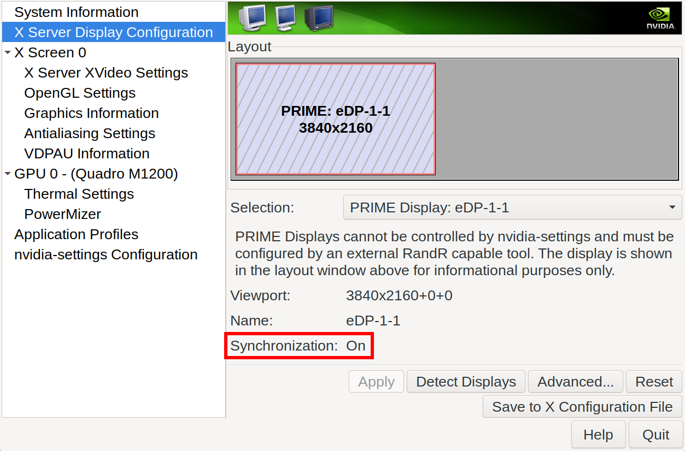

- 参考文章：
  - [NVIDIA/Optimus](https://wiki.gentoo.org/wiki/NVIDIA/Optimus)
  - [NVIDIA/nvidia-drivers](https://wiki.gentoo.org/wiki/NVIDIA/nvidia-drivers)
  - [NVIDIA on Linux](https://comfy.guide/client/nvidia/)
  - [Nvidia Optimus (youtube)](https://www.youtube.com/watch?v=Pn2iUgW3l6w)

> 笔记本双显卡

## 内核配置

```text {hl_lines=[1,4,8,13,18,23,31,36,41]}
CONFIG_MODULES
[*] Enable loadable module support --->

CONFIG_MTRR
Processor type and features --->
   [*] MTRR (Memory Type Range Register) support

CONFIG_VGA_ARB
Device Drivers --->
   PCI support --->
      [*] VGA Arbitration

CONFIG_ACPI_IPMI
Device Drivers --->
   Character devices --->
      [*] IPMI top-level message handler

CONFIG_AGP
Device Drivers --->
   Graphics support --->
      -*- /dev/agpgart (AGP Support) --->

CONFIG_FB_NVIDIA, CONFIG_FB_RIVA (DISABLE)
Device Drivers --->
    Graphics support --->
        Frame buffer Devices --->
            <*> Support for frame buffer devices --->
               < > nVidia Framebuffer Support
               < > nVidia Riva support

CONFIG_DRM_NOUVEAU (DISABLE)
Device Drivers  --->
    Graphics support  --->
        < > Nouveau (nVidia) cards

CONFIG_DRM_SIMPLEDRM (DISABLE)
Device Drivers --->
   Graphics support --->
      < > Simple framebuffer driver

CONFIG_SYSFB_SIMPLEFB, CONFIG_FB_VESA, CONFIG_FB_EFI, CONFIG_FB_SIMPLE
Device Drivers --->
   Firmware Drivers  --->
      [*] Mark VGA/VBE/EFI FB as generic system framebuffer
   Graphics support --->
      Frame buffer Devices  --->
         <*> Support for frame buffer devices  --->
            [*] VESA VGA graphics support
            [*] EFI-based Framebuffer Support 
            <*> Simple framebuffer support
```

## make.conf

```
VIDEO_CARDS="nvidia"
```

执行 `emerge -avuDN @world` 后会安装 `x11-drivers/nvidia-drivers` 

## 开机加载模块

创建 `/etc/modules-load.d/nvidia.conf`：

```bash
#nvidia
#nvidia-drm
nvidia-modeset
nvidia-uvm
```

## 配置模块

### 方法一

编辑 `/etc/modprobe.d/nvidia.conf`，添加：

```
options nvidia-drm modeset=1
```

> `/etc/modprobe.d/nvidia.conf` 由软件包 `x11-drivers/nvidia-drivers` 安装


### 方法二

编辑 `/etc/default/grub`，添加启动参数：

```
GRUB_CMDLINE_LINUX_DEFAULT="nvidia-drm.modeset=1"
```

然后执行 `grub-mkconfig -o /boot/grub/grub.cfg`

## 自动生成 Xorg.conf 配置

```bash-session
# nvidia-xconfig --prime
```

文件路径在 `/etc/X11/`

## startx

修改 `.xinitrc`，添加下列两行至开头：

```bash
xrandr --setprovideroutputsource modesetting NVIDIA-0
xrandr --auto
#xrandr --output eDP-1-1 --set "PRIME Synchronization" 1
```

## nvidia-settings

检查同步是否开启

<div align="left">
    </img>
</div>
