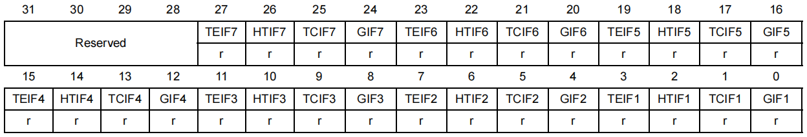
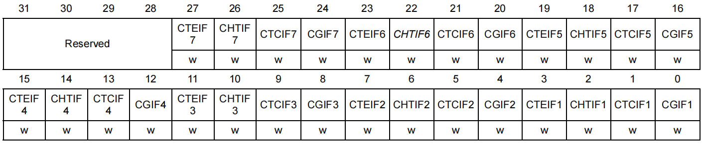
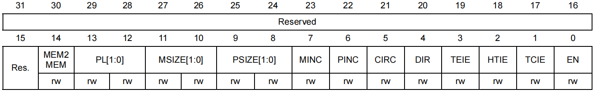
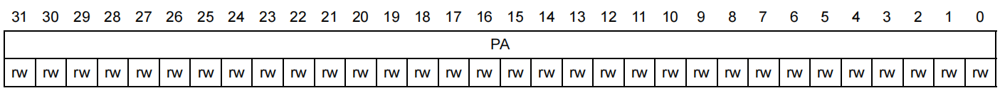

## 寄存器

### DMA_ISR

- DMA 中断状态寄存器（ DMA interrupt status register ）

<div align="center">
    </img>
</div>

- TEIFx：通道x的传输错误标志
- HTIFx：通道x的半传输标志
- TCIFx：通道x的传输完成标志
- GIFx：  通道x的全局中断标志 （TE、HT或TC事件）

### DMA_IFCR

- DMA中断标志清除寄存器（DMA interrupt flag clear register）

<div align="center">
    </img>
</div>


- CTEIFx：清除通道x的传输错误标志
- CHTIFx：清除通道x的半传输标志
- CTCIFx：清除通道x的传输完成标志
- CGIFx：  清除通道x的全局中断标志

### DMA_CCRx

- DMA通道x配置寄存器（DMA channel x configuration register）

<div align="center">
    </img>
</div>

- MEM2MEM：存储器到存储器模式 (Memory to memory mode)
- PL[1:0]：通道优先级 (Channel priority level)
- MSIZE[1:0]：存储器数据宽度 (Memory size)
- PSIZE[1:0]：外设数据宽度 (Peripheral size)
- MINC：存储器地址增量模式 (Memory increment mode)
- PINC：外设地址增量模式 (Peripheral increment mode)
- CIRC：循环模式 (Circular mode)
- DIR：数据传输方向 (Data transfer direction)
- TEIE：允许传输错误中断 (Transfer error interrupt enable)
- HTIE：允许半传输中断 (Half transfer interrupt enable)
- TCIE：允许传输完成中断 (Transfer complete interrupt enable)
- EN：通道开启 (Channel enable)

### DMA_CNDTRx

- DMA通道x传输数量寄存器（DMA channel x number of data register）

<div align="center">
    </img>
</div>

- NDT[15:0]：数据传输数量 (Number of data to transfer)

数据传输数量为0至65535。这个寄存器只能在通道不工作(DMA_CCRx的EN=0)时写入。通道开启后该寄存器变为只读，指示剩余的待传输字节数目。寄存器内容在每次DMA传输后递减。

数据传输结束后，寄存器的内容或者变为0；或者当该通道配置为自动重加载模式时，寄存器的内容将被自动重新加载为之前配置时的数值。

当寄存器的内容为0时，无论通道是否开启，都不会发生任何数据传输。

### DMA_CPARx

- DMA通道x外设地址寄存器（DMA channel x peripheral address register）

### DMA_CMARx

- DMA通道x存储器地址寄存器（DMA channel x memory address register）

## DMA_InitTypeDef 结构体

```c
typedef struct
{
    uint32_t DMA_PeripheralBaseAddr; // 外设地址
    uint32_t DMA_MemoryBaseAddr;     // 存储器地址
    uint32_t DMA_DIR;                // 传输方向
    uint32_t DMA_BufferSize;         // 传输数目
    uint32_t DMA_PeripheralInc;      // 外设地址增量模式
    uint32_t DMA_MemoryInc;          // 存储器地址增量模式
    uint32_t DMA_PeripheralDataSize; // 外设数据宽度
    uint32_t DMA_MemoryDataSize;     // 存储器数据宽度
    uint32_t DMA_Mode;               // 模式选择
    uint32_t DMA_Priority;           // 通道优先级
    uint32_t DMA_M2M;                // 存储器到存储器模式
}DMA_InitTypeDef;

typedef struct
{
    __IO uint32_t CCR;
    __IO uint32_t CNDTR;
    __IO uint32_t CPAR;
    __IO uint32_t CMAR;
} DMA_Channel_TypeDef;
```

## 例程

### 外设到存储器

```c
uint8_t ReceiveBuff[100];

void USART1_DMA_Config(void){
    RCC->APB2ENR |= (uint32_t)0x05;             // 使能GPIOA/AFIO时钟
    GPIOA->CRH   |= (uint32_t)0x0B << 4;        // 配置PA9复用推挽输出，最高50MHZ
    GPIOA->CRH   |= (uint32_t)0x04 << 8;        // 配置PA10浮空输入
    
    RCC->APB2ENR |= (uint32_t)0x01 << 14;       // 使能USART1时钟
    USART1->CR1  |= (uint16_t)0x00 << 12;       // 一个起始位，8个数据位
    USART1->CR2  |= (uint16_t)0x00 << 12;       // 一个停止位
    USART1->CR3  |= (uint16_t)0x00 << 8;        // 禁用CTS，RTS硬件流控制
    USART1->CR3   |= (uint16_t)0x0040;          // 使能USART1 DMA接收
    USART1->BRR   = (uint16_t)0x1D4C;           // 波特率9600
    USART1->CR1  |= (uint16_t)0x0B;             // 收/发使能
    
    NVIC->ISER[1] |= (uint32_t)0x01 << (37-32); // 使能USART1中断，中断号是37
    NVIC->IP[9]   |= (uint32_t)0x40;            // 配置优先级主1子1
    USART1->CR1   |= (uint16_t)0x01 << 0;       // 使能USART1


    RCC->APB2ENR |= (uint32_t)0x01 <<  0;       // 使能DMA1时钟
    DMA1_Channel5->CPAR = USART1_BASE + 0x04;   // 外设地址
    DMA1_Channel5->CMAR = (uint32_t)ReceiveBuff;// 存储器地址
    DMA1_Channel5->CCNDTR |= (uint16_t)0x1388;  // 数据传输数量
    
    DMA1_Channel5->CCR |= (uint32_t)0x00 << 14; // 禁止存储器到存储器
    DMA1_Channel5->CCR |= (uint32_t)0x01 << 12; // 优先级：中
    DMA1_Channel5->CCR |= (uint32_t)0x00 << 10; // 存储器数据宽度8位
    DMA1_Channel5->CCR |= (uint32_t)0x00 <<  8; // 外设数据宽度8位
    DMA1_Channel5->CCR |= (uint32_t)0x01 <<  7; // 存储器地址自增
    DMA1_Channel5->CCR |= (uint32_t)0x00 <<  6; // 外设地址不自增
    DMA1_Channel5->CCR |= (uint32_t)0x01 <<  5; // 循环模式
    DMA1_Channel5->CCR |= (uint32_t)0x00 <<  4; // 从外设读
    DMA1_Channel5->CCR |= (uint32_t)0x00 <<  3; // 禁止传输错误中断
    DMA1_Channel5->CCR |= (uint32_t)0x00 <<  2; // 禁止半传输中断
    DMA1_Channel5->CCR |= (uint32_t)0x00 <<  1; // 禁止传输完成中断
    DMA1_Channel5->CCR |= (uint32_t)0x01 <<  0; // 开启该DMA通道
    
    //NVIC->ISER[0] |= (uint32_t)0x01 << 15; // 使能DMA1_Channel5中断，中断号是15
    //NVIC->IP[3]   |= (uint32_t)0x40 << 23;            // 配置优先级主1子1

}

void USART1_IRQHandler(void){
    uint8_t ucTemp;
    if(USART1->SR & (uint16_t)0x10){                       // IDLE总线空闲标志
        DMA1_Channel5->CCR &= ~((uint32_t)0x01 <<  0);     // 关闭该DMA通道
        ucTemp = (uint8_t)(USARTx->DR & (uint16_t)0x01FF); // 读取一次数据,清除IDLE
        DMA1_Channel5->CCR |= (uint32_t)0x01 <<  0;        // 开启该DMA通道
    }
}

void DMA1_Channel5_IRQHandler(void){
    
}
```

