<div align="center">
    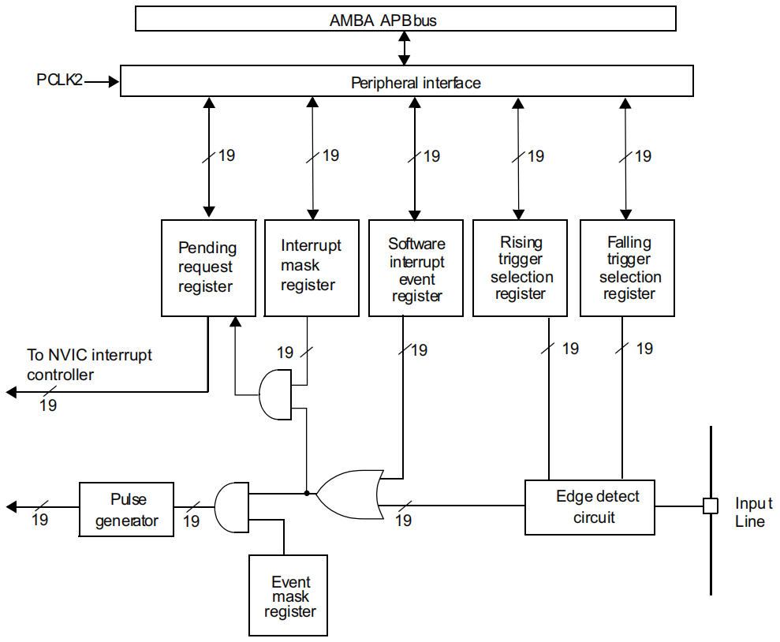</img>
</div>

## 中断优先级

> SCB 和 NVIC 相关寄存器属于内核，在 *stm32编程手册* 或 *CM3权威指南中* 能找到有关描述，参考手册是没有的。

### SCB_AIRCR

- 系统控制块（ System control block (SCB) ）

- 应用程序中断和复位控制寄存器（ Application interrupt and reset control register ）

<div align="center">
    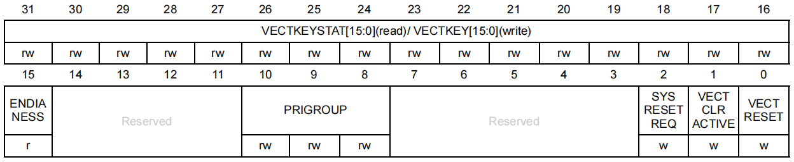</img>
</div>


- **PRIGROUP[2:0]** ：[中断优先级分组字段](#优先级分组)

### NVIC_IPRx

- 嵌套的矢量中断控制器（ Nested vectored interrupt controller ）
- 中断优先级寄存器（ Interrupt priority registers ）

<div align="center">
    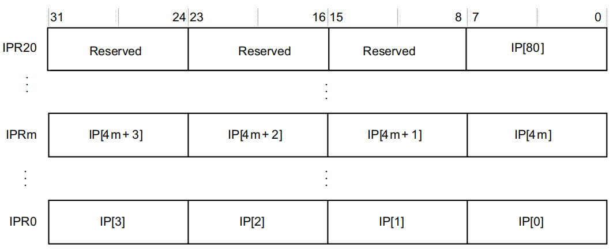</img>
</div>

 `NVIC_IPRx` 用来配置外部中断 `EXTIx` 的优先级，`IP[m]` 宽度为 `8bit`，原则上每个外部中断可配置的优先级为 `0~255`，数值越小，优先级越高。但是绝大多数 CM3 芯片都会精简设计，以致实际上支持的优先级数减少，在 F103 中，**只使用了高 4bit**，`IP[m] `如下所示：

<div align="center">
<table>
    <tr align="center" style="font-weight:bold;">
        <td align="center">bit7</td><td>bit6</td><td>bit5</td><td>bit4</td><td>bit3</td><td>bit2</td><td>bit1</td><td>bit0</td>
    </tr>
    <tr>
        <td colspan="4" align="center">用于表达优先级</td><td colspan="4" align="center">未使用，读回为 0</td>
    </tr>
</table>
</div>

用于表达优先级的这 `4bit`，又被分组成 **抢占优先级** 和 **子优先级**。如果有多个中断同时响应，抢占优先级高的就会优先得到执行，如果抢占优先级相同，就比较子优先级。如果抢占优先级和子优先级都相同的话，就比较他们的硬件中断编号，**编号越小，优先级越高**。

### 优先级分组

优先级的分组由内核外设 `SCB` 的应用程序中断及复位控制寄存器 `AIRCR` 的 `PRIGROUP[2:0]` 位决定，F103 分为了 5 组，具体如下：**主优先级 = 抢占优先级**

<div align="center">
<table>
   <tr align="center" style="font-weight:bold;">
      <td rowspan="2">PRIGROUP[2:0]</td>
      <td colspan="3">中断优先级值 PRI_N[7:4]</td>
      <td colspan="2">级数</td>
   </tr>
   <tr align="center" style="font-weight:bold;">
      <td>二进制点</td>
      <td>主优先级位</td>
      <td>子优先级位</td>
      <td>主优先级</td>
      <td>子优先级</td>
   </tr>
   <tr align="center">
      <td>0b 011</td>
      <td>0b xxxx.</td>
      <td>[7:4]</td>
      <td>None</td>
      <td>16</td>
      <td>None</td>
   </tr>
   <tr align="center">
      <td>0b 100</td>
      <td>0b xxx.y</td>
      <td>[7:5]</td>
      <td>[4]</td>
      <td>8</td>
      <td>2</td>
   </tr>
   <tr align="center" >
      <td>0b 101</td>
      <td>0b xx.yy</td>
      <td>[7:6]</td>
      <td>[5:4]</td>
      <td>4</td>
      <td>4</td>
   </tr>
   <tr align="center">
      <td>0b 110</td>
      <td>0b x.yyy</td>
      <td>[7]</td>
      <td>[6:4]</td>
      <td>2</td>
      <td>9</td>
   </tr>
   <tr align="center">
      <td>0b 111</td>
      <td>0b .yyyy</td>
      <td>None</td>
      <td>[7:4]</td>
      <td>None</td>
      <td>16</td>
   </tr>
</table>
</div>

以 `0b 100` 为例，二进制点为 `0b xxx.y`，表示前 3 位 `[7:5]` 用来表示主优先级，取值范围 `0-7`，共 8 级；后 1 位 `[4]` 用来表示子优先级，取值范围 `0-1`，共 2 级。

## 中断禁用/使能

### 中断函数

中断函数定义在 `startup_stm32f10x_hd.s` 中：

```asm
; External Interrupts
DCD     WWDG_IRQHandler            ; Window Watchdog
DCD     PVD_IRQHandler             ; PVD through EXTI Line detect
DCD     TAMPER_IRQHandler          ; Tamper
DCD     RTC_IRQHandler             ; RTC
DCD     FLASH_IRQHandler           ; Flash
DCD     RCC_IRQHandler             ; RCC
DCD     EXTI0_IRQHandler           ; EXTI Line 0
DCD     EXTI1_IRQHandler           ; EXTI Line 1
DCD     EXTI2_IRQHandler           ; EXTI Line 2
DCD     EXTI3_IRQHandler           ; EXTI Line 3
DCD     EXTI4_IRQHandler           ; EXTI Line 4
/* 篇幅有限，略去*/
```

### 中断号

中断号定义在头文件 `stm32f10x.h` 的枚举 `IRQn` 中：

```c
typedef enum IRQn
{
  /* 篇幅有限，略去*/
  EXTI0_IRQn                  = 6,      /*!< EXTI 0号线*/
  EXTI1_IRQn                  = 7,      /*!< EXTI 1号线*/
  EXTI2_IRQn                  = 8,      /*!< EXTI 2号线*/
  EXTI3_IRQn                  = 9,      /*!< EXTI 3号线*/
  EXTI4_IRQn                  = 10,     /*!< EXTI 4号线*/
  ...    
  EXTI9_5_IRQn                = 23,     /*!< External 5号到9号线*/
  ...
  EXTI15_10_IRQn              = 40,     /*!< External 10号到15号线*/
  /* 篇幅有限，略去*/
}
```

操作下面两个寄存器对应中断号的位，即可禁用/使能该中断。

### NVIC_ISERx

- 中断使能寄存器（ Interrupt set-enable registers ）

<div align="center">
    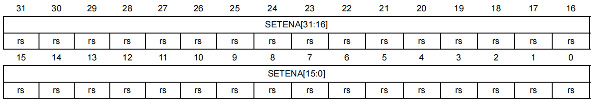</img>
</div>

**SETENA[31:0]**: 中断使能

  - 写：
    - 0：无效果
    - 1：使能中断
  - 读：
    - 0：中断禁用
    - 1：中断使能

### NVIC_ICERx

- 中断清除使能寄存器（ Interrupt clear-enable registers ）

<div align="center">
    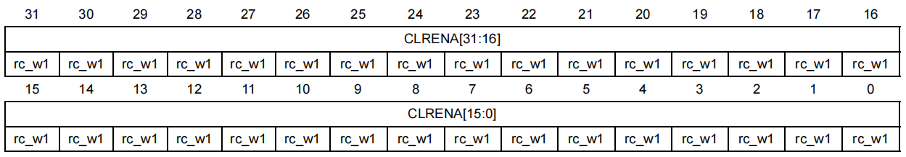</img>
</div>

**CLRENA[31:0]**: 清除中断使能

  - 写：
    - 0：无效果
    - 1：禁用中断
  - 读：
    - 0：中断禁用
    - 1：中断使能

### NVIC 结构体定义

在文件 `core_cm3.h` 中：

```c
typedef struct
{
  __IO uint32_t ISER[8];         /*!< Offset: 0x000  Interrupt Set Enable Register*/
       uint32_t RESERVED0[24];                                   
  __IO uint32_t ICER[8];         /*!< Offset: 0x080  Interrupt Clear Enable Register*/
       uint32_t RSERVED1[24];                                    
  __IO uint32_t ISPR[8];         /*!< Offset: 0x100  Interrupt Set Pending Register*/
       uint32_t RESERVED2[24];                                   
  __IO uint32_t ICPR[8];         /*!< Offset: 0x180  Interrupt Clear Pending Register*/
       uint32_t RESERVED3[24];                                   
  __IO uint32_t IABR[8];         /*!< Offset: 0x200  Interrupt Active bit Register*/
       uint32_t RESERVED4[56];                                   
  __IO uint8_t  IP[240];         /*!< Offset: 0x300  Interrupt Priority Register (8Bit wide) */
       uint32_t RESERVED5[644];                                  
  __O  uint32_t STIR;            /*!< Offset: 0xE00  Software Trigger Interrupt Register*/
}  NVIC_Type;   
```

由上面可知，NVIC_ISERx 和 NVIC_ICERx 寄存器各有 8 个

## 外部中断寄存器

### AFIO_EXTICRx

- 复用功能 I/O 口（ alternate-function I/O ）

- 外部中断配置寄存器（ External interrupt configuration register ）

**AFIO_EXTICR1**，如下图：

<div align="center">
    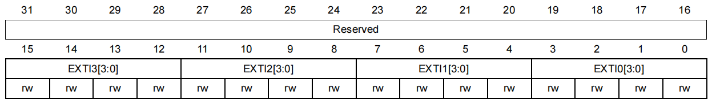</img>
</div>


. . . 

AFIO_EXTICR2

AFIO_EXTICR3

. . . 

**AFIO_EXTICR4**，如下图：

<div align="center">
    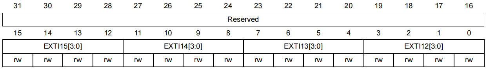</img>
</div>

- **EXTIx[3:0]:** 配置外部中断源
  - `0000`：PAx
  - `0001`：PBx
  - `0010`：PCx
  - `0011`：PDx
  - `0100`：PEx
  - `0101`：PFx
  - `0110`：PGx

对应关系如下图：

<div align="center">
    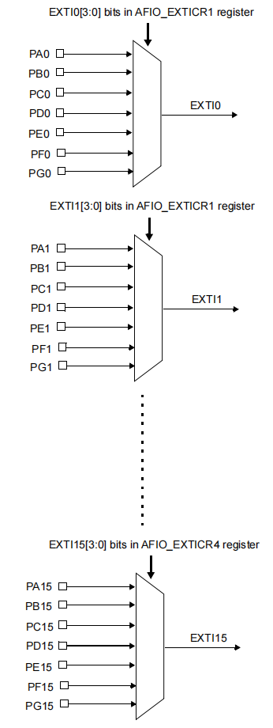</img>
</div>

### EXTI_IMR

- 外部中断/事件控制器（ External interrupt/event controller (EXTI) ）

- 中断屏蔽寄存器（ Interrupt mask register ）

<div align="center">
    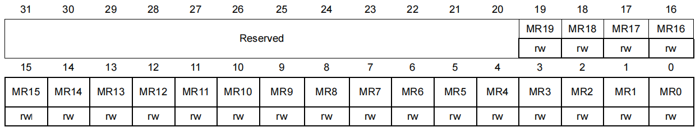</img>
</div>

- **MRx:**  屏蔽 EXTIx 中断
  - `0`：屏蔽
  - `1`：不屏蔽

### EXTI_EMR

- 事件屏蔽寄存器（ Event mask register ）

<div align="center">
    </img>
</div>

- **MRx:**  屏蔽 EXTIx 事件
  - `0`：屏蔽
  - `1`：不屏蔽

### EXTI_RTSR

- 上升沿触发选择寄存器（ Rising trigger selection register ）

<div align="center">
    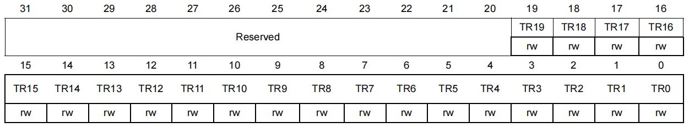</img>
</div>

- **TRx:** 配置 EXTIx 上升沿触发
  - `0`：禁用上升沿触发
  - `1`：使能上升沿触发

### EXTI_FTSR

- 下降沿触发选择寄存器（Falling trigger selection register）

<div align="center">
    </img>
</div>

- **TRx:** 配置 EXTIx 下降沿触发
  - `0`：禁用下降沿触发
  - `1`：使能下降沿触发

### EXTI_SWIER

- 软件中断事件寄存器（ Software interrupt event register ）

<div align="center">
    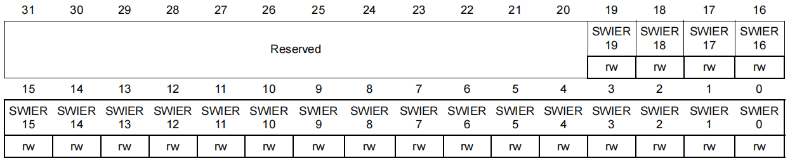</img>
</div>

- **SWIERx:**  触发 EXTIx 中断
  - `0`：无效果
  - `1`：触发中断

该寄存器通过软件控制触发中断，如下图：

<div align="center">
    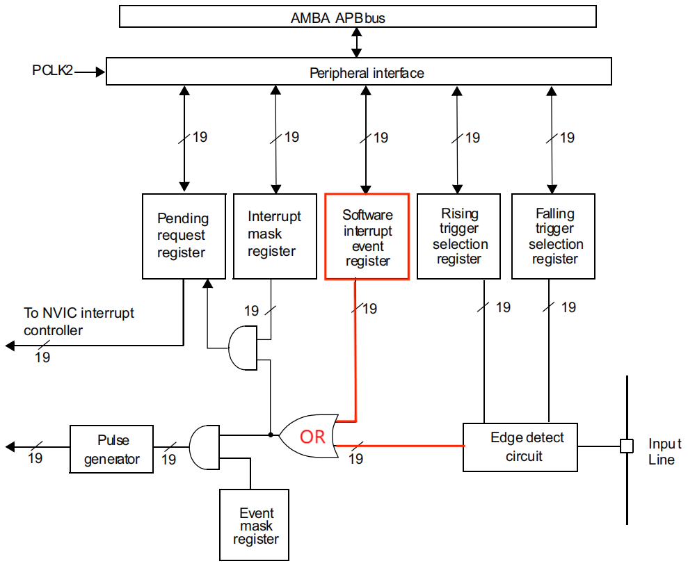</img>
</div>

EXTI_SWIER 寄存器连接到一个或门，该寄存器或外部输入信号有一个符合条件就能触发中断。

### EXTI_PR

- 挂起寄存器（ Pending register ）

<div align="center">
    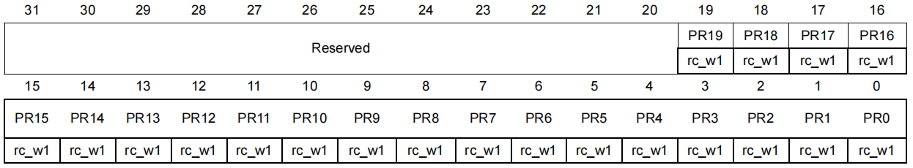</img>
</div>

- **PRx:** 挂起位（ Pending bit ）
  - `0`： 没有触发请求
  - `1`：EXTIx 发生了中断触发请求

当在外部中断线上发生了选择的边沿事件，该位被置 1。在该位中写入 1 可以清除它，也可以改变边沿检测的极性清除。

## 例程

### 寄存器

```c
void EXTI0_Config(void)
{
	RCC->APB2ENR    |= (unsigned int)0x01 << 2; //使能GPIOA时钟
	GPIOA->CRL      |= (unsigned int)0x04 << 0; //PA0 配置浮空输入
  
	RCC->APB2ENR    |= (unsigned int)0x01 << 0; //使能AFIO时钟
	AFIO->EXTICR[0] |= (unsigned int)0x00 << 0; //连接EXTI0输入线到PA0上
  
	SCB->AIRCR      |= (unsigned int)0x05 << 8; //中断控制器配置优先级分组，主2比特子2比特
    NVIC->IP[0]     |= (unsigned int)0xC0 << 0; //配置优先级主3子0（0b 1100 0000）
    NVIC->ISER[0]   |= (unsigned int)0x01 << 6; //使能EXTI0中断
    
	EXTI->IMR       |= (unsigned int)0x01 << 0; //不屏蔽EXTI0中断
	EXTI->RTSR      |= (unsigned int)0x01 << 0; //配置上升沿触发
}


void EXTI0_IRQHandler(void)
{
	if(EXTI->PR & 0x01) //检查EXTI0中断挂起标志
	{				 
		EXTI->PR = 0x01; //清除EXTI0中断挂起标志
	}		 
} 
```


### 标准库

```c
void EXTI0_Config(void)
{
  /* Enable GPIOA clock */
  RCC_APB2PeriphClockCmd(RCC_APB2Periph_GPIOA, ENABLE);
  
  /* Configure PA.00 pin as input floating */
  GPIO_InitStructure.GPIO_Pin = GPIO_Pin_0;
  GPIO_InitStructure.GPIO_Mode = GPIO_Mode_IN_FLOATING;
  GPIO_Init(GPIOA, &GPIO_InitStructure);

  /* Enable AFIO clock */
  RCC_APB2PeriphClockCmd(RCC_APB2Periph_AFIO, ENABLE);

  /* Connect EXTI0 Line to PA.00 pin */
  GPIO_EXTILineConfig(GPIO_PortSourceGPIOA, GPIO_PinSource0);

  /* Configure EXTI0 line */
  EXTI_InitStructure.EXTI_Line = EXTI_Line0;
  EXTI_InitStructure.EXTI_Mode = EXTI_Mode_Interrupt;
  EXTI_InitStructure.EXTI_Trigger = EXTI_Trigger_Rising;
  EXTI_InitStructure.EXTI_LineCmd = ENABLE;
  EXTI_Init(&EXTI_InitStructure);

  /* Enable and set EXTI0 Interrupt to the lowest priority */
  NVIC_InitStructure.NVIC_IRQChannel = EXTI0_IRQn;
  NVIC_InitStructure.NVIC_IRQChannelPreemptionPriority = 0x0F;
  NVIC_InitStructure.NVIC_IRQChannelSubPriority = 0x0F;
  NVIC_InitStructure.NVIC_IRQChannelCmd = ENABLE;
  NVIC_Init(&NVIC_InitStructure);
}


void EXTI0_IRQHandler(void)
{
  if(EXTI_GetITStatus(EXTI_Line0) != RESET)
  {
    /* Toggle LED1 */
     STM_EVAL_LEDToggle(LED1);

    /* Clear the  EXTI line 0 pending bit */
    EXTI_ClearITPendingBit(EXTI_Line0);
  }
}
```