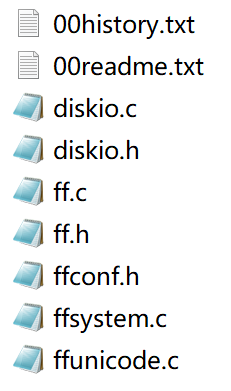
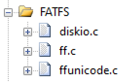

- 参考文章
  - [FatFs](http://elm-chan.org/fsw/ff/00index_e.html)
  - [串行FLASH文件系统FatFs](https://doc.embedfire.com/mcu/stm32/f103badao/std/zh/latest/book/FLASH_FatFs.html#)

## 硬件

- STM32F103ZET6
- Flash芯片：W25Q64JV

## FatFs 源码

<div align="left">
    </img>
</div>

- [下载地址](http://elm-chan.org/fsw/ff/00index_e.html)

解压后，源码都在 source 文件夹中

<div align="left">
    </img>
</div>

添加到 Keil 工程，记得添加头文件路径

<div align="left">
    </img>
</div>

## 配置 ffconf.h

```c
// 使能 f_mkfs 函数
#define FF_USE_MKFS     1
// 支持 U.S. 编码。中文是936，但是会大大增加烧录程序的大小
#define FF_CODE_PAGE    437
// 支持长文件名
#define FF_USE_LFN      1
// 文件名使用 utf8 编码，如果设置了这一项，则 FF_CODE_PAGE 没有意义
#define FF_LFN_UNICODE  2
// 物理设备数量
#define FF_VOLUMES      1
// 扇区大小的最小值
#define FF_MIN_SS       512
// 扇区大小的最大值
#define FF_MAX_SS       4096
// 不使用时间戳，如果设置0启用，则需要添加 get_fattime 函数
#define FF_FS_NORTC     1
```

## 编辑 diskio.c

需修改设备编号 DEV_FLASH 宏定义，及所有函数。

```c
/* This is an example of glue functions to attach various exsisting      */
/* storage control modules to the FatFs module with a defined API.       */
/*-----------------------------------------------------------------------*/

#include "ff.h"                 /* Obtains integer types */
#include "diskio.h"             /* Declarations of disk functions */
#include "bsp_flash.h"

/* Definitions of physical drive number for each drive */
#define DEV_FLASH    0


/*-----------------------------------------------------------------------*/
/* Get Drive Status                                                      */
/*-----------------------------------------------------------------------*/

DSTATUS disk_status (
    BYTE pdrv               /* Physical drive nmuber to identify the drive */
)
{
    switch (pdrv) {
        case DEV_FLASH :
            // 通过读 Flash id 判断
            if(FLASH_JADEC_ID == FLASH_ReadJedecID())
                return RES_OK;
            else
                return STA_NOINIT;
        default:
            return STA_NOINIT;
    }
}


/*-----------------------------------------------------------------------*/
/* Inidialize a Drive                                                    */
/*-----------------------------------------------------------------------*/

DSTATUS disk_initialize (
    BYTE pdrv               /* Physical drive nmuber to identify the drive */
)
{
    switch (pdrv) {
        case DEV_FLASH :
            // Flash 初始化
            FLASH_Init();
            return RES_OK;
        default:
            return STA_NOINIT;
    }
}


/*-----------------------------------------------------------------------*/
/* Read Sector(s)                                                        */
/*-----------------------------------------------------------------------*/

DRESULT disk_read (
    BYTE pdrv,              /* Physical drive nmuber to identify the drive */
    BYTE *buff,             /* Data buffer to store read data */
    LBA_t sector,           /* Start sector in LBA */
    UINT count              /* Number of sectors to read */
)
{
    switch (pdrv) {
        case DEV_FLASH :
            FLASH_Read(sector*FLASH_SECTOR_SIZE, buff, count*FLASH_SECTOR_SIZE);
            return RES_OK;
        default:
            return RES_PARERR;
    }
}


/*-----------------------------------------------------------------------*/
/* Write Sector(s)                                                       */
/*-----------------------------------------------------------------------*/

#if FF_FS_READONLY == 0

DRESULT disk_write (
    BYTE pdrv,              /* Physical drive nmuber to identify the drive */
    const BYTE *buff,       /* Data to be written */
    LBA_t sector,           /* Start sector in LBA */
    UINT count              /* Number of sectors to write */
)
{
    switch (pdrv) {
        case DEV_FLASH :
            // Flash 写入前需擦除扇区
            FLASH_SectorErase(sector*FLASH_SECTOR_SIZE);
            FLASH_Write(sector*FLASH_SECTOR_SIZE, (uint8_t*)buff, count*FLASH_SECTOR_SIZE);
            return RES_OK;
        default:
            return RES_PARERR;
    }
}

#endif


/*-----------------------------------------------------------------------*/
/* Miscellaneous Functions                                               */
/*-----------------------------------------------------------------------*/

DRESULT disk_ioctl (
    BYTE pdrv,              /* Physical drive nmuber (0..) */
    BYTE cmd,               /* Control code */
    void *buff              /* Buffer to send/receive control data */
)
{
    switch (pdrv) {
        case DEV_FLASH:
            switch (cmd) {
                case GET_SECTOR_COUNT:
                    // 扇区数量 2048
                    *(DWORD*)buff = FLASH_SECTOR_COUNT;
                    return RES_OK;
                    // 扇区大小 4096
                case GET_SECTOR_SIZE:
                    *(WORD*)buff = FLASH_SECTOR_SIZE;
                    return RES_OK;
                    // 同时擦除扇区个数
                case GET_BLOCK_SIZE:
                    *(DWORD*)buff = 1;
                    return RES_OK;
                default:
                    return RES_OK;
            }
        default:
            return RES_PARERR;
    }
}
```

## 测试程序

- Flash 驱动见这篇文章 [Flash SPI](../stm32-spi/)
- 因为缓冲区数组较大，所以要适当修改 **启动文件** 中 **栈** 的大小，以免溢出。

```c
uint16_t fatfs_test(void){
    FATFS fs;                        // 文件系统对象
    FIL fp;                          // 文件对象
    FRESULT ret;                     // 返回值
    UINT fnum;                       // 存储写入/读取的字节数 
    BYTE workbuf[FF_MAX_SS];         // 格式化缓冲区
    BYTE readbuf[100];               // 读缓冲区
    BYTE writebuf[] = "你好,世界!";   // 写缓冲区
    TCHAR* dev      = "0:";          // DEV_FLASH设备号
    TCHAR* fname    = "0:hello.txt"; // 文件名

    MKFS_PARM opt;             // 格式化参数               
    opt.fmt     = FM_FAT;      // 文件系统类型
    opt.n_fat   = 0;           // 0表示默认值
    opt.align   = 0;           //
    opt.n_root  = 0;           //
    opt.au_size = FF_MAX_SS;   // 簇大小    

    // 挂载设备
    ret = f_mount(&fs, dev, 1);
    switch(ret){
        case FR_OK:
            printf("挂载成功\r\n");
            break;
        case FR_NO_FILESYSTEM:
            ret = f_mkfs("0:", &opt, workbuf, FF_MAX_SS);
            if(!ret){
                printf("格式化成功\r\n");
            }else{
                printf("格式化失败（%d）\r\n", ret);
                return ret;
            }
            break;
        default:
            printf("挂载失败（%d）\r\n", ret);
            return ret;
    }

    // 测试打开文件写入
    ret = f_open(&fp, fname, FA_CREATE_ALWAYS | FA_WRITE );
    if(ret){
        printf("打开/创建文件失败（%d）\r\n", ret);
        return ret;
    }
    ret = f_write(&fp, writebuf, sizeof(writebuf), &fnum);
    if(ret){
        printf("文件写入失败（%d）\r\n", ret);
        return ret;
    }
    printf("文件写入字节数：%d \r\n", fnum);
    f_close(&fp);

    // 测试打开文件读取
    ret = f_open(&fp, fname, FA_OPEN_EXISTING | FA_READ);
    if(ret){
        printf("打开文件失败（%d）\r\n", ret);
        return ret;
    }
    ret = f_read(&fp, readbuf, sizeof(readbuf), &fnum);
    if(ret){
        printf("文件读取失败（%d）\r\n", ret);
        return ret;
    }
    printf("文件读取字节数：%d \r\n", fnum);
    printf("文件内容：\r\n%s\r\n", readbuf);
    f_close(&fp);

    // 卸载设备
    f_mount(NULL, dev, 1);
    return 0;
}
```
