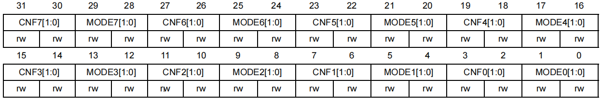
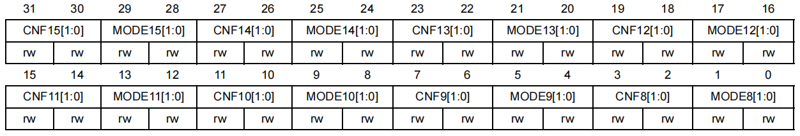
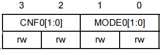
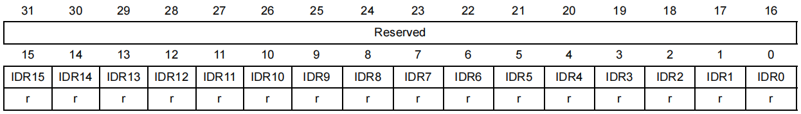
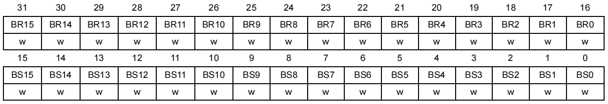
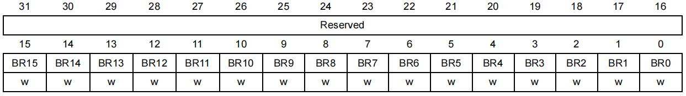
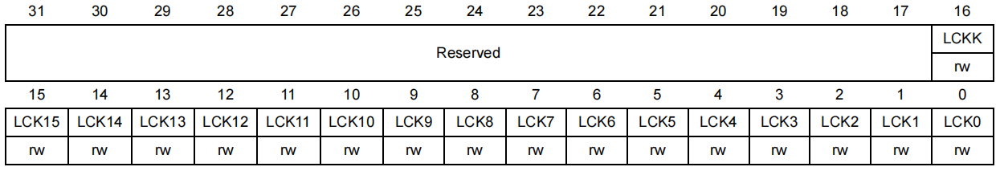

- 基于 `STM32F10x` 系列

## GPIO 寄存器

###  GPIOx_CRL

- 端口配置低位寄存器（0-7脚）（ Port configuration register low ）

<div align="center">
    </img>
</div>

### GPIO_CRH

- 端口配置高位寄存器（8-15脚）（ Port configuration register high ）

<div align="center">
    </img>
</div>

每一个引脚有4位可配置

<div align="left">
    </img>
</div>

- MODE：模式设置
  - 00：输入模式
  - 01：输出模式，最大 10 MHZ
  - 10：输出模式，最大 2 MHZ
  - 11：输出模式，最大 50 MHZ
  
- CNF：输入模式配置
  - 00：模拟输入
  - 01：浮空输入
  - 10：上拉/下拉输入
  - 11：保留

- CNF：输出模式配置
  - 00：推挽输出
  - 01：开漏输出
  - 10：复用推挽输出
  - 11：复用开漏输出

### GPIOx_IDR

- 端口输入数据寄存器（ Port input data register ）

<div align="center">
    </img>
</div>

`0-15` 位只读，读出的数值为 IO 口对应状态

### GPIOx_ODR

- 端口输出数据寄存器（ Port output data register ）

<div align="center">
    </img>
</div>

`0-15` 位可读写

### GPIOx_BSRR

- 端口位设置/清除寄存器（ Port bit set/reset register ）

<div align="center">
    </img>
</div>

- `31:16` 位：复位（只写）
  - 0：不做操作
  - 1：清除对应 ODRy 位为 0，就是对应引脚拉低电平

- `15:0` 位：置位（只写）
  - 0：不做操作
  - 1：设置对应 ODRy 位为 1

### GPIOx_BRR

- 端口位清除寄存器（ Port bit reset register ）

<div align="center">
    </img>
</div>

- 结构同 `GPIOx_IDR` ，`0-15` 位只写
  - 0：不做操作
  - 1：清除对应 ODRy 位为 0

### GPIOx_LCKR

- 端口配置锁定寄存器（ Port configuration lock register ）

<div align="center">
    </img>
</div>

用来锁定对应位的端口位配置，当端口被锁定时，不再有可能修改它的值，直到系统复位。每一个锁都冻结相应的4位控制寄存器 (CRL,CRH)

- **LCKK[16]:** 锁键，写入序列：写1 -> 写0 -> 写1 -> 读0 -> 读1
  - 0：LCKy 配置未激活
  - 1：LCKy 配置已激活，激活后只能通过复位解锁

- **LCKy:** 端口 x 的锁位，<u>只能在 LCKK 位为 0 时写入</u>
  - 0：不锁定端口配置
  - 1：锁定端口配置

#### 例程

```c
if(GPIOA->LCKR & (unsigned int)0x01 << 16){
	

	GPIOA->LCKR |=   (unsigned int)0x01 << 16;
	GPIOA->LCKR &= ~((unsigned int)0x01 << 16);
	GPIOA->LCKR |=   (unsigned int)0x01 << 16;
}
```


## 标准库头文件定义

```c
typedef struct
{
	__IO uint32_t CRL;
	__IO uint32_t CRH;
	__IO uint32_t IDR;
	__IO uint32_t ODR;
	__IO uint32_t BSRR;
	__IO uint32_t BRR;
	__IO uint32_t LCKR;
} GPIO_TypeDef;
```

## 例程

### 寄存器

```c
void GPIO_Config(void){
	RCC->APB2ENR    |= (unsigned int)0x01 << 2; //使能GPIOA时钟
	GPIOA->CRL      |= (unsigned int)0x03 << 4; //配置PA1推挽输出，最高50MHZ
}
```

### 标准库

```c
void GPIO_Config(void){
	/* 定义一个 GPIO_InitTypeDef 类型的结构体 */
	GPIO_InitTypeDef GPIO_InitStructure;
    
	/* 开启相关的 GPIO 外设时钟 */
	RCC_APB2PeriphClockCmd(RCC_APB2Periph_GPIOB, ENABLE);
    
	/* 选择要控制的 GPIO 引脚 */
	GPIO_InitStructure.GPIO_Pin = GPIO_Pin_1;
	/* 设置引脚模式为通用推挽输出 */
	GPIO_InitStructure.GPIO_Mode = GPIO_Mode_Out_PP;
	/* 设置引脚速率为 50MHz */
	GPIO_InitStructure.GPIO_Speed = GPIO_Speed_50MHz;
    
	/* 调用库函数，初始化 GPIO*/
	GPIO_Init(GPIOB, &GPIO_InitStructure);
}
```
