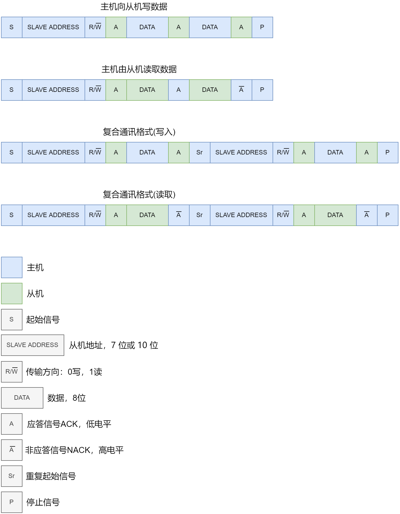
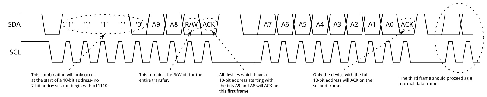
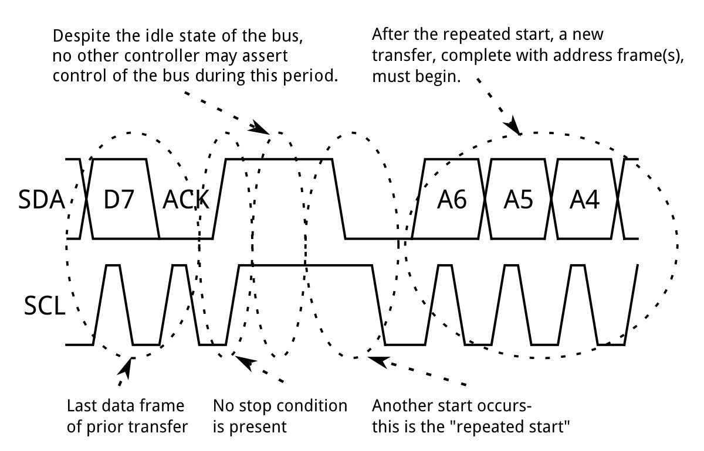
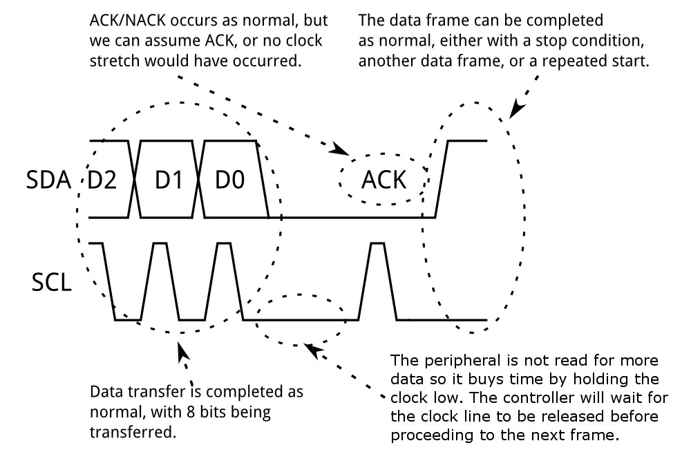
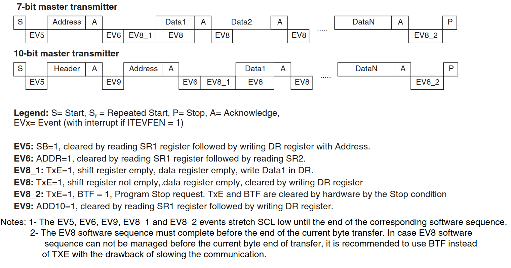
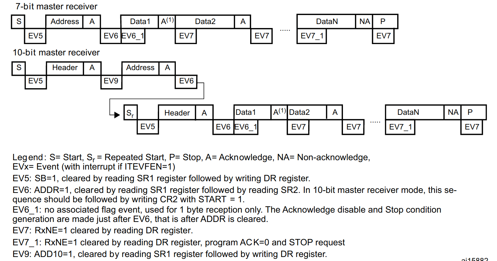
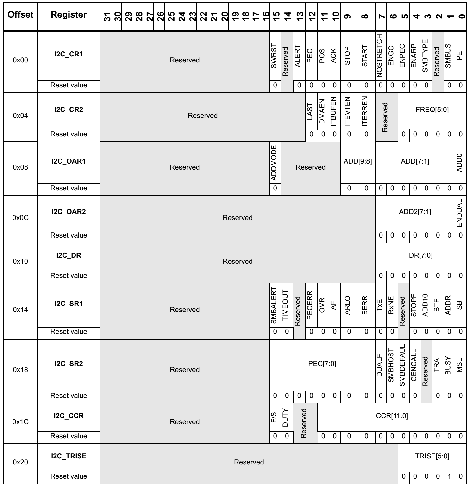

参考文章
- [I2C ](https://learn.sparkfun.com/tutorials/i2c/all)
- [I2C 时钟延展](https://blog.csdn.net/u011471873/article/details/85014124)

<div align="left">
    </img>
</div>


## 基本结构

<div align="center">
    </img>
</div>

### 起始和停止信号

当 SCL 是高电平时 SDA 线从高电平向低电平切换，表示通讯的起始。（下降沿触发）

当 SCL 是高电平时 SDA 线由低电平向高电平切换，表示通讯的停止。（上升沿触发）

### 数据有效性

SCL 为高电平的时候 SDA 表示的数据有效

### 7 位地址

如[上图](#基本结构)所示，通常地址高 4 位 `A6-A3` 表示器件类型，存储类芯片一般是 `1010b` ，这是由半导体厂家固定的。

低 3 位 `A2-A0` 表示器件地址，一般由器件的引脚电路决定。

`R/W` 位指示这是读取 (1) 还是写入 (0) 操作的 。


### 10 位地址

<div align="center">
    </img>
</div>

10 位的地址分为两帧发送。

- 第一帧，`0b 11110` 表示使用 10 位的地址。A9、A8 是地址的高 2 位。
- 第二帧，A7-A0 是地址的后 8 位。
- 第三帧，普通的数据帧。

### 响应

响应包括 **“应答 (ACK)”** 和 **“非应答 (NACK)”** 两种信号。

- ACK：继续发送
- NACK：结束发送

### 重复起始信号

I2C 通讯更常用的是复合格式，例如：第一次通讯是告诉从机读写地址，第二次则是读写的实际内容。

重复起始信号如下：

<div align="left">
    </img>
</div>

### 时钟延展

在 I2C 的主从通信过程中，总线上的 SCL 时钟总是由主机来产生和控制的，但如果从机跟不上主机的速率，I2C 协议规定从机是可以通过将 SCL 时钟线拉低来暂停一下传输，直到从机释放掉SCL线，传输继续进行。

<div align="left">
    </img>
</div>

总的来说，clock stretching 其实是一种降频的手段，使得更高频率的主机也能适应低频率从机的通信。


## STM32 I2C 收发事件

### 主机发送序列

<div align="center">
    </img>
</div>

### 主机接收序列

<div align="center">
    </img>
</div>


## 寄存器

- 控制寄存器 1（I2C CR1）
- 控制寄存器 2（I2C_CR2）
- 自身地址寄存器 1（I2C_OAR1）
- 自身地址寄存器 2（I2C_OAR2）
- 数据寄存器（I2C_DR）
- 状态寄存器 1（I2C_SR1）
- 状态寄存器 2 （I2C_SR2）
- 时钟控制寄存器（I2C_CCR）
- TRISE寄存器（I2C_TRISE）

<div align="center">
    </img>
</div>

## EEPROM I2C 驱动（标准库）

- 单片机：STM32F103ZET6
- EEPROM：AT24C02
- 使用硬件 I2C 驱动

### bsp_eeprom.h

```c
#ifndef __BSP_EEPROM_H
#define __BSP_EEPROM_H

#include "stm32f10x.h"

#define EEPROM_I2Cx                      I2C1
#define EEPROM_I2C_APBxClock_FUN         RCC_APB1PeriphClockCmd
#define EEPROM_I2C_CLK                   RCC_APB1Periph_I2C1

#define EEPROM_I2C_GPIO_APBxClock_FUN    RCC_APB2PeriphClockCmd
#define EEPROM_I2C_GPIO_CLK              RCC_APB2Periph_GPIOB
#define EEPROM_I2C_SCL_PORT              GPIOB
#define EEPROM_I2C_SCL_PIN               GPIO_Pin_6
#define EEPROM_I2C_SDA_PORT              GPIOB
#define EEPROM_I2C_SDA_PIN               GPIO_Pin_7

// 地址
#define EEPROM_ADDRESS              0xA0
// 存储容量（字节）
#define EEPROM_SIZE_BYTE            256
// 页面大小（字节）
#define EEPROM_PAGE_SIZE_BYTE       8
// 页数
#define EEPROM_PAGE_NUM             32

// I2C应答等待超时时间
#define I2CT_FLAG_TIMEOUT           ((uint32_t)0x1000)
#define I2CT_LONG_TIMEOUT           ((uint32_t)(10 * I2CT_FLAG_TIMEOUT))

// 本机地址
#define I2Cx_OWN_ADDRESS7           0x01
// I2C总线速度(Hz) 快速模式
#define I2C_SPEED                   400000
// I2C总线速度(Hz) 标准模式
// #define I2C_SPEED                100000


void EEPROM_Init(void);
uint8_t EepromWriteByte(uint8_t WriteAddr, uint8_t Byte);
uint8_t EepromWriteHalfWord(uint8_t WriteAddr, uint16_t HalfWord);
uint8_t EepromWriteWord(uint8_t WriteAddr, uint32_t Word);
uint8_t EepromWrite(uint8_t WriteAddr, uint8_t* pBuffer, uint16_t NumByteToWrite);
static uint8_t EepromWritePage(uint8_t WriteAddr, uint8_t* pBuffer, uint16_t NumByteToWrite);
static void EepromWaitStandby(void);
uint8_t EepromRead(uint8_t ReadAddr, uint8_t* pBuffer, uint16_t NumByteToRead);
```

### bsp_eeprom.c

```c
#include "bsp_eeprom.h"


/**
 * @brief  EEPROM初始化
 * @param
 * @retval
 */
void
EEPROM_Init(void){
    GPIO_InitTypeDef GPIO_InitStructure;
    I2C_InitTypeDef I2C_InitStructure;
    // 使能与 I2C 有关的时钟
    EEPROM_I2C_APBxClock_FUN(EEPROM_I2C_CLK, ENABLE);
    EEPROM_I2C_GPIO_APBxClock_FUN(EEPROM_I2C_GPIO_CLK, ENABLE);
    // I2C_SCL 开漏输出
    GPIO_InitStructure.GPIO_Pin   = EEPROM_I2C_SCL_PIN;
    GPIO_InitStructure.GPIO_Speed = GPIO_Speed_50MHz;
    GPIO_InitStructure.GPIO_Mode  = GPIO_Mode_AF_OD;
    GPIO_Init(EEPROM_I2C_SCL_PORT, &GPIO_InitStructure);
    // I2C_SDA 开漏输出
    GPIO_InitStructure.GPIO_Pin   = EEPROM_I2C_SDA_PIN;
    GPIO_InitStructure.GPIO_Speed = GPIO_Speed_50MHz;
    GPIO_InitStructure.GPIO_Mode  = GPIO_Mode_AF_OD;
    GPIO_Init(EEPROM_I2C_SDA_PORT, &GPIO_InitStructure);
    // I2C 配置
    I2C_InitStructure.I2C_Mode = I2C_Mode_I2C;
    // SCL占空比2:1，低电平/高电平，SCL为高电平的时读SDA数据
    I2C_InitStructure.I2C_DutyCycle = I2C_DutyCycle_2;
    // 本机地址
    I2C_InitStructure.I2C_OwnAddress1 =I2Cx_OWN_ADDRESS7;
    // ACK应答使能
    I2C_InitStructure.I2C_Ack = I2C_Ack_Enable ;
    // 7位寻址模式
    I2C_InitStructure.I2C_AcknowledgedAddress = I2C_AcknowledgedAddress_7bit;
    // 通信速率，不能大于400KHz
    I2C_InitStructure.I2C_ClockSpeed = I2C_SPEED;
    // I2C初始化
    I2C_Init(EEPROM_I2Cx, &I2C_InitStructure);
    // 使能I2C
    I2C_Cmd(EEPROM_I2Cx, ENABLE);
    // 使能应答
    I2C_AcknowledgeConfig(EEPROM_I2Cx, ENABLE);
}


/**
 * @brief  EEPROM 写单个字节
 * @param
 *   @arg  WriteAddr
 *   @arg  Byte
 * @retval 成功返回0，失败>0
 */
uint8_t
EepromWriteByte(uint8_t WriteAddr,uint8_t Byte){
    return EepromWrite(WriteAddr, &Byte, 1);
}


/**
 * @brief  EEPROM 写半字，小端存储
 * @param
 *   @arg  WriteAddr
 *   @arg  HalfWord
 * @retval 成功返回0，失败>0
 */
uint8_t
EepromWriteHalfWord(uint8_t WriteAddr, uint16_t HalfWord){
    return EepromWrite(WriteAddr, (uint8_t*)&HalfWord, 2);
}


/**
 * @brief  EEPROM 写字，小端存储
 * @param
 *   @arg  WriteAddr
 *   @arg  Word
 * @retval 成功返回0，失败>0
 */
uint8_t
EepromWriteWord(uint8_t WriteAddr, uint32_t Word){
    return EepromWrite(WriteAddr, (uint8_t*)&Word, 4);
}


/**
 * @brief  EEPROM 写入指定个数的字节
 * @param
 *   @arg  WriteAddr: EEPROM内部写地址
 *   @arg  pBuffer:缓冲区指针
 *   @arg  NumByteToWrite:字节数
 * @retval 成功返回0，失败>0
 */
uint8_t
EepromWrite(uint8_t WriteAddr, uint8_t* pBuffer, uint16_t NumByteToWrite){
    uint8_t WriteLen, PageOffset, errno;
    while(NumByteToWrite > 0){
        // 计算当前页能写入的字节数, 24C02不能跨页写(页面大小8字节)
        PageOffset = EEPROM_PAGE_SIZE_BYTE - (WriteAddr % EEPROM_PAGE_SIZE_BYTE);
        WriteLen   = NumByteToWrite > PageOffset ? PageOffset : NumByteToWrite;
        // 写入一页
        errno = EepromWritePage(WriteAddr, pBuffer, WriteLen);
        if(errno != 0){
            return errno;
        }
        NumByteToWrite = NumByteToWrite - WriteLen;
        // 剩余要写入的字节数大于0
        if(NumByteToWrite > 0){
            pBuffer   += WriteLen;
            WriteAddr += WriteLen;
        }
    }
    return 0;
}


/**
 * @brief  等待 EEPROM 芯片就绪
 * @param
 * @retval
 */
static void
EepromWaitStandby(void){
    __IO uint16_t SR1_Tmp = 0;
    do{
        // 发送起始信号
        I2C_GenerateSTART(EEPROM_I2Cx, ENABLE);
        // 读 I2C1 SR1 寄存器
        SR1_Tmp = I2C_ReadRegister(EEPROM_I2Cx, I2C_Register_SR1);
        // 发送EEPROM地址+写方向
        I2C_Send7bitAddress(EEPROM_I2Cx, EEPROM_ADDRESS, I2C_Direction_Transmitter);
        // 当I2C设备响应了地址的时候，ADDR会置1
    }while(!(I2C_ReadRegister(EEPROM_I2Cx, I2C_Register_SR1) & 0x0002));
    // 清除AF标志
    I2C_ClearFlag(EEPROM_I2Cx, I2C_FLAG_AF);
    // 发送停止信号
    I2C_GenerateSTOP(EEPROM_I2Cx, ENABLE);
}


/**
 * @brief   页写
 * @brief   AT24C02每页有8个字节, 且不能跨页写入
 * @param
 *   @arg   WriteAddr:写地址
 *   @arg   pBuffer:缓冲区指针
 *   @arg   NumByteToWrite:字节数
 * @retval  正常返回0，异常返回>0
 */
static uint8_t
EepromWritePage(uint8_t WriteAddr, uint8_t* pBuffer, uint16_t NumByteToWrite){
    __IO uint32_t I2CTimeout = I2CT_LONG_TIMEOUT;
    // 等待总线空闲
    while(I2C_GetFlagStatus(EEPROM_I2Cx, I2C_FLAG_BUSY)){
        if((I2CTimeout--) == 0) return 1;
    }
    // 发送起始信号
    I2C_GenerateSTART(EEPROM_I2Cx, ENABLE);
    I2CTimeout = I2CT_FLAG_TIMEOUT;
    while(!I2C_CheckEvent(EEPROM_I2Cx, I2C_EVENT_MASTER_MODE_SELECT)){
        if((I2CTimeout--) == 0) return 2;
    }
    // 发送EEPROM地址+写方向
    I2C_Send7bitAddress(EEPROM_I2Cx, EEPROM_ADDRESS, I2C_Direction_Transmitter);
    I2CTimeout = I2CT_FLAG_TIMEOUT;
    while(!I2C_CheckEvent(EEPROM_I2Cx, I2C_EVENT_MASTER_TRANSMITTER_MODE_SELECTED)){
        if((I2CTimeout--) == 0) return 3;
    }
    // 发送EEPROM内部要写入的起始地址
    I2C_SendData(EEPROM_I2Cx, WriteAddr);
    I2CTimeout = I2CT_FLAG_TIMEOUT;
    while(!I2C_CheckEvent(EEPROM_I2Cx, I2C_EVENT_MASTER_BYTE_TRANSMITTED)){
        if((I2CTimeout--) == 0) return 4;
    }
    // 发送数据
    while(NumByteToWrite--)
    {
        // 发送一个字节
        I2C_SendData(EEPROM_I2Cx, *pBuffer++);
        I2CTimeout = I2CT_FLAG_TIMEOUT;
        while (!I2C_CheckEvent(EEPROM_I2Cx, I2C_EVENT_MASTER_BYTE_TRANSMITTED)){
            if((I2CTimeout--) == 0) return 5;
        }
    }
    // 发送停止信号
    I2C_GenerateSTOP(EEPROM_I2Cx, ENABLE);
    // 等待芯片页写完成
    EepromWaitStandby();
    return 0;
}


/**
 * @brief  读取指定个数的字节到pBuffer
 * @param
 *   @arg  ReadAddr:接收数据的EEPROM的地址
 *   @arg  pBuffer:存放从EEPROM读取的数据的缓冲区指针
 *   @arg  NumByteToRead:要从EEPROM读取的字节数
 * @retval 正常返回0，异常返回>0
 */
uint8_t EepromRead(uint8_t ReadAddr, uint8_t* pBuffer, uint16_t NumByteToRead){
    __IO uint32_t I2CTimeout = I2CT_LONG_TIMEOUT;
    // 等待总线空闲
    while(I2C_GetFlagStatus(EEPROM_I2Cx, I2C_FLAG_BUSY)){
        if((I2CTimeout--) == 0) return 6;
    }
    // 产生I2C起始信号
    I2C_GenerateSTART(EEPROM_I2Cx, ENABLE);
    I2CTimeout = I2CT_FLAG_TIMEOUT;
    while(!I2C_CheckEvent(EEPROM_I2Cx, I2C_EVENT_MASTER_MODE_SELECT)){
        if ((I2CTimeout--) == 0) return 7;
    }
    // 发送EEPROM地址+写方向
    I2C_Send7bitAddress(EEPROM_I2Cx, EEPROM_ADDRESS,I2C_Direction_Transmitter);
    I2CTimeout = I2CT_FLAG_TIMEOUT;
    while (!I2C_CheckEvent(EEPROM_I2Cx, I2C_EVENT_MASTER_TRANSMITTER_MODE_SELECTED)){
        if ((I2CTimeout--) == 0) return 8;
    }
    // 通过重新设置PE位清除EV6事件
    I2C_Cmd(EEPROM_I2Cx, ENABLE);
    // 发送要读取的EEPROM内部地址
    I2C_SendData(EEPROM_I2Cx, ReadAddr);
    I2CTimeout = I2CT_FLAG_TIMEOUT;
    while (!I2C_CheckEvent(EEPROM_I2Cx,I2C_EVENT_MASTER_BYTE_TRANSMITTED)){
        if ((I2CTimeout--) == 0) return 9;
    }
    // 产生第二次I2C起始信号
    I2C_GenerateSTART(EEPROM_I2Cx, ENABLE);
    I2CTimeout = I2CT_FLAG_TIMEOUT;
    while(!I2C_CheckEvent(EEPROM_I2Cx, I2C_EVENT_MASTER_MODE_SELECT)){
        if ((I2CTimeout--) == 0) return 10;
    }
    // 发送EEPROM设备地址+读方向
    I2C_Send7bitAddress(EEPROM_I2Cx, EEPROM_ADDRESS, I2C_Direction_Receiver);
    I2CTimeout = I2CT_FLAG_TIMEOUT;
    while(!I2C_CheckEvent(EEPROM_I2Cx, I2C_EVENT_MASTER_RECEIVER_MODE_SELECTED)){
        if ((I2CTimeout--) == 0) return 11;
    }
    do{
        // 若是最后一个数据，发送非应答信号，结束传输
        if (NumByteToRead-- == 1){
            // 发送非应答信号
            I2C_AcknowledgeConfig(EEPROM_I2Cx, DISABLE);
            // 发送停止信号
            I2C_GenerateSTOP(EEPROM_I2Cx, ENABLE);
        }
        I2CTimeout = I2CT_LONG_TIMEOUT;
        while(!I2C_CheckEvent(EEPROM_I2Cx, I2C_EVENT_MASTER_BYTE_RECEIVED)){
            if((I2CTimeout--) == 0) return 12;
        }
        // 读取一个字节
        *pBuffer++ = I2C_ReceiveData(EEPROM_I2Cx);
    }while(NumByteToRead);
    // 使能应答，方便下一次I2C传输
    I2C_AcknowledgeConfig(EEPROM_I2Cx, ENABLE);
    return 0;
}
```


