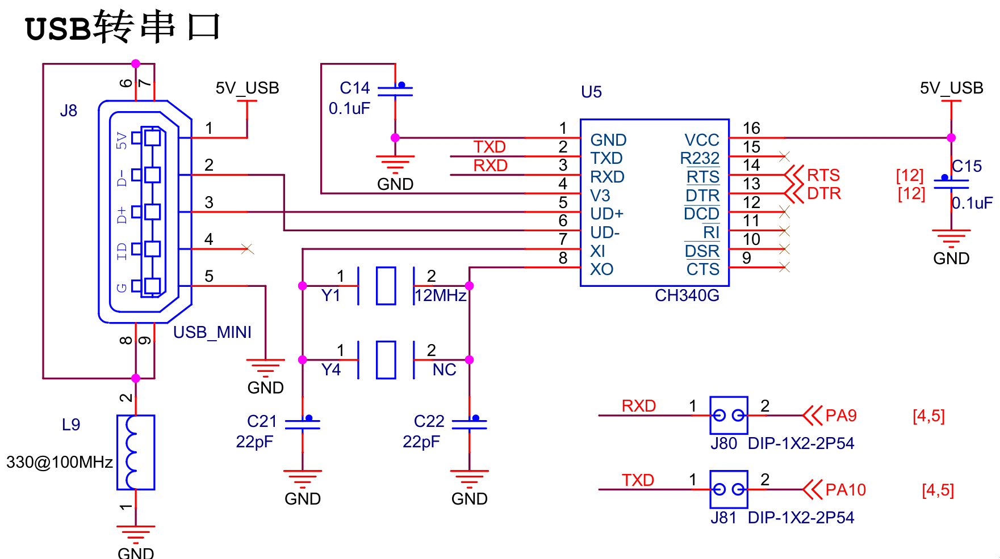
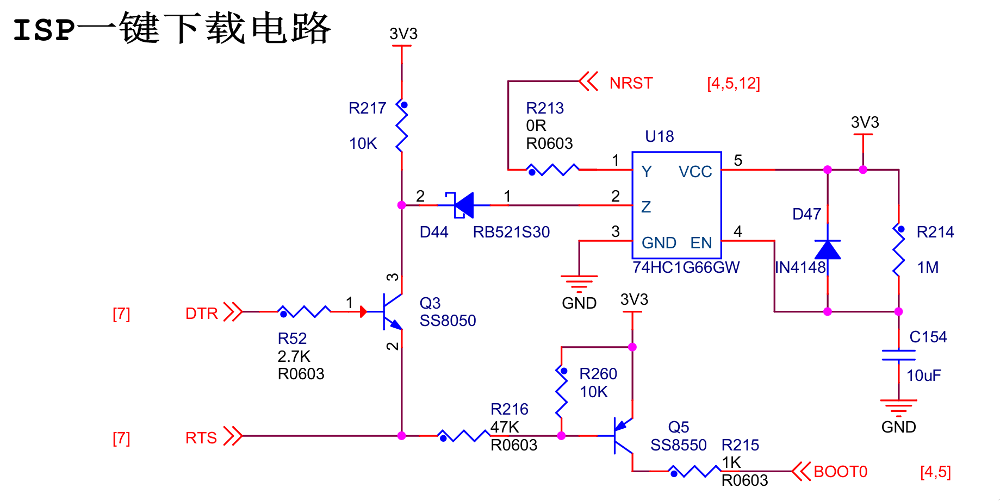
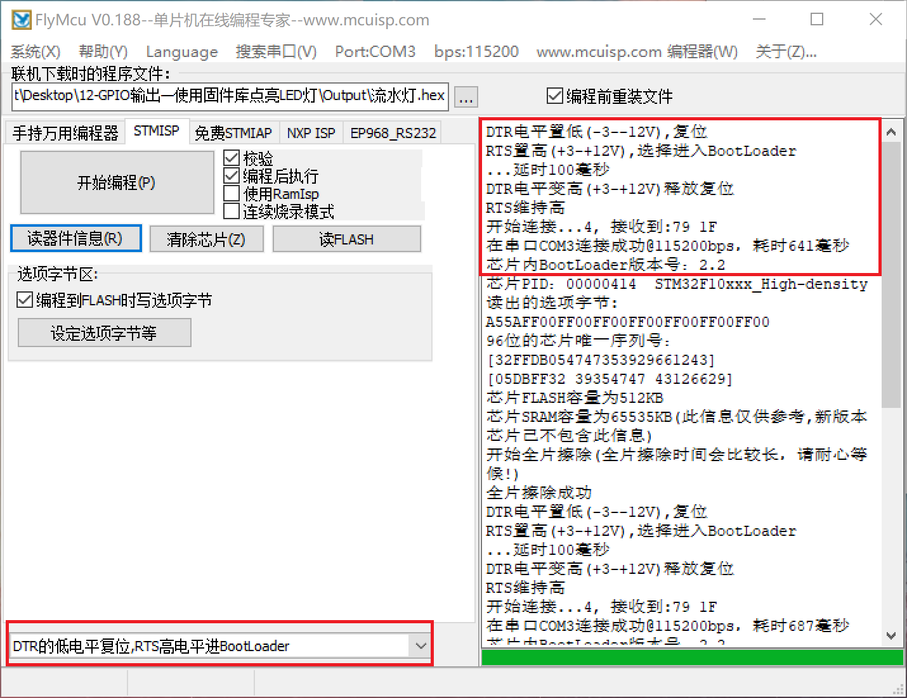

## stm32 启动模式

|BOOT0|BOOT1|启动方式|
|--|--|--|
|0|X|内部flash，用户程序|
|1|0|系统存储器，BootLoader|
|0|1|内部SRAM，程序调试|

厂家的 BootLoader 已提供了串口下载的功能，所以我们只要进入 BootLoader 即可。

即在单片机启动时将`BOOT0`置高电平，`BOOT1`置低电平。

## 一键下载电路

本文以野火霸道V2.0开发板为例

<div align="center">
    </img>
</div>

<div align="center">
    </img>
</div>

要进入bootloader，有以下流程:

1. **BOOT1** 跳线接  **GND**
2. **DTR** 置高电平，**RTS** 置低电平
3. **Q3** 被导通，**NRST** 被拉低，单片机复位
4. **Q5** 被导通，**BOOT0** 被拉高
5. **DTR** 置低电平，释放复位
6. 启动进入 **BootLoader**

**这里注意CH340G 芯片，DTR 和 RTS 输出电平是反向的（芯片图DTR上方有一横线）。所以实际是， DTR 低电平复位，RTS 高电平进入BootLoader。**

## Windows ISP 下载

<div align="center">
    </img>
</div>

如上图所示：DTR 低电平复位，RTS 高电平进入BootLoader。

## Linux ISP 下载

Linux 下使用 [stm32flash](https://sourceforge.net/projects/stm32flash/) 下载。下载解压后文件夹内有 `stm32flash_linux` 。

该命令有以下参数

```bash
Usage: stm32flash_linux [-bvngfhc] [-[rw] filename] [tty_device|i2c_device]
    -a bus_address  # 总线地址
    -b rate         # 波特率
    -m mode         # 串口模式
    -r filename     # 读取flash到文件（或者使用 - 符号， 表示标准输出）
    -w filename     # 写入文件到flash（或者使用 - 符号， 表示标准输出）
    -C              # 计算flash crc校验码
    -u              # 禁用flash写保护
    -j              # 启用flash读保护
    -k              # 禁用flash读保护
    -o              # 仅擦除
    -e n            # 写入flash前仅擦除n页，默认全擦
    -v              # 写入后校验
    -n count        # 写入失败重试次数，默认10
    -g address      # 指定程序开始执行的地址
    -S address[:length]       # 指定读取/写入的起始地址和长度（可选）
    -F RX_length[:TX_length]  # 指定接收/发送帧的最大长度
    -s start_page   # 在指定的页面写入
    -f              # 强制二进制解析
    -h              # 显示帮助信息
    -c              # 恢复连接
    -R              # 退出时复位设备
    -i GPIO_string  # 设置进入/退出BootLoader时信号输出的顺序
                    # GPIO_string=[entry_seq][:[exit_seq]]
                    # sequence=[[-]signal]&|,[sequence]
    
GPIO sequence:
    # 使用‘dtr’，‘rts’，‘brk’表示串口输出信号
    # ‘,’表示在在两个信号之间加100ms延时
    # ‘&’表示两个信号之间不加延时
    # 在信号前加‘-’表示低电平，不加表示高电平    
```

读取芯片信息，执行以下命令（root）：

```text
stm32flash_linux -b 115200 -i '-dtr&rts,dtr:-dtr&-rts,dtr' /dev/ttyUSB0
```
参数说明：
- -b 115200 ，指定115200波特率
- -dtr&rts,dtr
   - -dtr& 拉低复位
   - rts, 拉高 BOOT0，延时100ms
   - dtr 释放复位，进入 BootLoader
- -dtr&-rts,dtr
   - -dtr& 拉低复位
   - -rts, 拉低 BOOT0，延时100ms
   - dtr 释放复位，flash启动进入用户程序
- /dev/ttyUSB0，设备串口

上述命令执行成功输出以下信息：

```text
Interface serial_posix: 115200 8E1

GPIO sequence start
 setting port signal dtr to 0... ok
 setting port signal rts to 1... ok
 delay 100000 us
 setting port signal dtr to 1... ok
GPIO sequence end

Version      : 0x22
Option 1     : 0x00
Option 2     : 0x00
Devive ID    : 0x0414 (STM32F10XX High-density)
- RAM        : Up to 64KiB (512b reserved by bootloader)
- Flash      : Up to 512Kib (size first sector: 2x2048)
- Option RAM : 16b
- System RAm : 2KiB

GPIO sequence start
 setting port signal dtr to 0... ok
 setting port signal rts to 0... ok
 delay 100000 us
 setting port signal dtr to 1... ok
GPIO sequence end
```

下载程序，执行以下命令

```text
stm32flash_linux -b 115200 -i '-dtr&rts,dtr:-dtr&-rts,dtr' -v -w test.bin /dev/ttyUSB0
```
