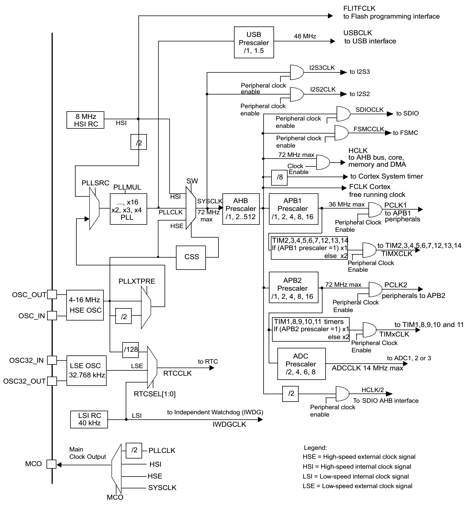

<div align="center">
    </img>
</div>


## 寄存器

|寄存器|说明|
|:--|:--|
|RCC_CR|时钟控制寄存器（Clock control register）|
|RCC_CFGR|时钟配置寄存器（Clock configuration register）|
|RCC_CIR|时钟中断寄存器（Clock interrupt register）|
|RCC_APB2RSTR|APB2 外设复位寄存器（APB2 peripheral reset register）|
|RCC_APB1RSTR|APB1 外设复位寄存器（APB1 peripheral reset register）|
|RCC_AHBENR|AHB 外设时钟使能寄存器（AHB peripheral clock enable register）|
|RCC_APB2EBR|APB2 外设时钟使能寄存器 （APB2 peripheral clock enable register）|
|RCC_APB1ENR|APB1 外设时钟使能寄存器 （APB1 peripheral clock enable register）|
|RCC_BDCR|备份域控制寄存器（Backup domain control register）|
|RCC_CSR|控制状态寄存器（Control/status register）|

## 头文件定义

```c
typedef struct
{
	__IO uint32_t CR;
	__IO uint32_t CFGR;
	__IO uint32_t CIR;
	__IO uint32_t APB2RSTR;
	__IO uint32_t APB1RSTR;
	__IO uint32_t AHBENR;
	__IO uint32_t APB2ENR;
	__IO uint32_t APB1ENR;
	__IO uint32_t BDCR;
	__IO uint32_t CSR;

#ifdef STM32F10X_CL  
	__IO uint32_t AHBRSTR;
	__IO uint32_t CFGR2;
#endif /* STM32F10X_CL */ 

#if defined (STM32F10X_LD_VL) || defined (STM32F10X_MD_VL) || defined (STM32F10X_HD_VL)   
	uint32_t RESERVED0;
	__IO uint32_t CFGR2;
#endif /* STM32F10X_LD_VL || STM32F10X_MD_VL || STM32F10X_HD_VL */
} RCC_TypeDef;
```

## 例程

### 寄存器

```c
void SetSysClockTo72(void)
{
    __IO uint32_t StartUpCounter = 0, HSEStatus = 0;
   
    RCC_DeInit();
    
    // 使能 HSE
    RCC->CR |= ((uint32_t)0x01 << 16);
 
    // 等待 HSE 启动
    do{
        HSEStatus = RCC->CR & ((uint32_t)0x01 << 17);
        StartUpCounter++;  
    }while((HSEStatus == 0) && (StartUpCounter != HSE_STARTUP_TIMEOUT));

    if ((RCC->CR & ((uint32_t)0x01 << 17)) != RESET){
        HSEStatus = (uint32_t)0x01;
    }else{
        HSEStatus = (uint32_t)0x00;
    }

    if (HSEStatus == (uint32_t)0x01){
        /* 使能 FLASH 预存取缓冲区 */
        FLASH->ACR |= FLASH_ACR_PRFTBE;

        /* Flash 2 wait state */
        FLASH->ACR &= (uint32_t)((uint32_t)~FLASH_ACR_LATENCY);
        FLASH->ACR |= (uint32_t)FLASH_ACR_LATENCY_2;    
      
        // AHB 时钟 HCLK = SYSCLK 不分频
        RCC->CFGR |= (uint32_t)0x00 << 4;
        // 高速 APB2 时钟 PCLK2 = HCLK 不分频
        RCC->CFGR |= (uint32_t)0x00 << 11;
        // 低速 APB1 时钟 PCLK1 = HCLK/2 二分频
        RCC->CFGR |= (uint32_t)0x04 << 8;

        // PLL 输入时钟源 HSE
        RCC->CFGR |= (uint32_t)0x01 << 16;
        // HSE 不分频  
        RCC->CFGR |= (uint32_t)0x00 << 17;
        // PLL 9倍频 PLLCLK = 8MHz * 9 = 72 MHz
        RCC->CFGR |= (uint32_t)0x07 << 18;

        // 使能 PLL
        RCC->CR |= (uint32_t)0x01 << 24;
        // 等待 PLL 时钟就绪
        while((RCC->CR & ((uint32_t)0x01 << 25)) == 0);
        // 选择 PLL 作为系统时钟源
        RCC->CFGR |= (uint32_t)0x02 << 0;
        // 等待 PLL 作为系统时钟源
        while ((RCC->CFGR & ((uint32_t)0x02 << 2)) != (uint32_t)0x08);
    }else{ 
        // HSE 启动失败
    }
}
```

### 标准库

```c
void SetSysClockTo72(void)
{
    /* RCC system reset(for debug purpose) */
    RCC_DeInit();

    /* Enable HSE */
    RCC_HSEConfig(RCC_HSE_ON);

    /* Wait till HSE is ready */
    HSEStartUpStatus = RCC_WaitForHSEStartUp();

    if (HSEStartUpStatus == SUCCESS){
        /* Enable Prefetch Buffer */
        FLASH_PrefetchBufferCmd(FLASH_PrefetchBuffer_Enable);
        /* Flash 2 wait state */
        FLASH_SetLatency(FLASH_Latency_2);
 
        /* HCLK = SYSCLK */
        RCC_HCLKConfig(RCC_SYSCLK_Div1); 
        /* PCLK2 = HCLK */
        RCC_PCLK2Config(RCC_HCLK_Div1); 
        /* PCLK1 = HCLK/2 */
        RCC_PCLK1Config(RCC_HCLK_Div2);
        
        /* PLLCLK = 8MHz * 9 = 72 MHz */
        RCC_PLLConfig(RCC_PLLSource_HSE_Div1, RCC_PLLMul_9);
        /* Enable PLL */ 
        RCC_PLLCmd(ENABLE);

        /* Wait till PLL is ready */
        while (RCC_GetFlagStatus(RCC_FLAG_PLLRDY) == RESET);

        /* Select PLL as system clock source */
        RCC_SYSCLKConfig(RCC_SYSCLKSource_PLLCLK);

        /* Wait till PLL is used as system clock source */
        while(RCC_GetSYSCLKSource() != 0x08);
    }else{ 
        /* If HSE fails to start-up, the application will have wrong clock configuration.
        User can add here some code to deal with this error */    

        /* Go to infinite loop */
        while (1);
    }
}
```

