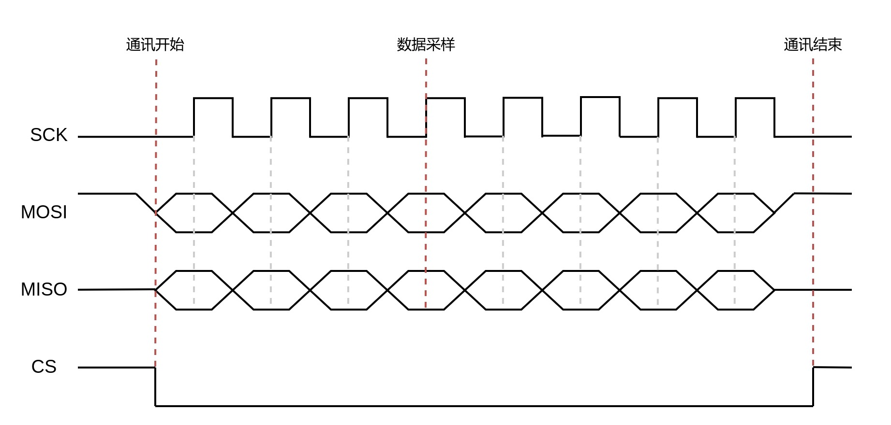
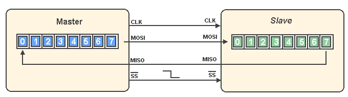

## SPI 基本通讯过程


<div align="center">
    </img>
</div>


<div align="center">
    </img>
</div>


**SCK**： 串行时钟信号，由主机产生发送给从机 

**MOSI**：发送：主机输出，从机输入

**MISO**：接收：主机输入，从机输出

**CS**：  片选信号，通讯时拉低


## SPI 时钟

- **时钟极性 Clock Polarity （CPOL）**
  - CPOL = 0 ，SCK 空闲时低电平
  - CPOL = 1 ，SCK 空闲时高电平

- **时钟相位 Clock Phase （CPHA）**
  - CPHA = 0，SCK 的第一个（奇数个）跳变沿采样数据
  - CPHA = 1，SCK 的第二个（偶数个）跳变沿采样数据


## SPI 模式

|SPI 模式|CPOL|CPHA|SCK 空闲电平|采样沿|
|:-:|:-:|:-:|:-:|:-:|
|0|0|0|低电平|上升沿|
|1|0|1|低电平|下降沿|
|2|1|0|高电平|下降沿|
|3|1|1|高电平|上升沿|


## SPI 读写 Flash
- 硬件
  - STM32F103ZET6
  - Flash：W25Q64JV

- Flash 写前需要先擦除。因为 Flash 只能将 1 写为 0，而不能将 0 写为 1。擦除后 flash 全是 1。

- SPI 发送的 Dummy_Byte 是无用数据，只是为了产生时钟信号以读取数据。

### bsp_flash.h

```c
/*
 * flash 型号 W25Q64JV  64M-bit
-------------------------------------------------------------------
|   容量   |  扇区大小 |  扇区数量 |  页面大小 |  扇区页面数量 |  页面总数 |
-------------------------------------------------------------------
|   8 MB  |   4 KB   |   2048  | 256 byte |      16     |  32768   |
-------------------------------------------------------------------
*/
#ifndef __BSP_FLASH_H
#define __BSP_FLASH_H
#include "stm32f10x.h"

#define FLASH_SPIx                      SPI1
#define FLASH_SPI_APBxClock_FUN         RCC_APB2PeriphClockCmd
#define FLASH_SPI_CLK                   RCC_APB2Periph_SPI1
#define FLASH_PIN_APBxClock_FUN         RCC_APB2PeriphClockCmd
// CS(NSS)引脚 片选选普通GPIO即可
#define FLASH_SPI_CS_CLK                RCC_APB2Periph_GPIOA
#define FLASH_SPI_CS_PORT               GPIOA
#define FLASH_SPI_CS_PIN                GPIO_Pin_4
// SCK引脚
#define FLASH_SPI_SCK_CLK               RCC_APB2Periph_GPIOA
#define FLASH_SPI_SCK_PORT              GPIOA
#define FLASH_SPI_SCK_PIN               GPIO_Pin_5
// MISO引脚
#define FLASH_SPI_MISO_CLK              RCC_APB2Periph_GPIOA
#define FLASH_SPI_MISO_PORT             GPIOA
#define FLASH_SPI_MISO_PIN              GPIO_Pin_6
// MOSI引脚
#define FLASH_SPI_MOSI_CLK              RCC_APB2Periph_GPIOA
#define FLASH_SPI_MOSI_PORT             GPIOA
#define FLASH_SPI_MOSI_PIN              GPIO_Pin_7
// 片选电平控制
#define FLASH_SPI_CS_LOW()              GPIO_ResetBits( FLASH_SPI_CS_PORT, FLASH_SPI_CS_PIN )
#define FLASH_SPI_CS_HIGH()             GPIO_SetBits( FLASH_SPI_CS_PORT, FLASH_SPI_CS_PIN )
// 页面大小，W25Q64JV不能跨页写
#define FLASH_PAGE_SIZE                 256
// 扇区大小
#define FLASH_SECTOR_SIZE               4096
// 扇区数量
#define FLASH_SECTOR_COUNT              2048
// 等待超时时间，如果读写数据异常适当调整
#define FLASH_FLAG_TIMEOUT              ((uint32_t)0x10000)
#define FLASH_BUSY_TIMEOUT              ((uint32_t)0x100000)
// FLASH芯片状态寄存器1的BUSY标志位
#define FLASH_BUSY_FLAG                 0x01

#define Dummy_Byte                      0xFF

// FLASH指令
#define WRITE_ENABLE          0x06
#define WRITE_DISABLE         0x04
#define READ_SR1              0x05
#define READ_DATA             0x03
#define PAGE_PROGRAM          0x02
#define SECOTR_ERASE          0x20
#define CHIP_ERASE            0xC7
#define JEDEC_ID              0x9F


void FLASH_Init(void);
uint32_t FLASH_ReadJedecID(void);
void FLASH_Write(uint32_t WriteAddr, uint8_t* pBuffer, uint16_t NumByteToWrite);
void FLASH_Read(uint32_t ReadAddr, uint8_t* pBuffer, uint16_t NumByteToRead);
void FLASH_SectorErase(uint32_t SectorAddr);
void FLASH_ChipErase(void);
static uint8_t FLASH_SendByte(uint8_t byte);
static void FLASH_WriteEnable(void);
static uint8_t FLASH_WaitForWriteEnd(void);
static void FLASH_PageWrite(uint32_t WriteAddr, uint8_t* pBuffer, uint16_t NumByteToWrite);

#endif
```

### bsp_falsh.c

```c
#include "bsp_flash.h"


/**
  * @brief  FLASH初始化
  * @param  无
  * @retval 无
  */
void
FLASH_Init(void){
    SPI_InitTypeDef  SPI_InitStructure;
    GPIO_InitTypeDef GPIO_InitStructure;
    // 使能SPI时钟
    FLASH_SPI_APBxClock_FUN ( FLASH_SPI_CLK, ENABLE );
    // 使能SPI引脚相关的时钟
    FLASH_PIN_APBxClock_FUN(FLASH_SPI_CS_CLK|
                            FLASH_SPI_SCK_CLK|
                            FLASH_SPI_MISO_PIN|
                            FLASH_SPI_MOSI_PIN, 
                            ENABLE );
    // CS引脚，普通IO即可
    GPIO_InitStructure.GPIO_Pin   = FLASH_SPI_CS_PIN;
    GPIO_InitStructure.GPIO_Speed = GPIO_Speed_50MHz;
    GPIO_InitStructure.GPIO_Mode  = GPIO_Mode_Out_PP;
    GPIO_Init(FLASH_SPI_CS_PORT, &GPIO_InitStructure);
    // SCK引脚
    GPIO_InitStructure.GPIO_Pin  = FLASH_SPI_SCK_PIN;
    GPIO_InitStructure.GPIO_Mode = GPIO_Mode_AF_PP;
    GPIO_Init(FLASH_SPI_SCK_PORT, &GPIO_InitStructure);
    // MISO引脚
    GPIO_InitStructure.GPIO_Pin = FLASH_SPI_MISO_PIN;
    GPIO_Init(FLASH_SPI_MISO_PORT, &GPIO_InitStructure);
    // MOSI引脚
    GPIO_InitStructure.GPIO_Pin = FLASH_SPI_MOSI_PIN;
    GPIO_Init(FLASH_SPI_MOSI_PORT, &GPIO_InitStructure);
    // 停止信号 FLASH: CS引脚高电平
    FLASH_SPI_CS_HIGH();
    // SPI配置
    // 双线双向全双工
    SPI_InitStructure.SPI_Direction = SPI_Direction_2Lines_FullDuplex;
    // 主机模式
    SPI_InitStructure.SPI_Mode = SPI_Mode_Master;
    // 数据帧长度8bit
    SPI_InitStructure.SPI_DataSize = SPI_DataSize_8b;
    // 时钟极性，SCK空闲时高电平
    SPI_InitStructure.SPI_CPOL = SPI_CPOL_High;
    // 时钟相位，在SCK的第二(偶数)个跳变沿采样
    SPI_InitStructure.SPI_CPHA = SPI_CPHA_2Edge;
    // 软件控制CS脚
    SPI_InitStructure.SPI_NSS = SPI_NSS_Soft;
    // SCK时钟频率，PLCK2/4=72/4=18MHz
    SPI_InitStructure.SPI_BaudRatePrescaler = SPI_BaudRatePrescaler_4;
    // 数据传输时高位先行
    SPI_InitStructure.SPI_FirstBit = SPI_FirstBit_MSB;
    // CRC校验的多项式，对应X0+X1+X2,是CRC-8校验类型
    SPI_InitStructure.SPI_CRCPolynomial = 7;
    // 初始化SPI
    SPI_Init(FLASH_SPIx, &SPI_InitStructure);
    // 使能SPI
    SPI_Cmd(FLASH_SPIx, ENABLE);
}


/**
  * @brief  使用SPI发送一个字节的数据
  * @param  byte：要发送的数据
  * @retval 返回接收到的数据
  */
static uint8_t 
FLASH_SendByte(uint8_t byte){
    __IO uint32_t  SPITimeout = FLASH_FLAG_TIMEOUT;
    // 等待发送缓冲区为空，TXE事件
    while(SPI_I2S_GetFlagStatus(FLASH_SPIx , SPI_I2S_FLAG_TXE) == RESET){
        if((SPITimeout--) == 0) return 0xFF;
    }
    // 写入数据寄存器，把要写入的数据写入发送缓冲区
    SPI_I2S_SendData(FLASH_SPIx , byte);
    SPITimeout = FLASH_FLAG_TIMEOUT;
    // 等待接收缓冲区非空，RXNE事件
    while (SPI_I2S_GetFlagStatus(FLASH_SPIx , SPI_I2S_FLAG_RXNE) == RESET){
        if((SPITimeout--) == 0) return 0xFF;
    }
    return SPI_I2S_ReceiveData(FLASH_SPIx );
}


/**
  * @brief  读取FLASH Jedec ID
  * @param  无
  * @retval Jedec ID
  */
uint32_t 
FLASH_ReadJedecID(void){
    uint8_t Temp[]={0,0,0,0};
    FLASH_SPI_CS_LOW();
    FLASH_SendByte(JEDEC_ID);
    Temp[2] = FLASH_SendByte(Dummy_Byte);
    Temp[1] = FLASH_SendByte(Dummy_Byte);
    Temp[0] = FLASH_SendByte(Dummy_Byte);
    FLASH_SPI_CS_HIGH();
    return *(uint32_t *)Temp;
}


/**
  * @brief  读取FLASH数据
  * @param  ReadAddr，读取地址
  * @param  pBuffer，存储读出数据的指针
  * @param  NumByteToRead，读取数据长度
  * @retval 无
  */
void 
FLASH_Read(uint32_t ReadAddr, uint8_t* pBuffer, uint16_t NumByteToRead){
    uint8_t* Addr = (uint8_t*)&ReadAddr;
    FLASH_SPI_CS_LOW();
    FLASH_SendByte(READ_DATA);
    FLASH_SendByte(Addr[2]);
    FLASH_SendByte(Addr[1]);
    FLASH_SendByte(Addr[0]);
    while (NumByteToRead--){
        *pBuffer++ = FLASH_SendByte(Dummy_Byte);
    }
    FLASH_SPI_CS_HIGH();
}


/**
  * @brief  FLASH写入指定个字节，调用本函数写入数据前需要先擦除扇区
  * @param  ReadAddr，写地址
  * @param  pBuffer，存储数据的指针
  * @param  NumByteToWrite，数据长度
  * @retval 无
  */
void
FLASH_Write(uint32_t WriteAddr, uint8_t* pBuffer, uint16_t NumByteToWrite){
    uint32_t WriteLen, PageOffset;
    while(NumByteToWrite > 0){
        // 计算当前页能写入的字节数
        PageOffset = FLASH_PAGE_SIZE - (WriteAddr % FLASH_PAGE_SIZE);
        WriteLen   = NumByteToWrite > PageOffset ? PageOffset : NumByteToWrite;
        FLASH_PageWrite(WriteAddr, pBuffer, WriteLen);
        NumByteToWrite -= WriteLen;
        if(NumByteToWrite > 0){
            pBuffer   += WriteLen;
            WriteAddr += WriteLen;
        }
    }
}


/**
  * @brief  对FLASH按页写入数据
  * @param  WriteAddr，写入地址
  * @param  pBuffer，要写入数据的指针
  * @param  NumByteToWrite，写入数据长度
  * @retval 无
  */
static void 
FLASH_PageWrite(uint32_t WriteAddr, uint8_t* pBuffer, uint16_t NumByteToWrite){
    uint8_t* Addr = (uint8_t*)&WriteAddr;
    FLASH_WriteEnable();
    FLASH_SPI_CS_LOW();
    FLASH_SendByte(PAGE_PROGRAM);
    FLASH_SendByte(Addr[2]);
    FLASH_SendByte(Addr[1]);
    FLASH_SendByte(Addr[0]);
    while(NumByteToWrite--){
        FLASH_SendByte(*pBuffer++);
    }
    FLASH_SPI_CS_HIGH();
    FLASH_WaitForWriteEnd();
}


/**
  * @brief  等待SR1 BUSY标志被置0，即等待到FLASH内部数据写入完毕
  * @param  无
  * @retval 无
  */
static uint8_t
FLASH_WaitForWriteEnd(void){
    __IO uint32_t  SPITimeout = FLASH_BUSY_TIMEOUT;
    FLASH_SPI_CS_LOW();
    FLASH_SendByte(READ_SR1);
    while((FLASH_SendByte(Dummy_Byte) & FLASH_BUSY_FLAG) == SET){
        if(SPITimeout-- == 0) return 0xFF;
    }
    FLASH_SPI_CS_HIGH();
    return 0;
}


/**
  * @brief  擦除FLASH扇区
  * @param  SectorAddr：地址在要擦除的扇区内就行
  * @retval 无
  */
void 
FLASH_SectorErase(uint32_t SectorAddr){
    uint8_t* Addr = (uint8_t*)&SectorAddr;
    FLASH_WriteEnable();
    FLASH_SPI_CS_LOW();
    FLASH_SendByte(SECOTR_ERASE);
    FLASH_SendByte(Addr[2]);
    FLASH_SendByte(Addr[1]);
    FLASH_SendByte(Addr[0]);
    FLASH_SPI_CS_HIGH();
    FLASH_WaitForWriteEnd();
}


/**
  * @brief  FLASH整片擦除
  * @param  无
  * @retval 无
  */
void 
FLASH_ChipErase(void){
    FLASH_WriteEnable();
    FLASH_SPI_CS_LOW();
    FLASH_SendByte(CHIP_ERASE);
    FLASH_SPI_CS_HIGH();
    FLASH_WaitForWriteEnd();
}


/**
  * @brief  向FLASH发送 写使能 命令
  * @param  无
  * @retval 无
  */
static void 
FLASH_WriteEnable(void){
    FLASH_SPI_CS_LOW();
    FLASH_SendByte(WRITE_ENABLE);
    FLASH_SPI_CS_HIGH();
}
```
