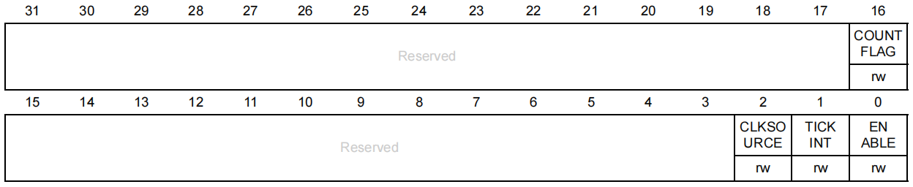
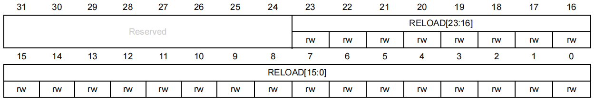
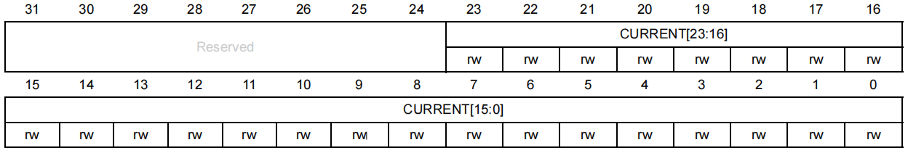
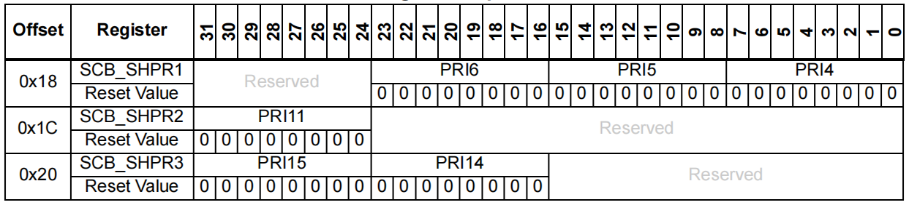
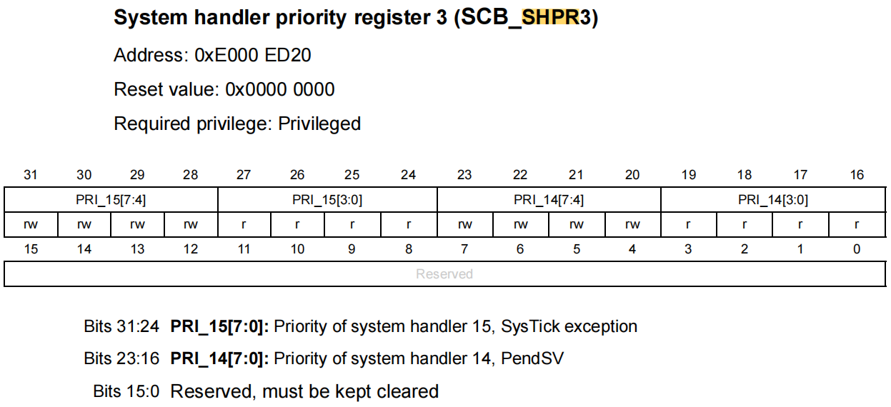
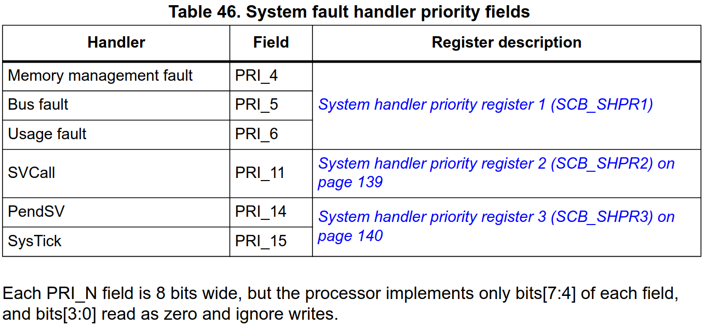

## 寄存器

### STK_CTRL

- SysTick 控制和状态寄存器（ SysTick control and status register ）

<div align="center">
    </img>
</div>

- **COUNTFLAG:** 如果在上次读取本寄存器后， SysTick 已经计到了 0，则该位为 1
- **CLKSOURCE:** 时钟源选择
  - 0：AHB/8
  - 1：处理器时钟 AHB
- **TICKINT:** SysTick异常请求使能
  - 0：数到 0 时无动作。
  - 1：数到 0 时触发 SysTick 异常请求
- **ENABLE:** SysTick 定时器的使能位
  - 0：禁止
  - 1：使能

### STK_LOAD

- 重装载数值寄存器（SysTick reload value register）

<div align="center">
    </img>
</div>


- **RELOAD[23:0]:** 当倒数计数至零时，将被重装载的值

### STK_VAL

- 当前数值寄存器（SysTick current value register）

<div align="center">
    </img>
</div>


**CURRENT[23:0]:** 读取时返回当前倒计数的值，写任意值则使之清零（包括COUNTFLAG）

### STK_CALIB

- 校准数值寄存器（SysTick calibration value register），用法不明，略过。

### 上述寄存器在内核头文件中的定义

```c
typedef struct
{
    __IO uint32_t CTRL;
    __IO uint32_t LOAD;
    __IO uint32_t VAL;
    __I  uint32_t CALIB;
} SysTick_Type;
```

## 例程

### 寄存器

```c
int main(void){
    while(1){
        LED_ON();
        Delay_ms(1000);
        LED_OFF();
        Delay_ms(1000);
    }
    return 0;
}


void Delay_ms(__IO uint32_t ms){
    SysTick->LOAD  = 72000;             // 计数器重装载值，1ms 中断一次(系统时钟72MHZ)
    SCB->SHP[11]  |= (uint8_t)0xF0;     // 配置 SysTick 中断优先级，具体看下一小节说明
    SysTick->VAL   = (uint32_t)0x00;    // 计数器初始值
    SysTick->CTRL |= (uint32_t)0x07;    // 选择AHB时钟源，使能 SysTick 中断，使能 SysTick

    while(ms-- > 0){
        // 当计数器的值减小到 0 的时候，CRTL 寄存器的位 16 会置 1
        while(!((SysTick->CTRL) & ((uint32_t)0x01 << 16)));
    }

    SysTick->CTRL &= ~(uint32_t)0x01;   //关闭 SysTick
}


void SysTick_Handler(void){
    // SysTick中断函数，本例中用不到
}
```

#### SCB->SHP[11] 配置 SysTick 中断优先级

- 系统中断优先级寄存器 （System handler priority register）

<div align="center">
</img>
</div>

`SysTicks` 属于内核（中断号 -1），不要和外部中断搞混，下面是官方手册的描述：

<div align="center">
</img>
</div>

<div align="center">
</img>
</div>

`SysTick` 中断优先级设置对应 `SCB_SHPR3` 寄存器的 `PRI_15[7:0]`，高四位有效。

再看头文件 `core_cm3.h` 中的定义：

```c
typedef struct
{
    /* 篇幅有限略去 */
    __IO uint8_t  SHP[12];
    /* 篇幅有限略去 */
} SCB_Type; 
```

刚好每个 SHPR 寄存器占 4 个

可知，`SHP[11]` 对应 `PRI_15[7:0]`

