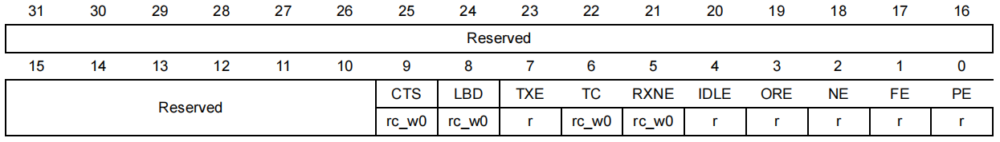
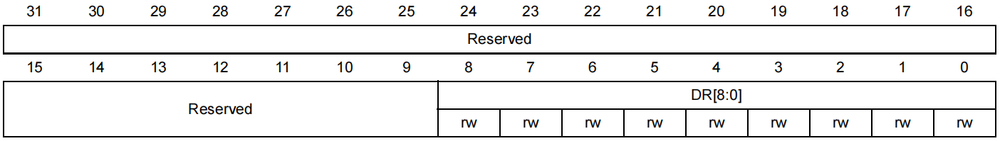
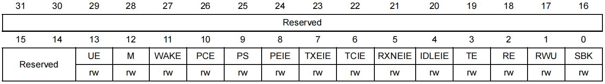
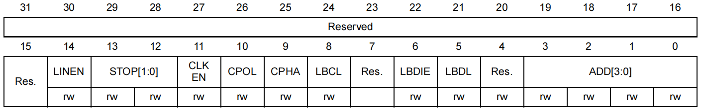
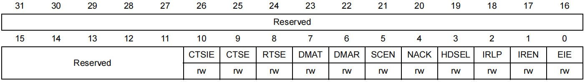
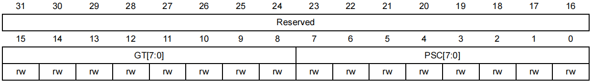
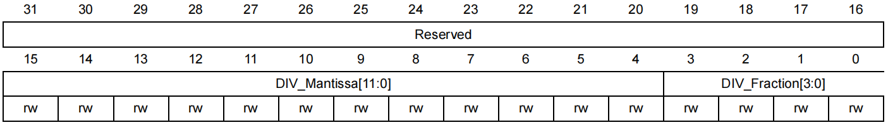
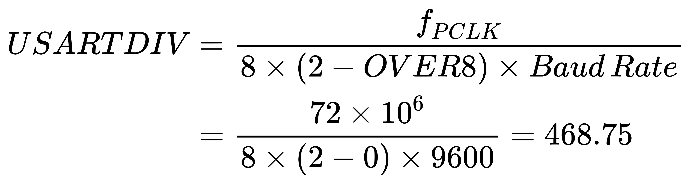
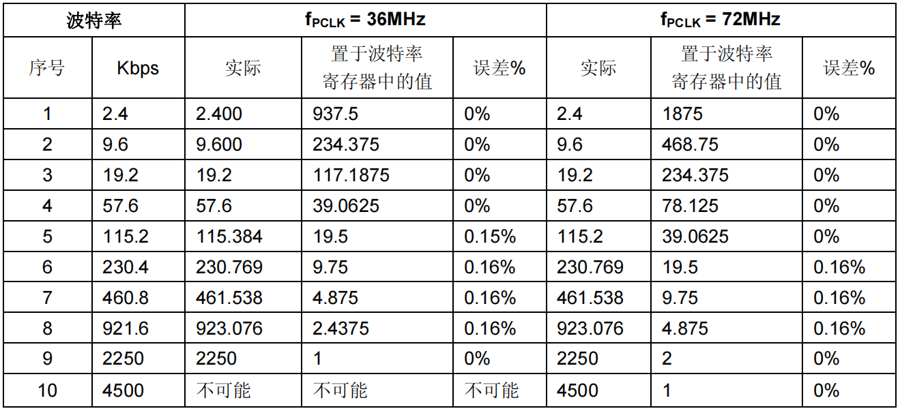

## USARTx_SR

- 状态寄存器（ Status register ）

<div align="center">
    </img>
</div>

- CTS:  CTS标志 (CTS flag)
- LBD:  LIN断开检测标志 (LIN break detection flag)
- **TXE:  发送数据寄存器空 (Transmit data register empty)**
- **TC:  发送完成 (Transmission complete)**
- **RXNE：读数据寄存器非空 (Read data register not empty)**
- IDLE：监测到总线空闲 (IDLE line detected)
- ORE：过载错误 (Overrun error)
- NE: 噪声错误标志 (Noise error flag)
- FE: 帧错误 (Framing error)
- **PE: 校验错误 (Parity error)**

## USARTx_DR

- 数据寄存器（ Data register ）

<div align="center">
    </img>
</div>

## USARTx_CR1

- 控制寄存器 1

<div align="center">
    </img>
</div>

- **UE：USART使能 (USART enable)**
- **M：字长 (Word length)**
- WAKE：唤醒的方法 (Wakeup method)
- **PCE：检验控制使能 (Parity control enable)**
- **PS：校验选择 (Parity selection)**
- **PEIE：PE中断使能 (PE interrupt enable)**
- **TXEIE：发送缓冲区空中断使能 (TXE interrupt enable)**
- **TCIE：发送完成中断使能 (Transmission complete interrupt enable)**
- **RXNEIE：接收缓冲区非空中断使能 (RXNE interrupt enable)**
- IDLEIE：IDLE中断使能 (IDLE interrupt enable)
- **TE：发送使能 (Transmitter enable)**
- **RE：接收使能 (Receiver enable)**
- RWU：接收唤醒 (Receiver wakeup)
- SBK：发送断开帧 (Send break)

## USARTx_CR2

- 控制寄存器 2

<div align="center">
    </img>
</div>

- LINEN：LIN模式使能 (LIN mode enable)
- **STOP：停止位 (STOP bits)**
- CLKEN：时钟使能 (Clock enable)
- CPOL：时钟极性 (Clock polarity)
- CPHA： 时钟相位 (Clock phase)
- LBCL：最后一位时钟脉冲 (Last bit clock pulse)
- LBDIE：LIN断开符检测中断使能 (LIN break detection interrupt enable)
- LBDL：LIN断开符检测长度 (LIN break detection length)
- ADD[3:0]：本设备的USART节点地址

## USARTx_CR3

- 控制寄存器 3

<div align="center">
    </img>
</div>

- CTSIE：CTS中断使能 (CTS interrupt enable)
- CTSE：CTS使能 (CTS enable)
- RTSE：RTS使能 (RTS enable)
- **DMAT：DMA使能发送 (DMA enable transmitter)**
- **DMAR: DMA使能接收 (DMA enable receiver)**
- SCEN: 智能卡模式使能 (Smartcard mode enable)
- NACK：智能卡NACK使能 (Smartcard NACK enable)
- HDSEL：半双工选择 (Half-duplex selection)
- IRLP：红外低功耗 (IrDA low-power)
- IREN：红外模式使能 (IrDA mode enable)
- EIE：错误中断使能 (Error interrupt enable)

## USART_GTPR

- 保护时间和预分频寄存器（ Guard time and prescaler register ）

<div align="center">
    </img>
</div>

- GT[7:0]：保护时间值 (Guard time value)
- PSC[7:0]：预分频器值 (Prescaler value)

## USARTx_BRR

 - 波特率寄存器（ Baud rate register ）

<div align="center">
    </img>
</div>

- **DIV_Mantissa[11:0]：** 定义 `USARTDIV` 的整数部分
- **DIV_Fraction[3:0]：** 定义 `USARTDIV` 的小数部分

公式如下，以 `fPLCK` = 72MHZ，`Baud Rate` = 9600 为例：

<div align="left">
    </img>
</div>


- `USARTDIV`：我是理解为 fPCLK 的分频系数
- `fPLCK` ：为 `USART` 时钟
- `OVER8`：读取 1 bit 所用的采样次数
  - 0：采样 16 次
  - 1：采样 8 次

OVER8 是 USART_BRR 的第 15 位，该位在参考手册中没有描述，但是在标准库 `stm32f10x_usart.c` 中有相关代码，如下：

```c
/* 篇幅有限，只截取 USART_Init 函数部分代码 */

/* USART OverSampling-8 Mask */
#define CR1_OVER8_Set             ((u16)0x8000)  /* USART OVER8 mode Enable Mask */
#define CR1_OVER8_Reset           ((u16)0x7FFF)  /* USART OVER8 mode Disable Mask */

/* Determine the integer part */
if ((USARTx->CR1 & CR1_OVER8_Set) != 0)
{
    /* Integer part computing in case Oversampling mode is 8 Samples */
    integerdivider = ((25 * apbclock) / (2 * (USART_InitStruct->USART_BaudRate)));    
}
else /* if ((USARTx->CR1 & CR1_OVER8_Set) == 0) */
{
    /* Integer part computing in case Oversampling mode is 16 Samples */
    integerdivider = ((25 * apbclock) / (4 * (USART_InitStruct->USART_BaudRate)));
}
```

`OVER8` 复位值是0，也就是 16 次采样，即 16 个时钟周期读取 1 bit。波特率单位 bps（bit per second），即每秒传输比特位个数。结合上面两点，公式也就不难理解。

再看上述结果 468.75，将它转化为二进制即 `000111010100.1100` ：

- 整数部分：即 `0x1D4` 写入 DIV_Mantissa[11:0]
- 小数部分：即 `0xC` 写入 DIV_Fraction[3:0]

有的教程是将小数部分乘上16：`0.75x16=12`，其实就是小数部分左移 4 位，结果是一样的（个人觉得上面更好理解）。

> 链接：[在线进制转换](https://www.rapidtables.org/zh-CN/convert/number/decimal-to-binary.html)

<div align="center">
    </img>
</div>

>1. CPU 的时钟频率越低，则某一特定波特率的误差也越低。可以达到的波特率上限可以由这组数据得到。
>2. 只有 USART1 使用 PCLK2 (最高72MHz)。其它 USART 使用 PCLK1 (最高36MHz)。


## 中断控制

USART 有多个中断请求事件

|中断事件|事件标志|寄存器|使能控制位|
|:-|:-|:-|:-|
|奇偶校验错误|PE|CR1|位8|
|发送数据寄存器为空|TXE|CR1|位7|
|发送完成|TC|CR1|位6|
|准备好读取接收到的数据 / 检测到上溢出错误|RXNE / ORE|CR1|位5|
|检测到空闲线路|IDLE|CR1|位4|
|断路标志|LBD|CR2|位6|
|CTS标志|CTS|CR3|位10|
|多缓冲通信中的噪声标志、上溢出错误和帧错误|NF/ORE/FE|CR3|位0|

事件标志对应状态寄存器 USART_SR 中的位，当对应位为 1 时触发中断事件。

## 例程

### 寄存器

```c
void USART_Config(){
    RCC->APB2ENR |= (uint32_t)0x05;      // 使能GPIOA/AFIO时钟
    GPIOA->CRH   |= (uint32_t)0x0B << 4; // 配置PA9复用推挽输出，最高50MHZ
    GPIOA->CRH   |= (uint32_t)0x04 << 8; // 配置PA10浮空输入
    
    RCC->APB2ENR |= (uint32_t)0x01 << 14; // 使能USART1时钟
    USART1->CR1  |= (uint16_t)0x00 << 12; // 一个起始位，8个数据位
    USART1->CR2  |= (uint16_t)0x00 << 12; // 一个停止位
    USART1->CR3  |= (uint16_t)0x00 << 8;  // 禁用CTS，RTS硬件流控制
    USART1->BRR   = (uint16_t)0x1D4C;     // 波特率9600
    USART1->CR1  |= (uint16_t)0x0B;       // 收/发使能
    
    NVIC->ISER[1] |= (uint32_t)0x01 << (37-32); // 使能USART1中断，中断号是37
    NVIC->IP[9]   |= (uint32_t)0x40;      // 配置优先级主1子1
    USART1->CR1   |= (uint16_t)0x01 << 5; // 使能接收中断 
    USART1->CR1   |= (uint16_t)0x01 << 0; // 使能USART1
}

void USART1_IRQHandler(void)
{
    uint8_t ucTemp;
    if(USART1->SR & (uint16_t)0x20)
    {
        ucTemp = (uint8_t)(USARTx->DR & (uint16_t)0x01FF); // 接收数据
        USARTx->DR = (uint16_t)ucTemp & (uint16_t)0x01FF;  // 发送数据
    }	 
}
```

### 标准库

```c
void USART_Config(void){
    GPIO_InitTypeDef GPIO_InitStructure;
    USART_InitTypeDef USART_InitStructure;
    NVIC_InitTypeDef NVIC_InitStructure;
    
    // 打开串口 GPIO 的时钟
    DEBUG_USART_GPIO_APBxClkCmd(GPIOA, ENABLE);
    
    // 打开串口外设的时钟
    DEBUG_USART_APBxClkCmd(RCC_APB2Periph_USART1, ENABLE);
    
    // 将 USART1 Tx 的 GPIO 配置为推挽复用模式
    GPIO_InitStructure.GPIO_Pin = GPIO_Pin_9;
    GPIO_InitStructure.GPIO_Mode = GPIO_Mode_AF_PP;
    GPIO_InitStructure.GPIO_Speed = GPIO_Speed_50MHz;
    GPIO_Init(GPIOA, &GPIO_InitStructure);
    
    // 将 USART1 Rx 的 GPIO 配置为浮空输入模式
    GPIO_InitStructure.GPIO_Pin = GPIO_Pin_10;
    GPIO_InitStructure.GPIO_Mode = GPIO_Mode_IN_FLOATING;
    GPIO_Init(GPIOA, &GPIO_InitStructure);
    
    // 配置串口的工作参数
    USART_InitStructure.USART_BaudRate = 9600;
    USART_InitStructure.USART_WordLength = USART_WordLength_8b;
    USART_InitStructure.USART_StopBits = USART_StopBits_1;
    USART_InitStructure.USART_Parity = USART_Parity_No ;
    USART_InitStructure.USART_HardwareFlowControl = USART_HardwareFlowControl_None;
    USART_InitStructure.USART_Mode = USART_Mode_Rx | USART_Mode_Tx;
    USART_Init(USART1, &USART_InitStructure);
    
    // 串口中断优先级配置
    NVIC_PriorityGroupConfig(NVIC_PriorityGroup_2);
    NVIC_InitStructure.NVIC_IRQChannel = USART1_IRQn;
    NVIC_InitStructure.NVIC_IRQChannelPreemptionPriority = 1;
    NVIC_InitStructure.NVIC_IRQChannelSubPriority = 1;
    NVIC_InitStructure.NVIC_IRQChannelCmd = ENABLE;
    NVIC_Init(&NVIC_InitStructure);
 
    // 使能串口接收中断
    USART_ITConfig(USART1, USART_IT_RXNE, ENABLE);
 
    // 使能串口
    USART_Cmd(USART1, ENABLE);
}

void USART1_IRQHandler(void)
{
  uint8_t ucTemp;
	if(USART_GetITStatus(DEBUG_USARTx,USART_IT_RXNE)!=RESET)
	{		
        ucTemp = USART_ReceiveData(DEBUG_USARTx);
        USART_SendData(DEBUG_USARTx,ucTemp);    
	}	 
}
```

